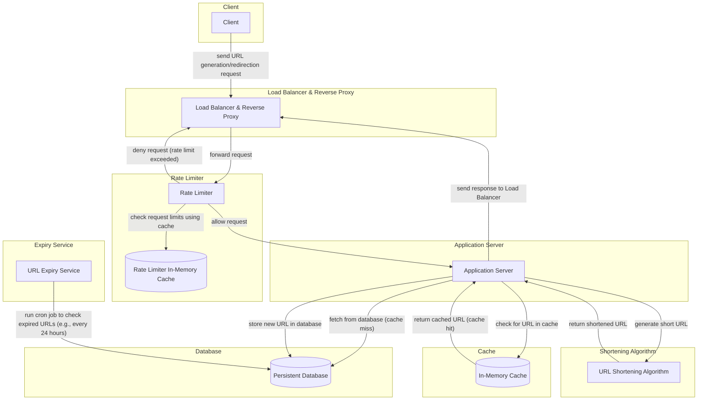
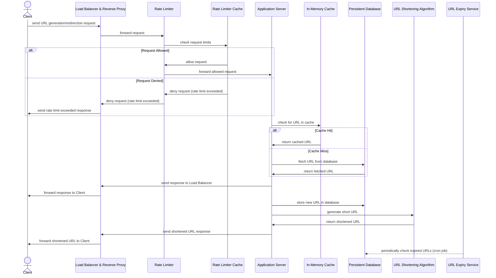

# Design a URL Shortening System

Design a URL shortening system like [TinyURL](https://tinyurl.com/).

## Requirements

### Functional Requirements

1. Generate a shorter alias: The system should generate a unique, shorter alias for any given URL.
2. Redirection: Upon hitting the shortened URL, the system should redirect users to the original URL.
3. The system should ensure no collisions in URL hashes.
4. Expiration options: Default expiration is 3 years, but users can set custom expiration times up to a maximum of 5 years.
5. Data retention policy: URL hashes should not exceed 5 years unless explicitly deleted.

### Non-Functional Requirements

1. High availability.
2. Low latency to ensure quick redirection.
3. Scalability to accommodate growing usage.

### Out of Scope

1. Analytics (e.g., visit count or unique clicks per URL)

## Resource Estimations

### Assumptions

1. Users: 100 million daily active users (DAU).
2. Read-to-write ratio: 100:1.
3. URL generation rate: 1 million new short URL requests per day.
4. Data size: Each URL entry is ~500 bytes.
5. Data retention: URL entries expire after a maximum of 5 years.

### Load Estimation

$$
\text{Write QPS} = \frac{\text{Average Writes per Day}}{\text{Seconds per Day}} = \frac{1\ \text{Million}}{86400} ≈ 12\ \text{Writes/Second}
$$

Given the 100:1 read-to-write ratio:

$$
\text{Read QPS} = 12\ \text{Writes/Second} \times 100 = 1200\ \text{Reads/Second}
$$

### Storage Estimation

1 million URLs created daily, each entry averaging 500 bytes, results in:

$$
\text{Daily Storage} = \text{Number of Entries per Day} \times \text{Average Entry Size} = 1\ \text{Million} \times 500\ \text{Byte} = 500\ \text{MB/Day}
$$

Given the 5 years URLs retention policy:

$$
\text{5-Year Storage} = 500\ \text{MB/Day} \times 365\ \text{Day} \times 5\ \text{Years} ≈ 900\ \text{GB over 5 years}
$$

### Network Bandwidth Estimation

With each write being 500 bytes, and 12 Writes/Second:

$$
\text{Write Bandwidth} = 12\ \text{Writes/Second} \times 500\ \text{Bytes} = 6\ \text{KB/Second}
$$

For 1200 Reads/Second, averaging 500 bytes per entry:

$$
\text{Read Bandwidth} = 1200\ \text{Reads/Second} \times 500\ \text{Bytes} = 600\ \text{KB/Second}
$$

### Cache Estimation

Let’s assume a split of 80-20 in the incoming requests. 20 percent of redirection requests generate 80 percent of the traffic.

So 20% of the daily read requests can be cached, results in:

$$
\text{Cache Size per Second} = 20\% \times 1200\ \text{Read QPS} \times 500\ \text{Bytes} = 120\ \text{KB/Second}
$$

$$
\text{Cache Size per Day} = 120\ \text{KB/Second} \times 86400\ \text{Seconds} = 10.368\ \text{GB/Day}
$$

### Number of Servers Estimation

With the assumption that a typical server can serve 64,000 requests per second and assuming that daily active users is the number of requests per second for peak load times, we get 100 million requests per second.

Therefore, we would need:

$$
\text{Number of Servers} = \frac{\text{Total Requests per Second}}{\text{Requests per Second per Server}} = \frac{100\ \text{Million}}{64,000} ≈ 1563\ \text{Servers}
$$

## High-Level Design

### System Components

- Database: Stores URL mappings with expiration times.
- Application Server: Handles the URL shortening requests.
- Cache: Holds frequently accessed URLs to reduce DB load.
- Load Balancer: Distributes incoming traffic across servers.
- Rate Limiter: Prevents misuse by rate-limiting requests per IP.
- Shortening Algorithm: Generates unique, collision-resistant short URLs.
- Expiry Service: Handles URL expiration and cleanup.

### System Design

Here is the high-level design of the URL shortening system:



Here is the flow of how the system works:



### API Design

The system should have the following APIs:

#### Generate Short URL

To generate a short URL for the given original URL with an optional expiry time.

```plaintext
shortenUrl(originalUrl, expiryTime)
```

Parameters:

- `originalUrl`: The original URL to shorten.
- `expiryTime`: The expiry time for the short URL. It should be validated to be within the allowed 5 years range.

Returns:

- `shortUrl`: The shortened URL.

#### Redirect to Original URL

To redirect the user to the original URL when they hit the shortened URL.

```plaintext
redirectUrl(shortUrl)
```

Parameters:

- `shortUrl`: The shortened URL.

Returns:

- `originalUrl`: The original URL to redirect to.

The server can return a 301 (Moved Permanently) HTTP status code and include the original URL in the `Location` HTTP header to redirect the user to the original URL.

#### Delete Short URL

To delete the short URL from the system.

```plaintext
deleteUrl(shortUrl)
```

Parameters:

- `shortUrl`: The shortened URL to delete.

### Database

For URL shortening, we need a database to store the mappings between the original URLs and the shortened URLs.

Database with the following characteristics can be used:

- Horizontally scalable.
- Read-optimized.
- There is not much need for complex and relational queries.

NoSQL database like MongoDB or Casandra can be used for this purpose.

#### Schema

The database schema can be as follows:

|      Key       |    Type    |             Description             |           Example           |
| :------------: | :--------: | :---------------------------------: | :-------------------------: |
|   `shortUrl`   |  `String`  |         The shortened URL.          | `http://tinyurl.com/abc123` |
| `originalUrl`  |  `String`  |          The original URL.          |  `https://www.example.com`  |
| `creationTime` | `DateTime` | The creation time of the short URL. |    `2025-03-01 00:00:00`    |
|  `expiryTime`  | `DateTime` |  The expiry time of the short URL.  |    `2025-04-01 00:00:00`    |

#### Replication

The database should have a replication factor of at least 3 to ensure high availability and durability of the data.

The replication can be achieved by using a leader-follower replication model while utilizing replicas for read operations.

#### Sharding

The database should be sharded to distribute the data across multiple nodes.

The sharding can be applied on a range of the hash (a.k.a range-based sharding) of the `shortUrl` to evenly distribute the data.

### Shortening Algorithm

The shortening algorithm should generate a unique and short alias for the given URL.

The algorithm consists of two main parts:

1. Hashing: The original URL is hashed to generate a unique hash.
2. Encoding: The hash is encoded to generate a short human-readable alias.

#### Hashing

##### Option 1: MD5 Hashing

MD5 hashing can be used to generate a unique 128-bit/16-byte (32 hexadecimal characters) hash for the original URL.

```python
import hashlib

def md5_hash(url):
    return hashlib.md5(url.encode()).hexdigest()
```

MD5 has high collision probability, but it is fast and widely used for generating unique hashes. We can double hash the URL to reduce the collision probability.

```python
def md5_double_hash(url):
    _hash = hashlib.md5(url.encode()).hexdigest()
    return hashlib.md5(_hash).hexdigest()
```

##### Option 2: SHA-256 Hashing

SHA-256 hashing can be used to generate a unique 256-bit/32-byte (64 hexadecimal characters) hash for the original URL.

```python
import hashlib

def sha256_hash(url):
    return hashlib.sha256(url.encode()).hexdigest()
```

SHA-256 has a lower collision probability compared to MD5, but it is slower and generates longer hashes.

##### Option 4: UUID Hashing

UUID hashing can be used to generate a unique 128-bit/16-byte (32 hexadecimal characters) hash for the original URL.

```python
import uuid

def uuid_hash(url):
    return str(uuid.uuid4().hex)
```

> Wikipedia:
> In UUID 4 bits are used to indicate version 4, and 2 or 3 bits to indicate the variant. Thus, for variant 1 (that is, most UUIDs) a random version 4 UUID will have 6 predetermined variant and version bits, leaving 122 bits for the randomly generated part, for a total of 2^122, possible version-4 variant-1 UUIDs.

UUID v4 generates random hashes, which are unique, given the number of possible combinations (2^122), and has a lower collision probability but are also longer.

##### Option 4: Sequencer

A sequencer can be used to generate unique sequential IDs for the URLs. The sequencer can be implemented as a separate service that generates unique IDs in a distributed manner.

To avoid making the sequencer a single point of failure, it can be scaled horizontally on multiple nodes and use a consensus algorithm like Raft or Paxos or a distributed database like ZooKeeper or etcd for synchronization between the nodes.

Zookeeper can be used to maintain multiple ranges for sequencer servers and once a server reaches its maximum range Zookeeper will assign an unused counter range to the new server.

```plaintext
/sequencer
    /server1
        /range1
            /counter
        /range2
            /counter
    /server2
        /range3
            /counter
        /range4
            /counter
```

#### Encoding

##### Option 1: Base64 Encoding

Base64 encoding can be used to encode the hash into a short human-readable alias.

It uses a 64-character set (`A-Z`, `a-z`, `0-9`, `+`, `/`) to encode the hash and each Base64 character represents 6 bits of data.

```python
import base64

def base64_encode(hash):
    return base64.base64encode(hash.encode()).decode('utf-8')
```

How Base64 encoding works?

1. Binary data is divided into chunks of 6 bits, and each 6-bit chunk is mapped to one of 64 printable characters.
2. Character Set: The 64 characters used include:
    - 26 uppercase letters (`A-Z`)
    - 26 lowercase letters (`a-z`)
    - 10 digits (`0-9`)
    - 2 special characters (`+`, `/`)
3. Padding with `=`: If the input data doesn’t divide evenly into 6-bit chunks, `=` characters are used as padding at the end.

Example:

```plaintext
Input: Hello World!
Binary: 01001000 01100101 01101100 01101100 01101111 00100000 01010111 01101111 01110010 01101100 01100100 00100001

Divide into 6-bit chunks: 010010 000110 010101 100110 110011 011011 110011 011011 110111 001000 000101 011101 110011 011011 100100 001000 01

Map to Base64 characters: 3q5b2t6
```

##### Option 2: Base62 Encoding

Base62 encoding can be used to encode the hash into a short human-readable alias after removing the `+` and `/` characters from the Base64 encoding.

It uses a 62-character set (`A-Z`, `a-z`, `0-9`) to encode the hash and each Base62 character represents 6 bits of data.

```python
import string

def base62_encode(hash):
    base62 = string.ascii_lowercase + string.ascii_uppercase + string.digits
    
    base62_hash = ""
    while hash > 0:
        hash, i = divmod(hash, 62)
        base62_hash = base62[i] + base62_hash
    return base62_hash
```

##### Option 2: Base56 Encoding

Base56 encoding can be used to encode the hash into a short even more human-readable alias after removing the `+`, `/`, and `I`, `l`, `1`, `o`, `O`, `0` characters from the Base64 encoding.

It uses a 56-character set (`A-Z`, `a-z`, `2-9`) to encode the hash and each Base56 character represents 6 bits of data.

```python
import string

def base56_encode(hash):
    base56 = (
      string.ascii_lowercase + 
      string.ascii_uppercase + 
      string.digits
    ).replace('I', '').replace('l', '').replace('1', '').replace('o', '').replace('O', '').replace('0', '')
    
    base56_hash = ""
    while hash > 0:
        hash, i = divmod(hash, 56)
        base56_hash = base56[i] + base56_hash
    return base56_hash
```

### Caching

The system should cache the most frequently accessed URLs to reduce the load on the database. We can use an in-memory cache like Redis or Memcached to store the URLs. The cache should have a large enough capacity to store the most frequently accessed URLs.

#### Cache Strategy

A cache-aside (or lazy-loading) strategy can be used where the application first checks the cache for the URL. If the URL is not found in the cache, the application fetches it from the database and then stores it in the cache for future requests.

#### Cache Eviction Policy

The cache should have an eviction policy to remove old or least frequently accessed URLs. A common eviction policy is the Least Recently Used (LRU) policy, where the least recently accessed URLs are removed from the cache.

### Rate Limiting

A token bucket rate limiting can be used to prevent abuse of the system. The rate limiting can be applied on user ID or IP address to prevent a single user from generating too many URLs in a short period of time.

### Expiry Service

To delete the expired URLs from the database, an expiry service can be used.

The expiry service can run a cron job every 24 hours to check for expired URLs and delete them from the database or archive them in a data warehouse where it can be kept for long-term archival, analysis, or backup purposes.

One alternative approach is to use a TTL (Time to Live) index on the `expiryTime` field in the database to automatically delete the expired URLs (MongoDB supports that with [TTL Indexes](https://www.mongodb.com/docs/manual/core/index-ttl/)).

## References

- [Design Url Shortener - System Design School](https://systemdesignschool.io/problems/url-shortener)
- [Design a URL Shortening Service / TinyURL - Educative](https://www.educative.io/courses/grokking-modern-system-design-interview-for-engineers-managers/system-design-tinyurl)
- [URL Shortening System Design - System Design One](https://systemdesign.one/url-shortening-system-design/)
- [URL Shortener - Karan Pratap Singh](https://www.karanpratapsingh.com/courses/system-design/url-shortener)
