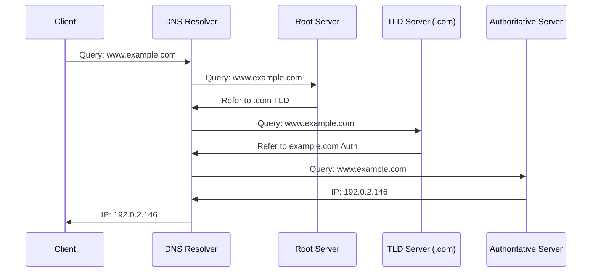
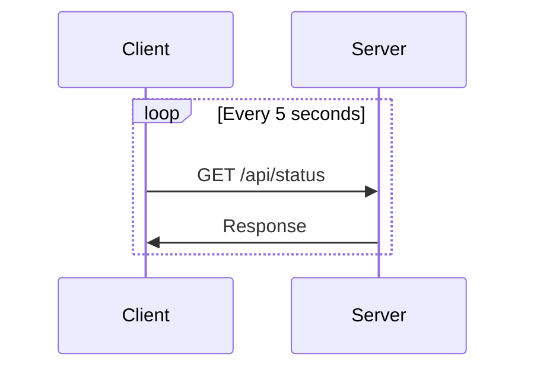
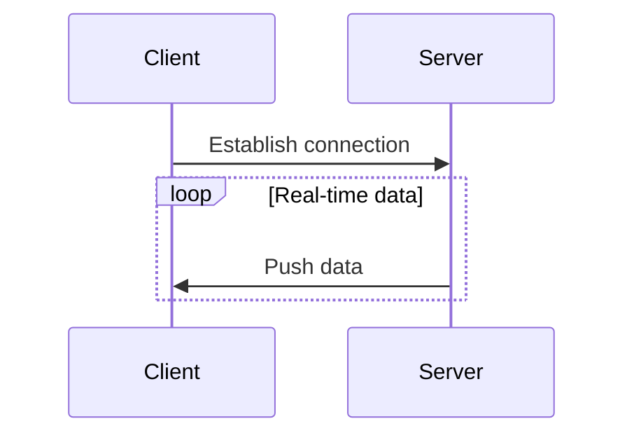
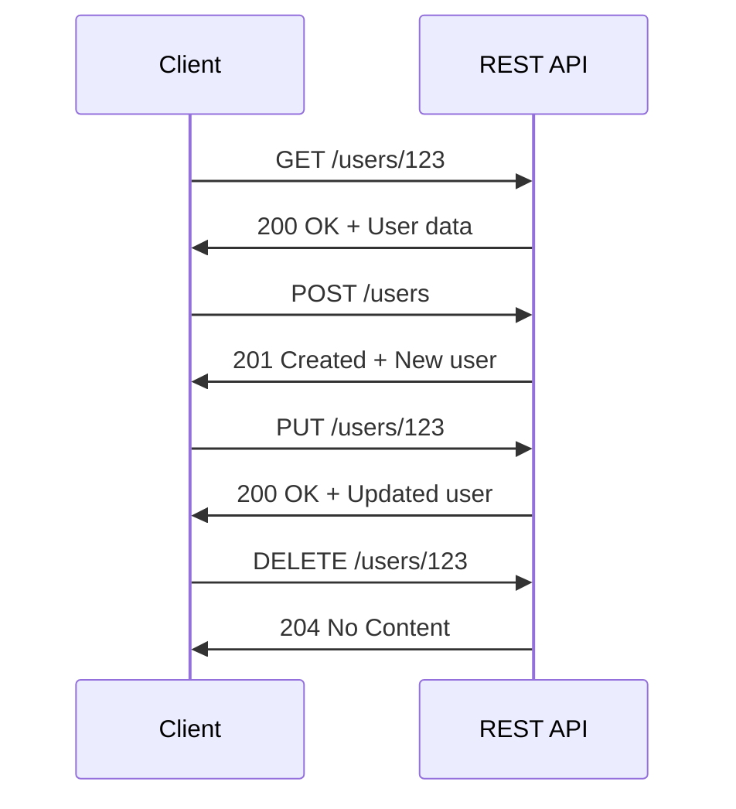
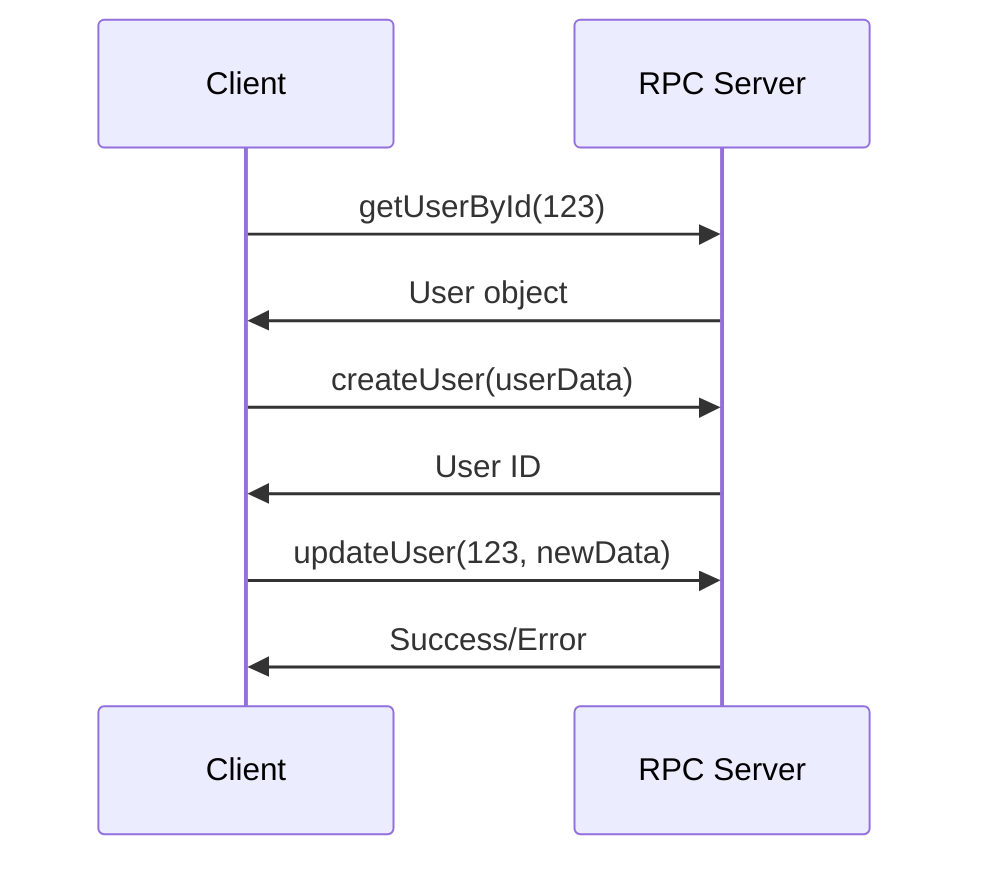
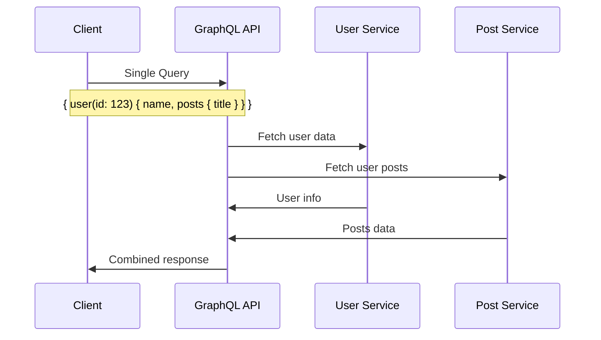
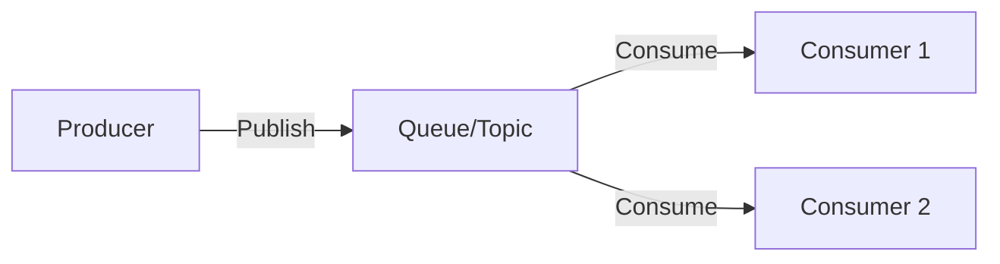

# Client-Server Model

The client-server model is a computing architecture where clients (requesters) and servers (providers) communicate over a network to share resources and services.

**Key Characteristics:**

- **Asymmetric**: Clients initiate requests; servers respond
- **Stateless or Stateful**: Servers may or may not maintain client state

## IP Addresses

Internet Protocol addresses uniquely identify devices on a network.

- **IPv4**: 32-bit (4 bytes) in dotted-decimal format: `192.0.2.146`
- **IPv6**: 128-bit (16 bytes) in hexadecimal notation: `2001:0db8:85a3:0000:0000:8a2e:0370:7334`

**IPv4 vs IPv6:**

- IPv4: ~4.3 billion addresses (exhausted)
- IPv6: ~340 undecillion addresses (future-proof)

## Ports

Ports are 16-bit numbers (0-65535) that identify specific processes or services on a host.

**Port Ranges:**

- **0-1023**: System/well-known ports (require root privileges)
- **1024-49151**: Registered ports
- **49152-65535**: Dynamic/private ports

**Common Well-Known Ports:**

- HTTP: 80
- HTTPS: 443 (not 8843)
- DNS: 53
- SSH: 22
- FTP: 21

## DNS (Domain Name System)

DNS translates human-readable domain names into IP addresses. It's a hierarchical, distributed database system.

### DNS Server Types

**Recursive Resolver:**

- Acts as intermediary between client and DNS infrastructure
- Caches responses to improve performance
- Typically provided by ISP or public services (8.8.8.8, 1.1.1.1)

**Authoritative Server:**

- Holds the actual DNS records for a domain
- Final authority for domain name resolution
- No caching - always returns current records

### DNS Resolution Process

1. **Client Query**: Browser requests `www.example.com`
2. **Recursive Resolver**: ISP's DNS server receives query
3. **Root Server Query**: Resolver asks root server for .com TLD info
4. **TLD Query**: Resolver asks .com server for `example.com` info  
5. **Authoritative Query**: Resolver asks `example.com`'s server for www record
6. **Response Chain**: IP address returned back through the chain
7. **Caching**: Each step caches the result (TTL-based)

## Communication Patterns

### Polling

Client repeatedly requests data from server at regular intervals.

**Trade-offs:**

- ✅ Simple to implement
- ✅ Works with standard HTTP
- ❌ Inefficient (unnecessary requests)
- ❌ Higher latency for updates

**Use Cases:** Email checks, system monitoring, non-critical real-time updates

### Streaming

Server continuously pushes data to client as it becomes available.

**Technologies:**

- **WebSockets**: Bidirectional, persistent connection
- **Server-Sent Events (SSE)**: Unidirectional, HTTP-based
- **gRPC Streaming**: High-performance, Protocol Buffers

**Trade-offs:**

- ✅ Real-time updates
- ✅ Efficient bandwidth usage
- ❌ Complex connection management
- ❌ Firewall/proxy challenges

### REST (Representational State Transfer)

REST is an architectural style for designing web services that treats everything as resources identified by URLs.

**Key Principles:**

- **Stateless**: Each request contains all necessary information
- **Resource-based**: URLs represent resources, not actions
- **Uniform Interface**: Consistent interaction patterns

**Trade-offs:**

- ✅ Excellent caching support
- ✅ Stateless scaling
- ✅ Wide tooling support
- ❌ Can be chatty (multiple requests)
- ❌ Over-fetching/under-fetching data

### RPC (Remote Procedure Call)

RPC allows calling functions on remote servers as if they were local function calls.

**Types:**

- **JSON-RPC**: Simple, text-based protocol
- **gRPC**: High-performance, Protocol Buffers
- **XML-RPC**: Legacy, XML-based format

**Trade-offs:**

- ✅ Natural programming model
- ✅ Strong typing (gRPC)
- ✅ High performance potential
- ❌ Tighter coupling
- ❌ Limited caching
- ❌ Language/platform dependencies

### GraphQL

GraphQL is a query language and runtime that allows clients to request exactly the data they need.

**Key Features:**

- **Single Endpoint**: One URL for all operations
- **Flexible Queries**: Client specifies exactly what data to fetch
- **Type System**: Strong schema definition
- **Real-time**: Built-in subscription support

**Trade-offs:**

- ✅ Prevents over-fetching
- ✅ Single request for complex data
- ✅ Self-documenting schema
- ❌ Complex caching
- ❌ Query complexity management

### Message Queues

Asynchronous communication through message brokers enables loose coupling.

**Patterns:**

- **Point-to-Point**: One producer, one consumer
- **Publish-Subscribe**: One producer, multiple consumers
- **Request-Reply**: Synchronous-like behavior over async messaging

**Technologies:**

- **RabbitMQ**: Feature-rich, AMQP protocol
- **Apache Kafka**: High-throughput, distributed streaming
- **AWS SQS**: Managed, serverless queuing

## Key Considerations

### When to Choose Each Pattern

**Polling**: Simple integrations, infrequent updates, firewall-friendly
**Streaming**: Real-time requirements, high-frequency updates, bidirectional communication  
**REST**: Web APIs, CRUD operations, caching important
**RPC**: Internal services, performance-critical, strong typing needed
**GraphQL**: Complex data requirements, mobile clients, API aggregation
**Message Queues**: Decoupling services, reliability important, async processing

## Reference Materials

- [What is DNS?](https://aws.amazon.com/route53/what-is-dns)
- [WebSockets vs Server-Sent-Events vs Long-Polling vs WebRTC vs WebTransport](https://rxdb.info/articles/websockets-sse-polling-webrtc-webtransport.html)
- [Distributed Systems: RPC (Remote Procedure Call)](https://www.youtube.com/watch?v=S2osKiqQG9s&ab_channel=MartinKleppmann)
- [What's the difference between RPC and REST?](https://aws.amazon.com/compare/the-difference-between-rpc-and-rest/)
- [DNS Record Types Explained](https://www.cloudflare.com/learning/dns/dns-records/)
