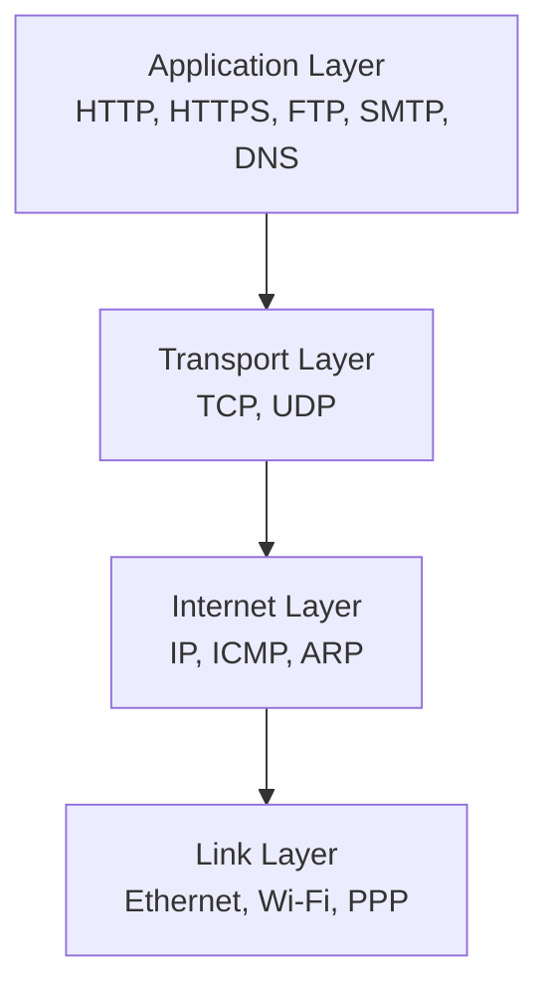
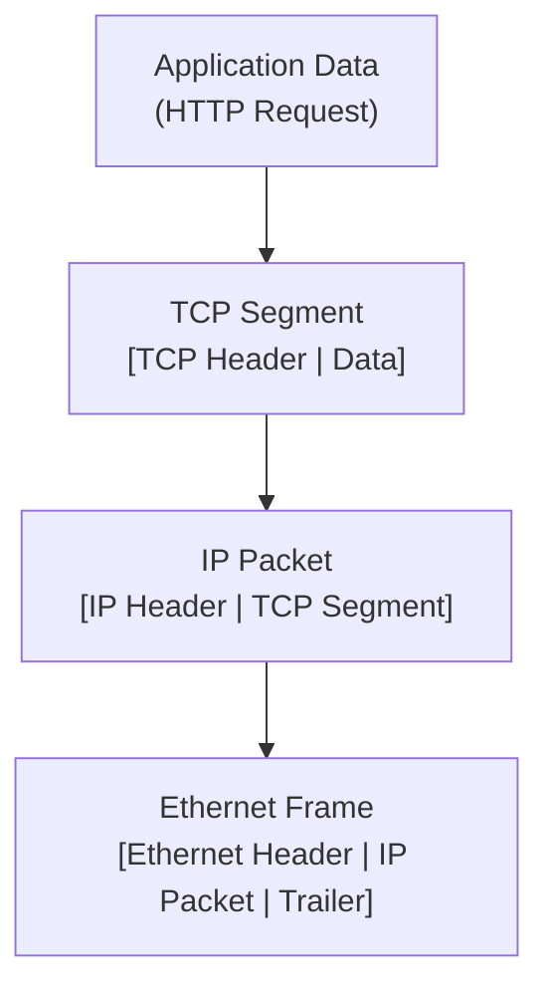
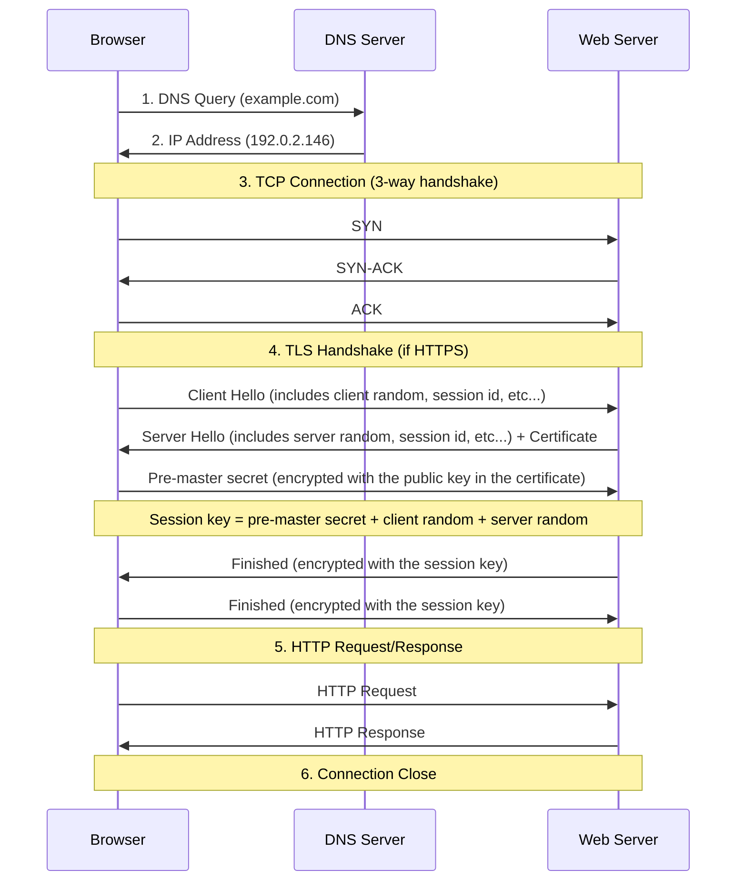

# Network Protocols

Network protocols define how devices communicate across networks.

## TCP/IP Network Model

The TCP/IP model provides a layered approach to network communication, with each layer serving specific functions.

### Layer Functions

**1. Application Layer**

- Provides network services to applications
- Handles user interfaces and data formatting
- **Protocols**: HTTP/HTTPS, FTP, SMTP, DNS, SSH

**2. Transport Layer**

- Ensures reliable end-to-end communication
- Handles flow control, error detection, and recovery
- **Protocols**: TCP (reliable), UDP (fast)

**3. Internet Layer**

- Routes packets across networks
- Handles addressing and fragmentation
- **Protocols**: IP (IPv4/IPv6), ICMP, ARP

**4. Link Layer**

- Manages physical network connections
- Handles frame transmission and error detection
- **Protocols**: Ethernet, Wi-Fi, PPP

## Data Encapsulation Process

Each layer adds its own header (and sometimes trailer) to the data from the layer above.

### Encapsulation Steps

**1. Application Layer**

- Data: HTTP request, email message, file content
- Format: Protocol-specific (JSON, HTML, binary)

**2. Transport Layer**

- **TCP Segments**: Include sequence numbers, acknowledgment numbers, window size
- **UDP Datagrams**: Include source/destination ports, length, checksum
- Adds: Port information, flow control, error detection

**3. Internet Layer**

- **IP Packets**: Include source/destination IP addresses, TTL, protocol type
- Adds: Routing information, fragmentation control, quality of service

**4. Link Layer**

- **Frames**: Include source/destination MAC addresses, frame type, CRC
- Adds: Physical addressing, error detection, frame boundaries

### TCP vs UDP Trade-offs

| Feature          | TCP                       | UDP                    |
|------------------|---------------------------|------------------------|
| **Reliability**  | Guaranteed delivery       | Best effort            |
| **Ordering**     | In-order delivery         | No ordering guarantee  |
| **Connection**   | Connection-oriented       | Connectionless         |
| **Overhead**     | Higher (20+ bytes)        | Lower (8 bytes)        |
| **Flow Control** | Yes                       | No                     |
| **Use Cases**    | Web, email, file transfer | Gaming, streaming, DNS |

## What happens when you type example.com in browser?

### Detailed Steps

**1. DNS Resolution**

- Browser checks cache (browser → OS → router → ISP)
- DNS query for A record (IPv4) or AAAA record (IPv6)

**2. TCP Connection Establishment**

- Three-way handshake (SYN → SYN-ACK → ACK)
- Establishes reliable communication channel

**3. TLS Handshake (HTTPS only)**

- Certificate verification and cipher negotiation
- Establishes encrypted communication

**4. HTTP Request**

- Includes headers (Host, User-Agent, Accept, etc.)
- May include cookies, authentication tokens

**5. Server Processing**

- Route handling, business logic execution
- Database queries, cache lookups

**6. HTTP Response**

- Status code, headers, body content
- Caching directives, content encoding

**7. Response Processing**

- Parse headers (redirects, caching, compression)
- Decompress content (gzip, brotli)
- Render content (HTML parsing, CSS, JavaScript)

**8. Connection Management**

- HTTP/1.1: Keep-alive or close
- HTTP/2: Multiplexed streams
- HTTP/3: QUIC protocol over UDP

### Performance Considerations

**Connection Reuse**: HTTP/1.1 keep-alive, HTTP/2 multiplexing
**Compression**: gzip, brotli for text content
**Caching**: Browser cache, CDN, proxy servers
**DNS**: Pre-resolution, DNS-over-HTTPS (DoH)

## Further References

- [TCP/IP Protocol Suite](https://en.wikipedia.org/wiki/Internet_protocol_suite)
- [How the TCP/IP Protocols Handle Data Communications](https://docs.oracle.com/cd/E26505_01/html/E27061/ipov-29.html)
- [What Happens When You Type google.com Into Your Browser?](https://github.com/alex/what-happens-when)
- [TLS Handshake Explained](https://www.cloudflare.com/learning/ssl/what-happens-in-a-tls-handshake)
- [HTTP/2 vs HTTP/3](https://blog.cloudflare.com/http-3-vs-http-2/)
