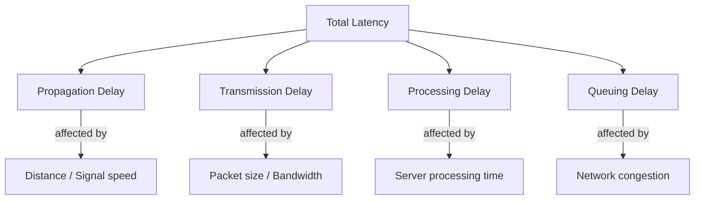
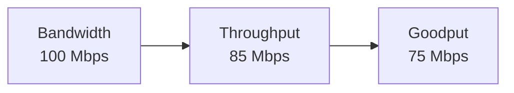
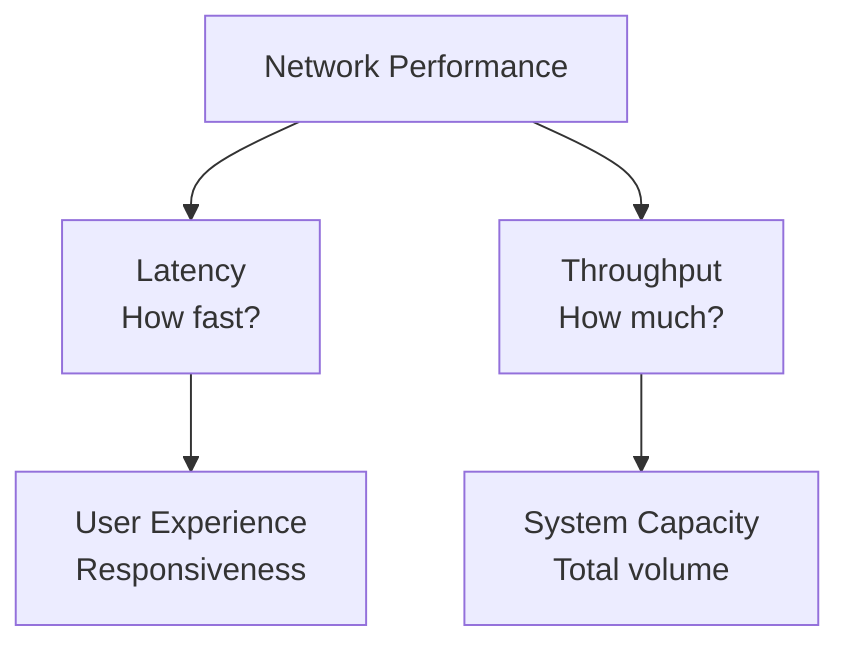
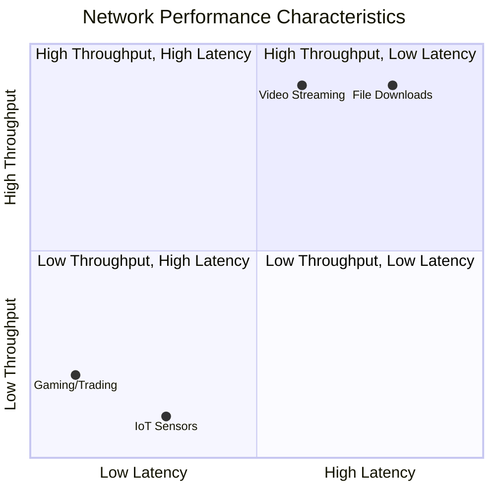
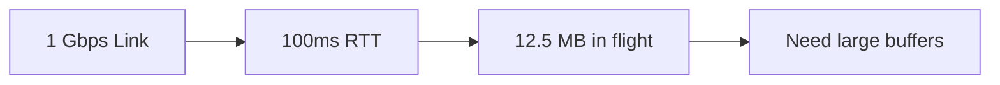

# Latency and Throughput

Latency and throughput are key metrics used to measure network/system performance.

They work together to determine overall connectivity and efficiency, with each affecting the other.

## Latency

**Definition**: Time delay between sending a request and receiving a response.

**Measured in**: Milliseconds (ms) or microseconds (μs)

**Components of Latency:**

**Types:**

- **Network Latency**: Time for packet to travel across network
- **Application Latency**: Time for application to process request
- **Database Latency**: Time for database query execution
- **Disk Latency**: Time for disk I/O operations

## Throughput

**Definition**: Amount of data successfully transmitted/processed per unit time.

**Measured in**: bits per second (bps), megabits per second (Mbps), or gigabits per second (Gbps)

**Key Distinction:**

- **Bandwidth**: Theoretical maximum capacity of a link/system
- **Throughput**: Actual data transfer/processing rate achieved
- **Goodput**: Useful data transfer/processing rate (excluding headers, retransmissions, errors)

## Relationship Between Latency and Throughput

**Common Misconception**: High bandwidth always means low latency

**Reality**: They measure different aspects and can be independent

## Performance Trade-offs

### Latency vs Throughput Examples

## Optimization Strategies

### Reducing Latency

**Geographic Distribution:**

- Content Delivery Networks (CDNs)
- Edge computing and regional data centers
- Anycast routing

**Protocol Optimization:**

- HTTP/2 multiplexing (eliminates head-of-line blocking)
- HTTP/3 with QUIC (faster connection setup)
- Connection pooling and keep-alive

**Application-Level:**

- Database query optimization
- Efficient processing of requests
- Asynchronous processing

**Network-Level:**

- Reduce network hops
- Quality of Service (QoS) prioritization
- Direct peering agreements

### Improving Throughput

**Bandwidth Scaling:**

- Increase link capacity
- Load balancing across multiple connections
- Network interface bonding

**Compression:**

- gzip/brotli for text content
- Image and video compression
- Protocol-level compression

**Concurrency:**

- Parallel processing
- Pipelining requests
- Batch operations

**Caching Strategies:**

- Browser caching
- Reverse proxy caching
- Application-level caching

## Real-World Considerations

### Bandwidth-Delay Product

**Formula**: Bandwidth × Round-Trip Time = Amount of data "in flight"

**Impact**: Determines optimal TCP window size and buffer requirements

### Little's Law Application

**Formula**: Average number of requests = Arrival rate × Average response time

**Usage**: Capacity planning and performance modeling

### Common Bottlenecks

**Latency Bottlenecks:**

- Physical distance (speed of light limitation)
- DNS resolution time
- TLS handshake overhead
- Database query performance

**Throughput Bottlenecks:**

- Network bandwidth limits
- Server CPU/memory resources
- Database connection pools
- Disk I/O capacity

## Further References

- [What's the Difference Between Throughput and Latency?](https://aws.amazon.com/compare/the-difference-between-throughput-and-latency/)
- [CDN Performance Optimization](https://www.cloudflare.com/learning/cdn/performance/)
