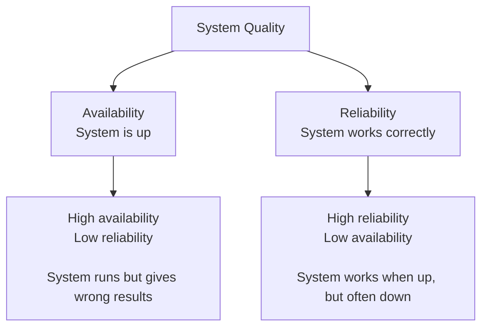
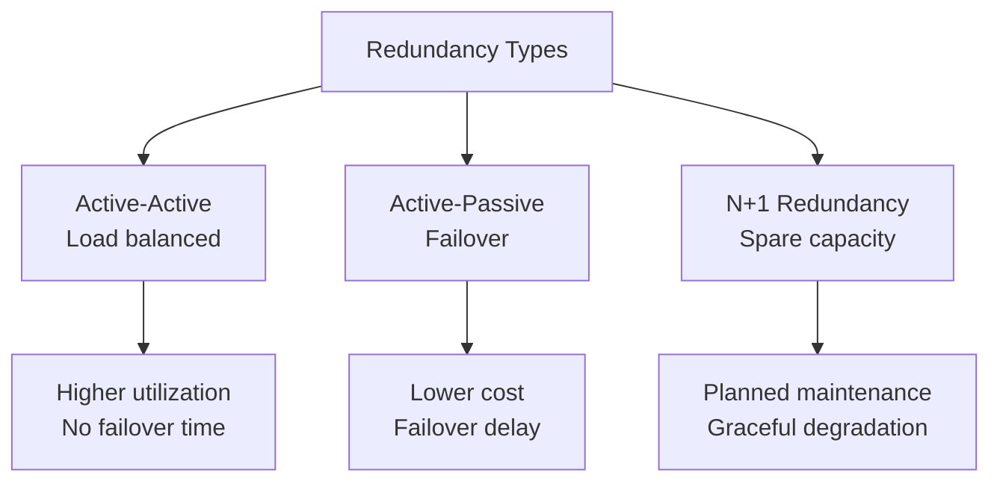

# Availability and Reliability

Availability and reliability are key metrics that define the overall dependability of a system:

- Availability measures the percentage of time a system remains operational and accessible when required.
- Reliability measures the probability that a system consistently performs correctly ts intended function within a given time period.

## Key Concepts

### Availability vs Reliability

**Availability**: System is operational when needed

- Focus: Uptime percentage
- Measure: Time-based
- Question: "Is the system running?"

**Reliability**: System performs correctly without failure

- Focus: Error-free operation
- Measure: Probability-based  
- Question: "Does the system work correctly?"

## High Availability (HA)

HA systems are designed to remain operational with minimal downtime, typically achieving 99.9% (three nines) or higher availability.

## Availability Levels ("Nines")

Availability is typically expressed as a percentage, with "nines" referring to the number of 9s in the percentage.

| Availability         | Downtime per year |
|----------------------|-------------------|
| 90% (one nine)       | 36.53 days        |
| 99% (two nines)      | 3.65 days         |
| 99.9% (three nines)  | 8.77 hours        |
| 99.99% (four nines)  | 52.6 minutes      |
| 99.999% (five nines) | 5.3 minutes       |

Typically, each additional nine costs 10x more to achieve and maintain.

## Achieving High Availability

### Redundancy Strategies

### Common Patterns

**1. Load Balancing**

- Distributes traffic across multiple instances
- Removes single points of failure
- Enables horizontal scaling

**2. Health Checks**

- Continuous monitoring of system components
- Automatic removal of unhealthy instances
- Circuit breaker patterns

**3. Geographic Distribution**

- Multi-region deployments
- DNS failover
- Content delivery networks (CDNs)

**4. Database Strategies**

- Master-slave replication
- Multi-master setups
- Database clustering
- Backup and recovery procedures

## Challenges and Considerations

### The Reliability Paradox

- Adding more components can decrease overall reliability
- Each component introduces potential failure points
- System complexity increases maintenance burden

### Error Budgets

**Concept**: Acceptable amount of unreliability
**Formula**: Error Budget = 1 - SLO
**Example**: 99.9% SLO = 0.1% error budget = 43.8 minutes/month or 100 errors/month

### Testing for Availability

**Chaos Engineering**: Intentionally introducing failures to test system resilience
**Disaster Recovery Drills**: Regular testing of recovery procedures
**Load Testing**: Verifying system behavior under stress
**Failure Mode and Effect Analysis (FMEA)**: Identifying potential points of failure

## Reference Materials

- [High Availability Wikipedia](https://en.wikipedia.org/wiki/High_availability)
- [The Calculus of Service Availability](https://queue.acm.org/detail.cfm?id=3096459)
