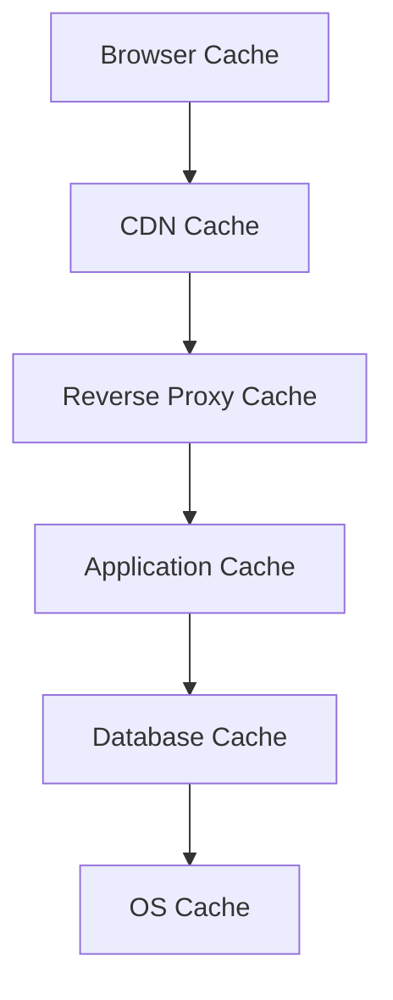
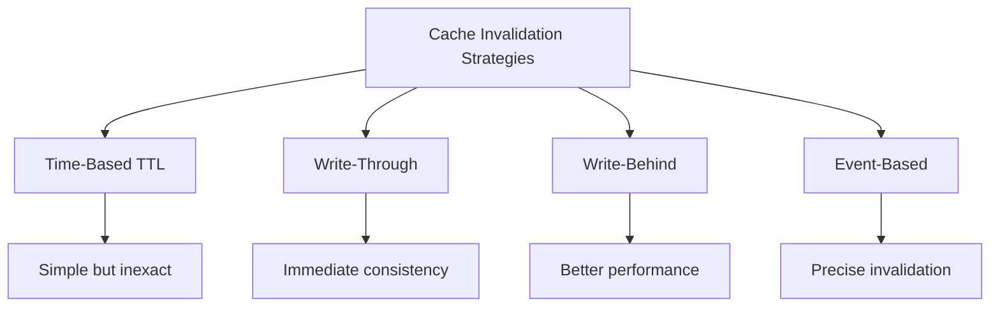
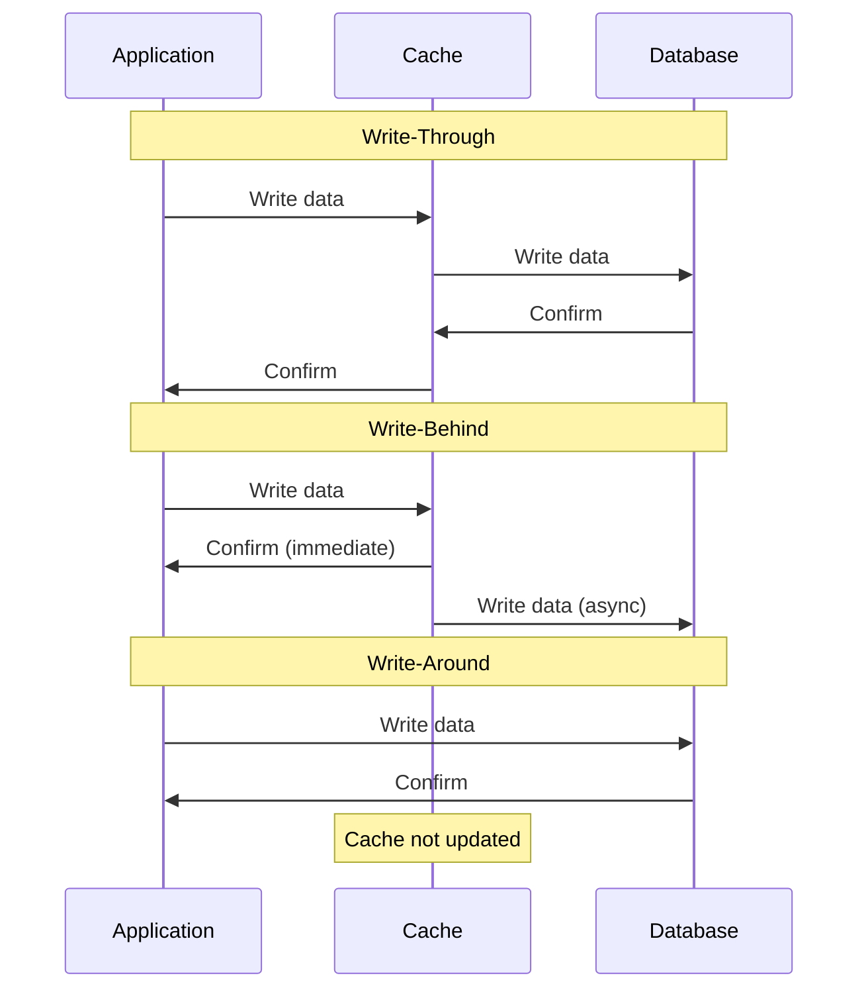
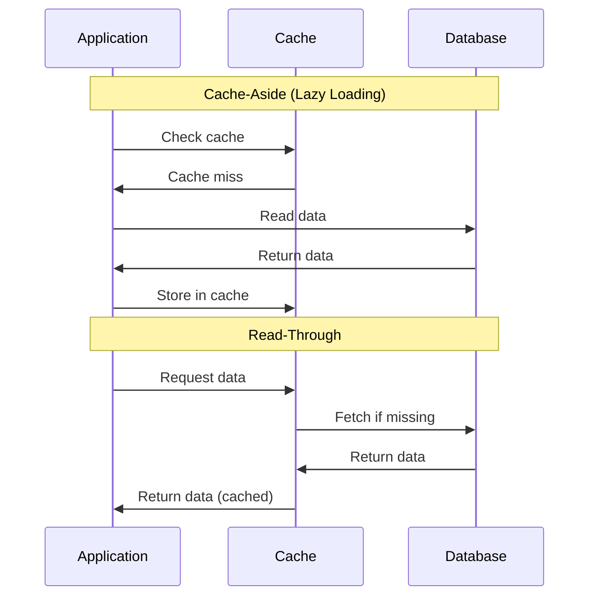
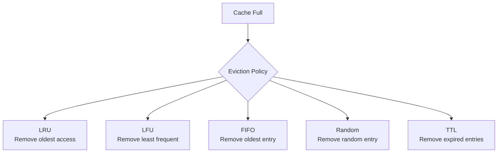

# Caching

Caching stores frequently accessed data in faster storage to reduce latency, improve performance, and decrease load on primary data sources.

## When to Use Caching

**Ideal Scenarios:**

- High read-to-write ratios
- Expensive computations or database queries
- Slow external API calls
- Static or infrequently changing data
- Geographic distribution needs

**Trade-offs:**

- ✅ Improves response times
- ✅ Reduces database load and costs
- ✅ Better user experience
- ❌ Data staleness issues
- ❌ Cache invalidation complexity
- ❌ Additional infrastructure overhead

## Cache Levels

Caching exists at multiple levels in modern systems, each with specific benefits and trade-offs.

### Cache Types by Location

**1. Client-Side Caching**

- **Browser Cache**: Stores static assets (CSS, JS, images)
- **Application Cache**: Mobile apps, desktop applications
- **Benefits**: Reduced server requests, offline capability
- **Challenges**: Limited control, cache size constraints

**2. Server-Side Caching**

- **In-Memory Cache**: Redis, Memcached - fastest access
- **Application Cache**: Within application process (local cache)
- **Benefits**: Full control, consistent performance
- **Challenges**: Memory limitations

**3. Distributed Caching**

- **Multi-node cache clusters**: Data spread across nodes
- **Benefits**: Scalability, fault tolerance
- **Challenges**: Network latency, consistency complexity

**4. Web Caching**

- **CDN (Content Delivery Network)**: Geographic distribution
- **Reverse Proxy**: Nginx, Varnish
- **Benefits**: Global performance, reduced origin load
- **Challenges**: Cache invalidation across nodes

## Cache Invalidation Strategies

Managing data freshness is one of the hardest problems in caching.

### Invalidation Approaches

**1. Time-To-Live (TTL)**

- Set expiration time for cached data
- ✅ Simple to implement
- ❌ May serve stale data or invalidate fresh data

**2. Write-Through Invalidation**

- Update cache immediately when data changes
- ✅ Data always fresh
- ❌ Higher write latency

**3. Write-Behind Invalidation**

- Invalidate cache, update database asynchronously
- ✅ Lower write latency
- ❌ Risk of data loss

**4. Event-Based Invalidation**

- Publish events when data changes
- ✅ Precise invalidation
- ❌ Complex to implement

**5. Versioning**

- Associate version numbers with cached data
- ✅ Prevents serving stale data
- ❌ Additional metadata overhead

## Caching Patterns

Different patterns for reading and writing cached data, each with specific use cases and trade-offs.

### Write Patterns

**Write-Through**

- Write to cache and database simultaneously
- ✅ Data consistency guaranteed
- ✅ Cache always fresh
- ❌ Higher write latency
- **Use case**: Critical data, strong consistency needs

**Write-Behind (Write-Back)**

- Write to cache immediately, database asynchronously
- ✅ Lower write latency
- ✅ Better write performance
- ❌ Risk of data loss
- **Use case**: High write loads, eventual consistency acceptable

**Write-Around**

- Write directly to database, bypass cache. The cache is only populated if the same data is subsequently read.
- ✅ Prevents cache pollution
- ✅ Good for infrequently read data
- ❌ Cache misses on subsequent reads
- **Use case**: Write-heavy workloads with rare reads

### Read Patterns

**Cache-Aside (Lazy Loading)**

- Application manages cache manually
- ✅ Full control over caching logic
- ✅ Flexible data transformation
- ❌ Code complexity increases
- **Use case**: Custom caching logic, data transformation needed

**Read-Through**

- The caching layer automatically queries the database, populates itself with the data, and then returns the data to the application.
- ✅ Simplified application code
- ✅ Automatic cache population
- ❌ Limited flexibility
- **Use case**: Simple caching, no data transformation

## Cache Eviction Policies

When cache reaches capacity, eviction policies determine which data to remove.

### Common Eviction Algorithms

| Policy     | How it Works                  | Best For                           | Implementation               |
|------------|-------------------------------|------------------------------------|------------------------------|
| **LRU**    | Removes least recently used   | General purpose, temporal locality | Doubly-linked list + HashMap |
| **LFU**    | Removes least frequently used | Stable access patterns             | Counter + Min-heap           |
| **FIFO**   | Removes oldest entries        | Simple, predictable behavior       | Queue                        |
| **Random** | Removes random entries        | Low overhead, simple               | Random selection             |
| **TTL**    | Removes expired entries       | Time-sensitive data                | Timer-based cleanup          |

### Advanced Eviction Strategies

- **Adaptive Replacement Cache (ARC)**: Balances between LRU and LFU
- **Clock Algorithm**: Approximates LRU with less overhead
- **W-TinyLFU**: Window-based LFU with bloom filters

## Further References

- [Caching Best Practices](https://aws.amazon.com/caching/best-practices/)
- [Introduction to Database Caching](https://www.prisma.io/dataguide/managing-databases/introduction-database-caching)
- [Cache Eviction Policies](https://www.codecademy.com/article/cache-eviction-policies)
- [The Complexity of Caching](https://codeopinion.com/the-complexity-of-caching/)
- [Cache invalidation isn’t a hard problem](https://codeopinion.com/cache-invalidation-isnt-a-hard-problem/)
- [Cache-Friendly Code](https://gameprogrammingpatterns.com/data-locality.html)
