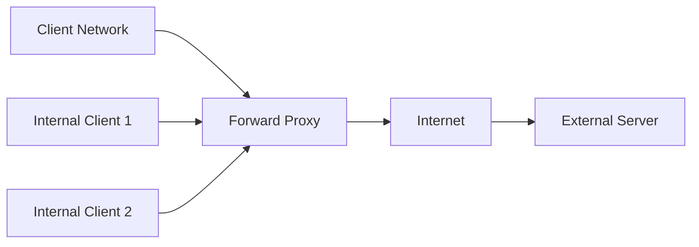
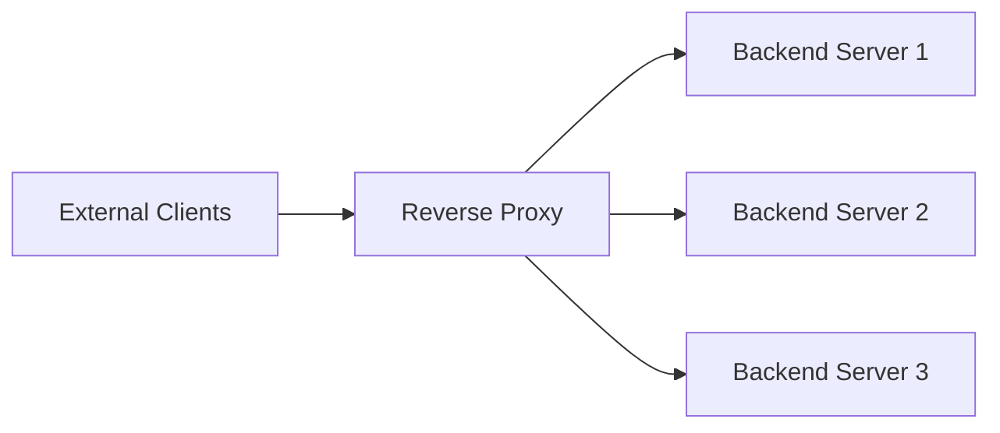

# Proxies

Proxies are intermediary servers that sit between clients and backend servers, intercepting and forwarding requests.

**Key Benefits:**

- Security and anonymity
- Performance optimization (caching, compression)
- Load distribution and failover
- Content filtering and access control
- Protocol translation and API gateway functionality

## Proxy Types Overview

There are two main types of proxies: forward proxies and reverse proxies.

## Forward Proxy

Forward proxies act on behalf of clients, sitting between internal networks and external servers.

**Request Flow**: Client → Forward Proxy → External Server

### Use Cases & Benefits

**1. Corporate Network Security**

- Content filtering and malware protection
- URL blacklisting and whitelisting
- Monitor and log employee internet usage

**2. Anonymity & Privacy**

- Hide client IP addresses from external servers
- Bypass geographic restrictions
- Protect user identity online

**3. Performance Optimization**

- Cache frequently accessed content
- Compress responses to save bandwidth
- Reduce external API calls

**4. Access Control**

- Authenticate users before internet access
- Enforce company policies
- Block inappropriate or malicious websites

## Reverse Proxy

Reverse proxies act on behalf of servers, sitting between external clients and internal backend services.

**Request Flow**: External Client → Reverse Proxy → Backend Servers

### Use Cases & Benefits

**1. Load Balancing**

- Distribute requests across multiple backend servers
- Health checking and automatic failover
- Session persistence and sticky sessions

**2. SSL/TLS Termination**

- Offload encryption/decryption from backend servers
- Centralized certificate management
- Reduced computational overhead on application servers

**3. Caching & Performance**

- Cache static content and API responses
- Gzip compression for smaller payloads
- Connection pooling and keep-alive optimization

**4. Security & Protection**

- Hide backend server details from clients
- DDoS protection and rate limiting
- Web Application Firewall (WAF) functionality
- Request/response filtering

**5. API Gateway Functionality**

- Authentication and authorization
- Request routing and transformation
- API versioning and backwards compatibility

## Proxy vs Load Balancer

While often confused, proxies and load balancers serve different primary purposes:

| Aspect               | Reverse Proxy                      | Load Balancer                      |
|----------------------|------------------------------------|------------------------------------|
| **Primary Purpose**  | Security, caching, SSL termination | Traffic distribution               |
| **Traffic Handling** | Can modify requests/responses      | Typically passes through unchanged |
| **Intelligence**     | Application-aware processing       | Network-level distribution         |
| **Use Cases**        | API Gateway, CDN, Security         | High availability, scaling         |

**Note**: Many modern solutions (like Nginx, HAProxy) can function as both reverse proxies and load balancers.

## Reference Materials

- [Proxy Server Overview](https://en.wikipedia.org/wiki/Proxy_server)
- [Understanding Reverse Proxies](https://www.cloudflare.com/learning/cdn/glossary/reverse-proxy/)
