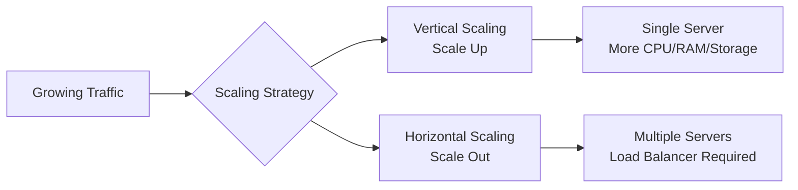
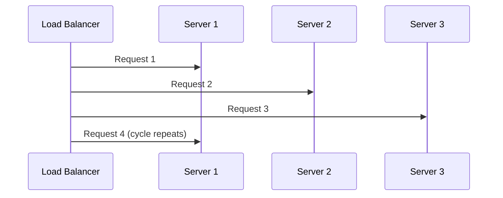
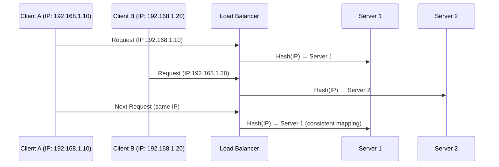
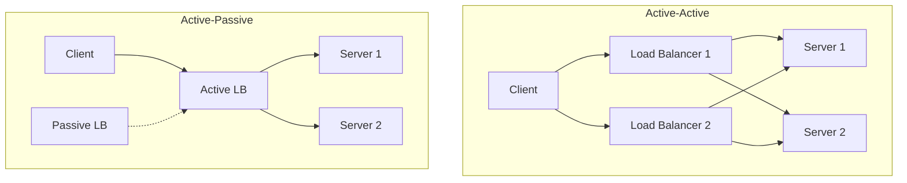

# Load Balancing

Load balancing distributes incoming requests across multiple servers to prevent any single server from becoming overwhelmed.

**Core Benefits:**

- Prevents server overload and bottlenecks
- Improves application availability and fault tolerance
- Enables horizontal scaling for growing traffic
- Optimizes resource utilization across infrastructure

## Scaling Strategies

Understanding scaling approaches helps determine when load balancing becomes necessary.

### Vertical Scaling (Scale Up)

**Approach**: Add more compute resources to existing machines

- Upgrade CPU, memory, storage on single server
- ✅ Simple to implement, no architecture changes
- ✅ No load balancing complexity
- ❌ Hardware limits and diminishing returns
- ❌ Expensive at scale

### Horizontal Scaling (Scale Out)

**Approach**: Add more machines to resource pool

- Distribute load across multiple servers
- ✅ Nearly unlimited scaling potential
- ✅ Better fault tolerance and redundancy
- ✅ Cost-effective with commodity hardware
- ❌ Increased complexity and coordination
- ❌ Requires load balancing and state management

## Load Balancing Algorithms

Different algorithms optimize for various factors like simplicity, performance, and session management.

Load balancing algorithms can be categorized into two types:

- **Static algorithms**: The mapping of requests to servers is determined in advance using fixed rules.
- **Dynamic algorithms**: Decisions are made in real-time, based on current server load or performance metrics.

### Static Algorithms

**Round Robin**

- Distributes requests sequentially across servers
- ✅ Simple implementation, predictable distribution
- ✅ Works well with homogeneous servers
- ❌ Doesn't consider server capacity or current load
- **Use case**: Equal-capacity servers, stateless applications

**Weighted Round Robin**

- Assigns weights based on server capacity
- More powerful servers receive proportionally more requests
- ✅ Accounts for different server capacities
- ❌ Static weights don't adapt to real-time conditions
- **Use case**: Heterogeneous server configurations

**IP Hash (Consistent Assignment)**

- Uses client IP to determine target server
- Same client always routes to same server
- ✅ Maintains session affinity without sticky sessions
- ❌ Uneven distribution if clients cluster by IP
- **Use case**: Session-dependent applications, caching benefits

### Dynamic Algorithms

**Least Connections**

- Routes to server with fewest active connections
- ✅ Better load distribution than round robin
- ✅ Adapts to varying request processing times
- ❌ Requires connection tracking overhead
- **Use case**: Long-lived connections, varying request complexity

**Least Response Time**

- Considers both connection count and response time
- Routes to server with fastest response + fewest connections
- ✅ Optimizes for performance
- ❌ Higher computational overhead
- **Use case**: Performance-critical applications

**Resource-Based (Adaptive)**

- Uses real-time server metrics (CPU, memory, custom metrics)
- ✅ Most intelligent load distribution
- ✅ Adapts to server health and capacity
- ❌ Complex implementation and monitoring required
- **Use case**: Critical applications, heterogeneous environments

## Load Balancer Types

Load balancers can be implemented at different layers and using various technologies.

### By Implementation

**Hardware Load Balancers**

- Dedicated physical appliances (F5, Citrix NetScaler)
- ✅ High performance and throughput
- ✅ Advanced features and optimization
- ❌ Expensive and vendor lock-in
- ❌ Limited scalability and flexibility

**Software Load Balancers**

- Applications running on standard servers (Nginx, HAProxy)
- ✅ Cost-effective and flexible
- ✅ Easy to scale and customize
- ❌ Limited by server hardware capacity
- ❌ Requires more management overhead

**Cloud Load Balancers**

- Managed services (AWS ALB/ELB, Google Cloud Load Balancer)
- ✅ Fully managed, auto-scaling
- ✅ Integrated with cloud ecosystem
- ❌ Vendor lock-in and pricing concerns
- ❌ Less control over configuration

## High Availability Patterns

Understanding deployment patterns helps design resilient load balancing architectures.

### Active-Active Configuration

**Architecture**: Multiple load balancers handle traffic simultaneously

- All nodes actively process requests
- DNS round-robin or BGP routing distributes traffic
- ✅ Higher availability and resource utilization
- ✅ Better performance and scalability
- ❌ Complex synchronization and state management
- ❌ Potential split-brain scenarios

### Active-Passive Configuration

**Architecture**: Primary load balancer handles traffic, backup on standby

- Single active node, others in standby mode
- Failover mechanism activates backup when primary fails
- ✅ Simpler implementation and management
- ✅ Lower cost with idle backup resources
- ❌ Wasted standby resources and lower availability
- ❌ Failover time impacts availability

### Decision Matrix

| Requirement               | Recommended Algorithm | Why                               |
|---------------------------|-----------------------|-----------------------------------|
| **Simple setup**          | Round Robin           | Easy to implement and understand  |
| **Session persistence**   | IP Hash               | Maintains client-server affinity  |
| **Heterogeneous servers** | Weighted Round Robin  | Accounts for capacity differences |
| **Long connections**      | Least Connections     | Better for persistent connections |
| **Performance critical**  | Least Response Time   | Optimizes for latency             |
| **Dynamic environments**  | Resource-Based        | Adapts to real-time conditions    |

## Further References

- [Horizontal vs Vertical Scaling](https://www.digitalocean.com/resources/article/horizontal-scaling-vs-vertical-scaling)
- [What Is Load Balancing?](https://www.nginx.com/resources/glossary/load-balancing/)
- [Active-Active vs Active-Passive Systems](https://www.youtube.com/watch?v=d-Bfi5qywFo&ab_channel=HusseinNasser)
