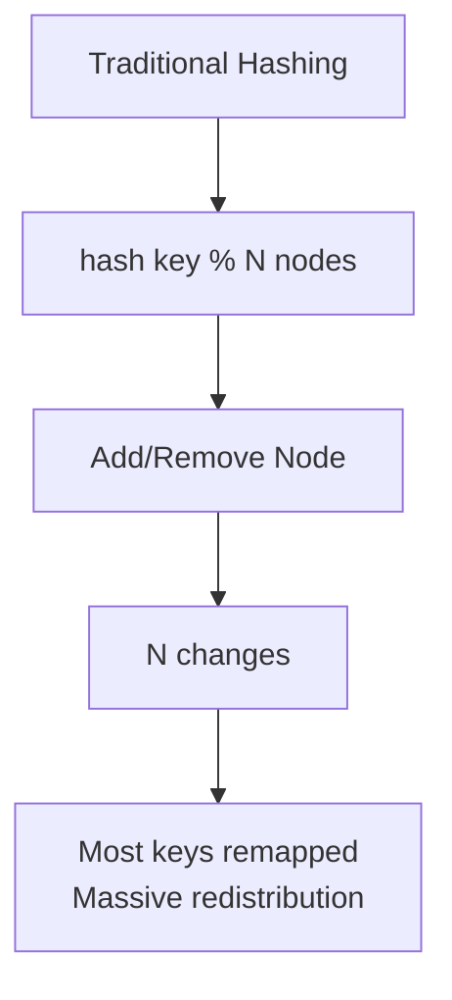
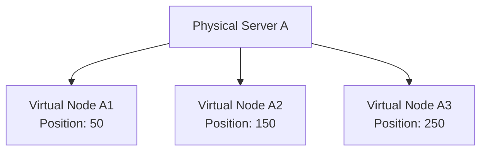
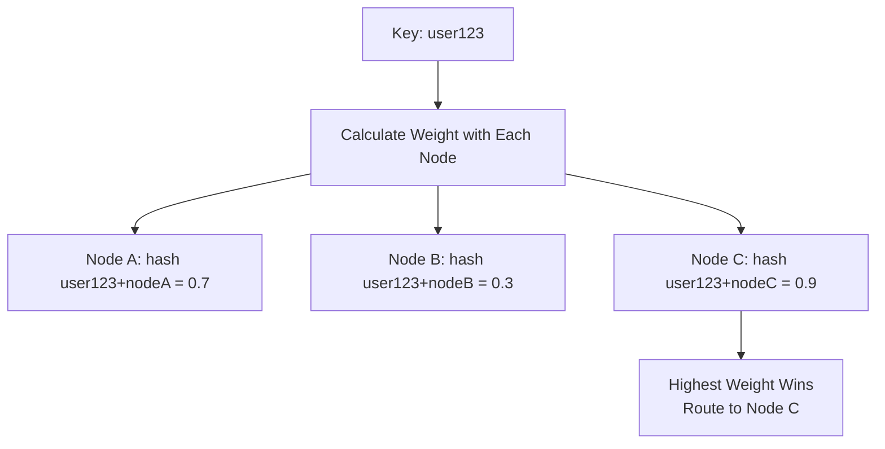
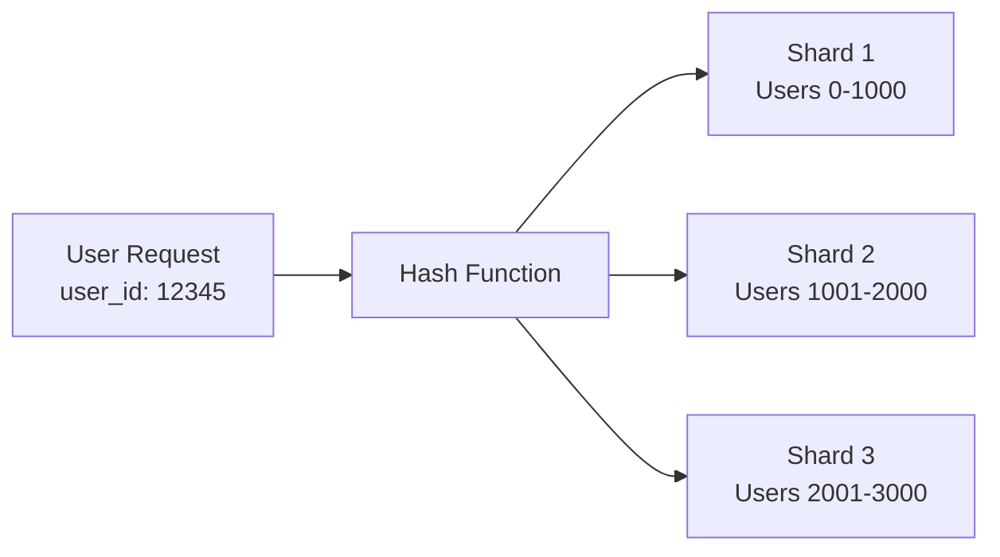

# Hashing

Hashing transforms input data into fixed-size values through mathematical functions.

In distributed systems, hashing is crucial for data distribution, load balancing, and consistent partitioning across multiple nodes.

**Key Properties:**

- **Deterministic**: Same input always produces same output
- **Uniform Distribution**: Hash values spread evenly across output space
- **Fixed Output Size**: Consistent hash length regardless of input size
- **Avalanche Effect**: Small input changes cause large output changes

## Cryptographic Hash Functions

**Purpose**: Security, integrity verification, digital signatures

| Algorithm   | Output Size | Security          | Use Cases                         |
|-------------|-------------|-------------------|-----------------------------------|
| **MD5**     | 128-bit     | ❌ Broken          | Legacy systems only               |
| **SHA-1**   | 160-bit     | ❌ Deprecated      | Avoid for new systems             |
| **SHA-256** | 256-bit     | ✅ Secure          | Digital signatures, blockchain    |
| **SHA-3**   | Variable    | ✅ Latest standard | Modern cryptographic applications |

## Non-Cryptographic Hash Functions

**Purpose**: Fast hashing for data structures, load balancing

| Algorithm      | Speed          | Quality   | Use Cases                        |
|----------------|----------------|-----------|----------------------------------|
| **MurmurHash** | Very Fast      | Good      | Hash tables, caches              |
| **CityHash**   | Fast           | Good      | Google's general-purpose hashing |
| **xxHash**     | Extremely Fast | Excellent | High-performance applications    |

**Trade-offs:**

- ✅ Much faster than cryptographic hashes
- ✅ Good distribution properties
- ❌ Not secure against malicious attacks
- ❌ Not suitable for security purposes

## Hash Distribution and Uniformity

Good hash functions distribute values uniformly across the output space to minimize collisions and ensure balanced load distribution.

**Factors Affecting Distribution:**

- **Input Data Patterns**: Real-world data often has patterns that can cause skew
- **Hash Function Quality**: Poor functions create clustering
- **Output Space Size**: Larger spaces reduce collision probability

## Distributed Hashing Techniques

Hashing in distributed systems requires special considerations for node changes and data rebalancing.

## Consistent Hashing

Consistent hashing solves the redistribution problem when nodes are added or removed from a distributed system.

### Traditional Hashing Problems



**Problem**: When servers change, `hash(key) % server_count` changes for most keys, causing massive data movement.

### Consistent Hashing Solution

**Benefits:**

- ✅ Adding/removing nodes only affects adjacent keys
- ✅ Minimal data redistribution (O(K/N) keys affected)
- ✅ Maintains load balance with virtual nodes

### Implementation Details

**Virtual Nodes (Replicas)**
To improve load distribution, each physical node is mapped to multiple positions on the ring.



**Kind of like this Implementation:**

```python
class ConsistentHash:
    def __init__(self, replicas=3):
        self.replicas = replicas
        self.ring = {}
        self.sorted_keys = []
    
    def add_node(self, node):
        for i in range(self.replicas):
            key = self.hash(f"{node}:{i}")
            self.ring[key] = node
            self.sorted_keys.append(key)
        self.sorted_keys.sort()
    
    def remove_node(self, node):
        for i in range(self.replicas):
            key = self.hash(f"{node}:{i}")
            del self.ring[key]
            self.sorted_keys.remove(key)
    
    def get_node(self, key):
        if not self.ring:
            return None
        
        hash_key = self.hash(key)
        # Find first node clockwise
        for node_key in self.sorted_keys:
            if node_key >= hash_key:
                return self.ring[node_key]
        # Wrap around to first node
        return self.ring[self.sorted_keys[0]]
```

## Rendezvous Hashing (HRW)

Alternative approach where each node computes a weight for each key, and the highest weight wins.



**Kind of like this Implementation:**

```python
def get_node_hrw(key, nodes):
    max_weight = -1
    selected_node = None
    
    for node in nodes:
        # Combine key and node, then hash
        weight = hash(f"{key}:{node}")
        if weight > max_weight:
            max_weight = weight
            selected_node = node
    
    return selected_node
```

**Rendezvous vs Consistent Hashing:**

| Aspect           | Consistent Hashing             | Rendezvous Hashing                 |
|------------------|--------------------------------|------------------------------------|
| **Simplicity**   | More complex (ring management) | Simpler (direct calculation)       |
| **Performance**  | O(log N) lookup                | O(N) calculation per lookup        |
| **Load Balance** | Good (with virtual nodes)      | Excellent (mathematically uniform) |
| **Node Changes** | Minimal redistribution         | Minimal redistribution             |
| **Use Cases**    | Large-scale systems            | Smaller node counts                |

## Real-World Applications

### Database Sharding



**Use Cases:**

- **Distributed Databases**: MongoDB, Cassandra use consistent hashing for data distribution
- **Caching Systems**: Redis Cluster, Memcached distribute cache entries
- **Load Balancing**: Route requests to backend servers
- **CDN Edge Selection**: Choose nearest edge server for content delivery

## Performance Considerations

### Hash Function Selection

**For Security:**

- Use SHA-256 or SHA-3 for cryptographic needs
- Avoid MD5 and SHA-1 for new applications

**For Performance:**

- Use MurmurHash3 or xxHash for non-cryptographic needs
- Consider CityHash for Google-compatible systems

**For Distributed Systems:**

- Consistent hashing for dynamic node environments
- Rendezvous hashing for smaller, stable clusters

### Common Pitfalls

**Poor Hash Distribution:**

- Using sequential keys can create hotspots
- Consider adding randomness or using compound keys

**Node Imbalance:**

- Use sufficient virtual nodes (100-200 per physical node)
- Monitor and adjust based on actual load patterns

**Cascading Failures:**

- Implement health checks and failover mechanisms
- Use multiple hash rings for redundancy

## Reference Materials

- [Hashing Algorithms Overview](https://jscrambler.com/blog/hashing-algorithms)
- [Consistent Hashing Deep Dive](https://www.toptal.com/big-data/consistent-hashing)  
- [Consistent Hashing Tradeoffs](https://dgryski.medium.com/consistent-hashing-algorithmic-tradeoffs-ef6b8e2fcae8)
- [Amazon DynamoDB Partitioning](https://docs.aws.amazon.com/amazondynamodb/latest/developerguide/HowItWorks.Partitions.html)
- [Cassandra Dataset Partitioning using Consistent Hashing](https://cassandra.apache.org/doc/latest/cassandra/architecture/dynamo.html#dataset-partitioning-consistent-hashing)
