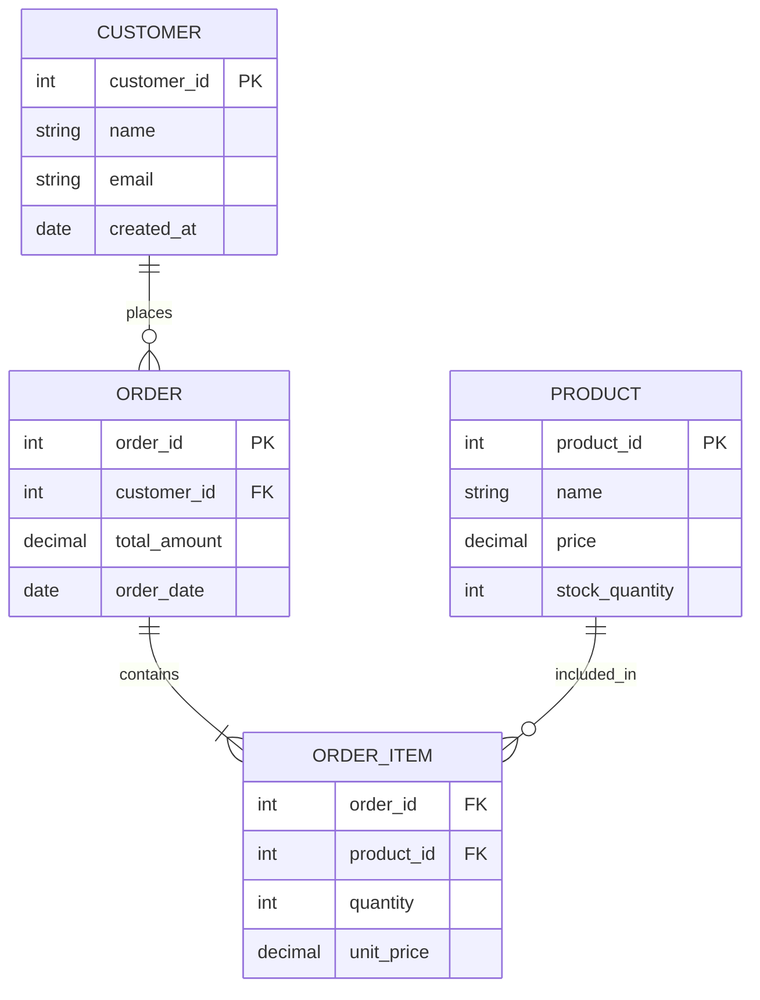
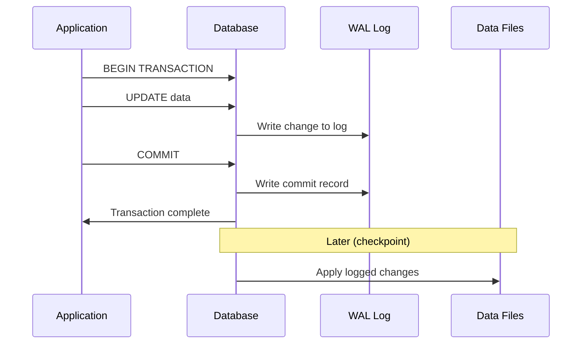
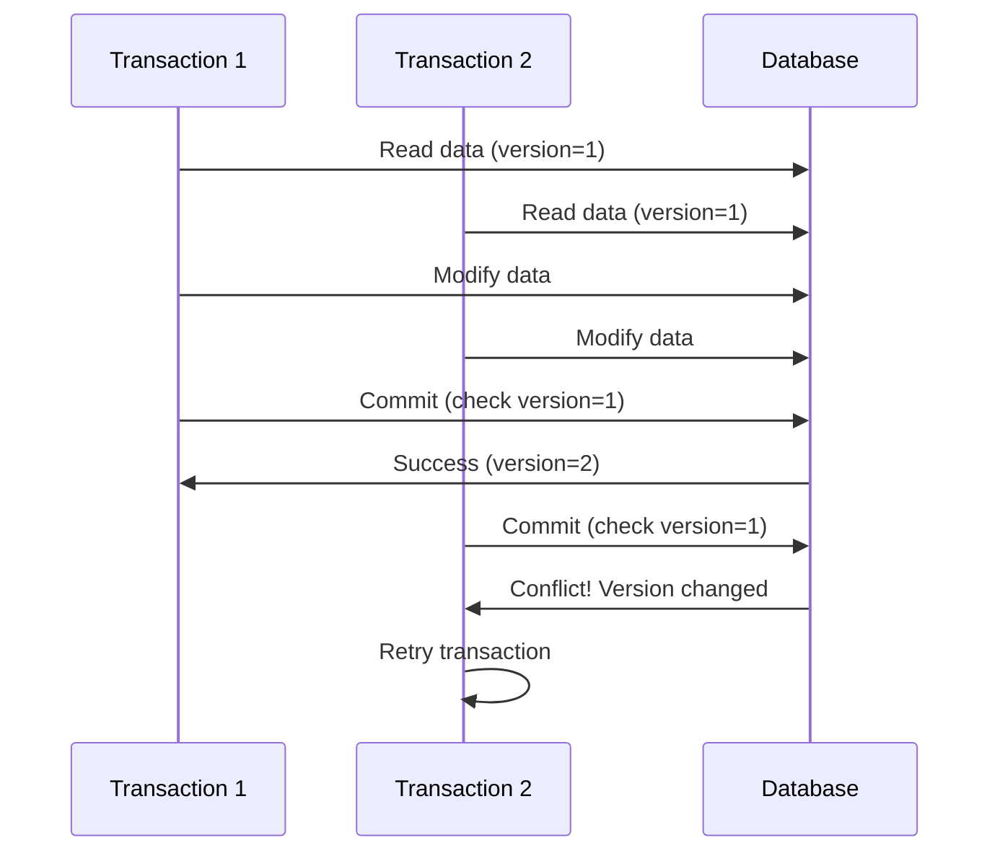

# Relational Databases

Relational databases organize data in structured tables with rows and columns, using mathematical relations to link data across tables.



**Core Components:**

- **Tables**: Structured data storage representing entities (Customers, Orders)
- **Rows**: Individual records containing specific data instances
- **Columns**: Attributes defining data types and constraints
- **Primary Keys**: Unique identifiers for each row
- **Foreign Keys**: References establishing relationships between tables
- **Indexes**: Data structures improving query performance

## SQL (Structured Query Language)

SQL provides a standardized interface for relational database operations, supporting complex queries, transactions, and data integrity constraints.

**SQL Operation Categories**:

- Data Query Language (DQL): `SELECT`
- Data Manipulation Language (DML): `INSERT`, `UPDATE`, `DELETE`
- Data Definition Language (DDL): `CREATE`, `ALTER`, `DROP`
- Data Control Language (DCL): `GRANT`, `REVOKE`
- Transaction Control Language (TCL): `COMMIT`, `ROLLBACK`

**Key SQL Capabilities:**

- **Complex Joins**: Combine data from multiple tables
- **Aggregations**: GROUP BY, SUM, COUNT, AVG functions
- **Subqueries**: Nested queries for complex logic
- **Window Functions**: Advanced analytical operations
- **Common Table Expressions (CTEs)**: Temporary result sets
- **Stored Procedures**: Reusable business logic

## ACID Properties

ACID properties guarantee reliable transaction processing in relational databases, ensuring data integrity even under concurrent access and system failures.

### Atomicity

**Definition**: All operations in a transaction succeed or all fail together.

**Example**: Bank transfer between accounts

```sql
BEGIN TRANSACTION;
UPDATE accounts SET balance = balance - 100 WHERE id = 1;
UPDATE accounts SET balance = balance + 100 WHERE id = 2;
COMMIT; -- Both updates succeed, or both rollback
```

**Implementation**:

- Transaction logs track all operations
- Rollback mechanisms undo partial changes
- Two-phase commit for distributed transactions

### Consistency

**Definition**: Database transitions from one valid state to another, maintaining all integrity constraints.

**Constraint Types**:

- **Entity Integrity**: Primary keys must be unique and non-null
- **Referential Integrity**: Foreign keys must reference existing primary keys
- **Domain Integrity**: Column values must satisfy defined data types and constraints
- **User-Defined Constraints**: Business rules enforced at database level

**Example**: Order total must equal sum of line items

```sql
CHECK (total_amount = (
    SELECT SUM(quantity * unit_price) 
    FROM order_items 
    WHERE order_id = orders.order_id
))
```

### Isolation

**Definition**: Concurrent transactions appear to execute independently without interfering with each other.

**Isolation Levels** (ordered by strength):

| Level                | Dirty Read | Non-Repeatable Read | Phantom Read | Performance |
|----------------------|------------|---------------------|--------------|-------------|
| **Read Uncommitted** | ❌ Yes      | ❌ Yes               | ❌ Yes        | ⚡ Highest   |
| **Read Committed**   | ✅ No       | ❌ Yes               | ❌ Yes        | ⚡ High      |
| **Repeatable Read**  | ✅ No       | ✅ No                | ❌ Yes        | ⚡ Medium    |
| **Serializable**     | ✅ No       | ✅ No                | ✅ No         | ⚡ Lowest    |

**Anomaly Types**:

- **Dirty Read**: Reading uncommitted changes from another transaction
- **Non-Repeatable Read**: Same query returns different results within transaction
- **Phantom Read**: New rows appear/disappear between identical queries

### Durability

**Definition**: Committed changes persist permanently, surviving system crashes and power failures.

**Implementation Mechanisms**:

- **Write-Ahead Logging (WAL)**: Log changes before applying to data files
- **Checkpoints**: Periodic data file synchronization
- **RAID and Replication**: Hardware-level data protection
- **Backup and Recovery**: Regular backups for disaster recovery



## Concurrency Control

Database systems use various mechanisms to manage concurrent access while maintaining data consistency and maximizing performance.

### Pessimistic Locking

**Philosophy**: Assume conflicts will occur, prevent them by locking resources upfront.

**Lock Granularity Levels**:

- **Row-Level**: Lock individual rows (fine-grained, higher concurrency)
- **Page-Level**: Lock data pages containing multiple rows
- **Table-Level**: Lock entire tables (coarse-grained, lower concurrency)
- **Database-Level**: Lock entire database (rarely used)

**Lock Types**:

- **Shared (S) Lock**: Multiple readers allowed, no writers
- **Exclusive (X) Lock**: Single writer, no readers or writers
- **Intent Locks**: Indicate intention to acquire finer-grained locks

**Trade-offs**:

- ✅ Prevents lost updates and write-write conflicts
- ✅ Simpler application logic
- ❌ Reduced concurrency and potential deadlocks
- ❌ Lock contention can hurt performance

### Optimistic Locking

**Philosophy**: Assume conflicts are rare, check for conflicts at commit time.



**Implementation Approaches**:

- **Version Numbers**: Increment version on each update
- **Timestamps**: Compare last-modified timestamps
- **Checksums**: Compare data checksums for changes

**Trade-offs**:

- ✅ Higher concurrency, no blocking
- ✅ No deadlock potential
- ❌ Wasted work on conflicts
- ❌ Complex retry logic required

### Multi-Version Concurrency Control (MVCC)

**Philosophy**: Maintain multiple versions of data to allow readers and writers to operate without blocking each other.

**How it Works**:

- Each row has multiple versions with timestamps
- Readers see consistent snapshot without locks
- Writers create new versions
- Garbage collection removes old versions

**Benefits**:

- ✅ Readers never block writers
- ✅ Writers never block readers
- ✅ Consistent snapshots for transactions
- ❌ Increased storage overhead
- ❌ Vacuum/cleanup processes needed

## Database Normalization

Normalization reduces data redundancy and improves data integrity by organizing tables according to normal forms.

### First Normal Form (1NF)

**Requirements**:

- **Atomic Values**: Each column contains indivisible values
- **Unique Rows**: No duplicate rows allowed
- **Primary Key**: Each table must have a primary key
- **No Repeating Groups**: No repeating columns (e.g., phone1, phone2, phone3)

**Before 1NF** (Violates atomicity and has repeating groups):

```markdown
Customers:
| CustomerID | Name     | Phones              | Orders           |
|------------|----------|---------------------|------------------|
| 1          | John Doe | 555-1234, 555-5678  | Laptop, Mouse    |
```

**After 1NF**:

```markdown
Customers:
| CustomerID | Name     |
|------------|----------|
| 1          | John Doe |

CustomerPhones:
| CustomerID | Phone    |
|------------|----------|
| 1          | 555-1234 |
| 1          | 555-5678 |

Orders:
| OrderID | CustomerID | Product |
|---------|------------|---------|
| 1       | 1          | Laptop  |
| 2       | 1          | Mouse   |
```

### Second Normal Form (2NF)

**Requirement**: Must be in 1NF + all non-key attributes fully depend on the entire primary key (eliminates partial dependencies).

**Problem Example** - Composite key (`PlayerID`, `ItemType`):

```markdown
PlayerItems:
| PlayerID | ItemType | ItemQuantity | PlayerRating |
|----------|----------|--------------|--------------|
| jodge1   | amulets  | 2            | Intermediate |
| jodge1   | rings    | 4            | Intermediate |
| gilal9   | coins    | 20           | Advanced     |
```

**Issue**: `PlayerRating` depends only on `PlayerID`, not the full key (`PlayerID`, `ItemType`).

**After 2NF Normalization**:

```markdown
PlayerItems:
| PlayerID | ItemType | ItemQuantity |
|----------|----------|--------------|
| jodge1   | amulets  | 2            |
| jodge1   | rings    | 4            |
| gilal9   | coins    | 20           |

Players:
| PlayerID | PlayerRating |
|----------|--------------|
| jodge1   | Intermediate |
| gilal9   | Advanced     |
```

### Third Normal Form (3NF)

**Requirement**: Must be in 2NF + no transitive dependencies (non-key attributes depend only on primary key, not on other non-key attributes).

**Problem Example**:

```markdown
Players:
| PlayerID | PlayerRating | PlayerSkillLevel |
|----------|--------------|------------------|
| jodge1   | Intermediate | 6                |
| gilal9   | Advanced     | 9                |
```

**Issue**: `PlayerRating` depends on `PlayerSkillLevel`, creating transitive dependency: PlayerID → PlayerSkillLevel → PlayerRating

**After 3NF Normalization**:

```markdown
Players:
| PlayerID | PlayerSkillLevel |
|----------|------------------|
| jodge1   | 6                |
| gilal9   | 9                |

RatingLevels:
| SkillLevel | Rating       |
|------------|--------------|
| 0-4        | Beginner     |
| 5-7        | Intermediate |
| 8-10       | Advanced     |
```

### Normalization Trade-offs

| Aspect                | Normalized       | Denormalized                |
|-----------------------|------------------|-----------------------------|
| **Data Redundancy**   | ✅ Minimal        | ❌ High                      |
| **Storage Space**     | ✅ Efficient      | ❌ More storage needed       |
| **Update Anomalies**  | ✅ Prevented      | ❌ Risk of inconsistency     |
| **Query Complexity**  | ❌ More joins     | ✅ Simpler queries           |
| **Read Performance**  | ❌ Slower (joins) | ✅ Faster (fewer joins)      |
| **Write Performance** | ✅ Faster         | ❌ Slower (multiple updates) |

**When to denormalize**:

- Read-heavy workloads with performance requirements
- Data warehouse and analytical systems
- Caching layers where consistency can be eventually consistent

## Reference Materials

- [ACID Properties Explained](https://www.youtube.com/watch?v=GAe5oB742dw&ab_channel=ByteByteGo)
- [How Transaction Isolation Provides Data Integrity in Database](https://newsletter.scalablethread.com/p/how-transaction-isolation-provides)
- [Database Normalization Explained](https://www.youtube.com/watch?v=GFQaEYEc8_8&ab_channel=Decomplexify)
- [Optimistic vs Pessimistic Locking](https://vladmihalcea.com/optimistic-vs-pessimistic-locking/)
- [Database Indexing Strategies](https://use-the-index-luke.com/)
