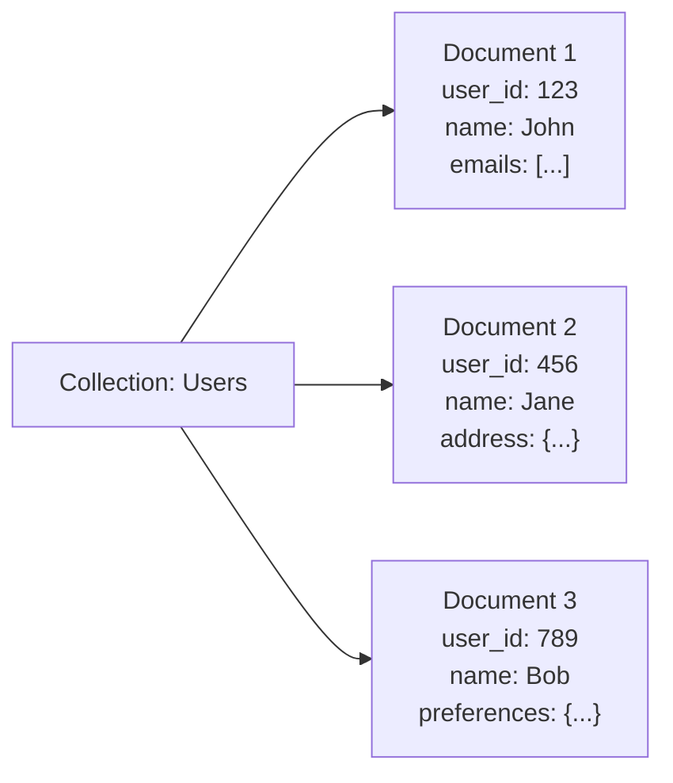
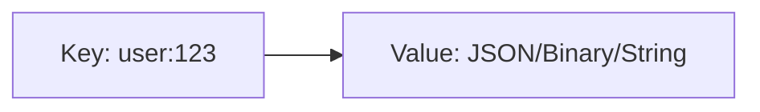
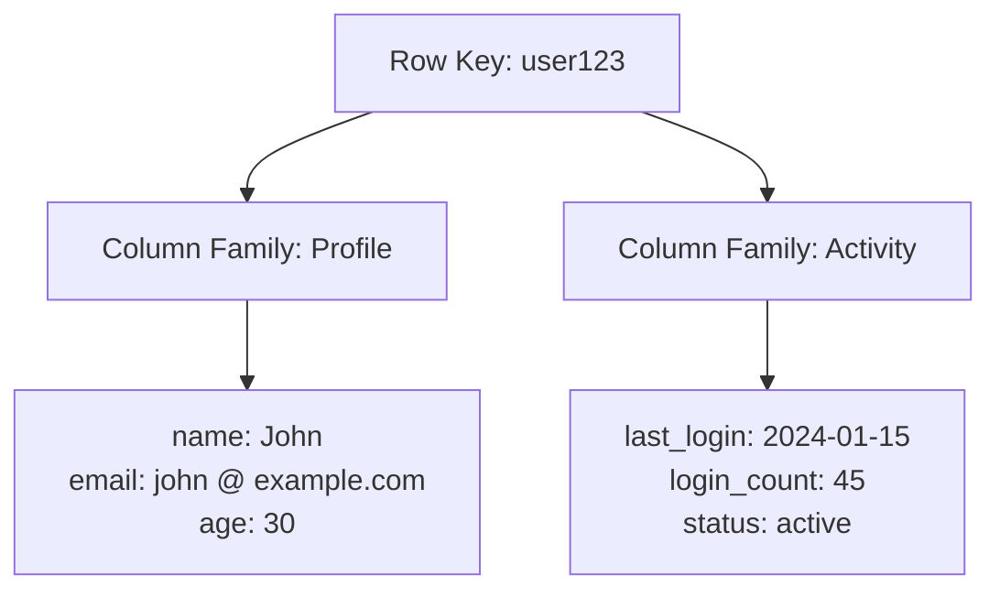
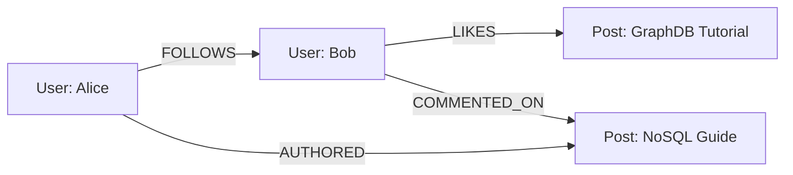
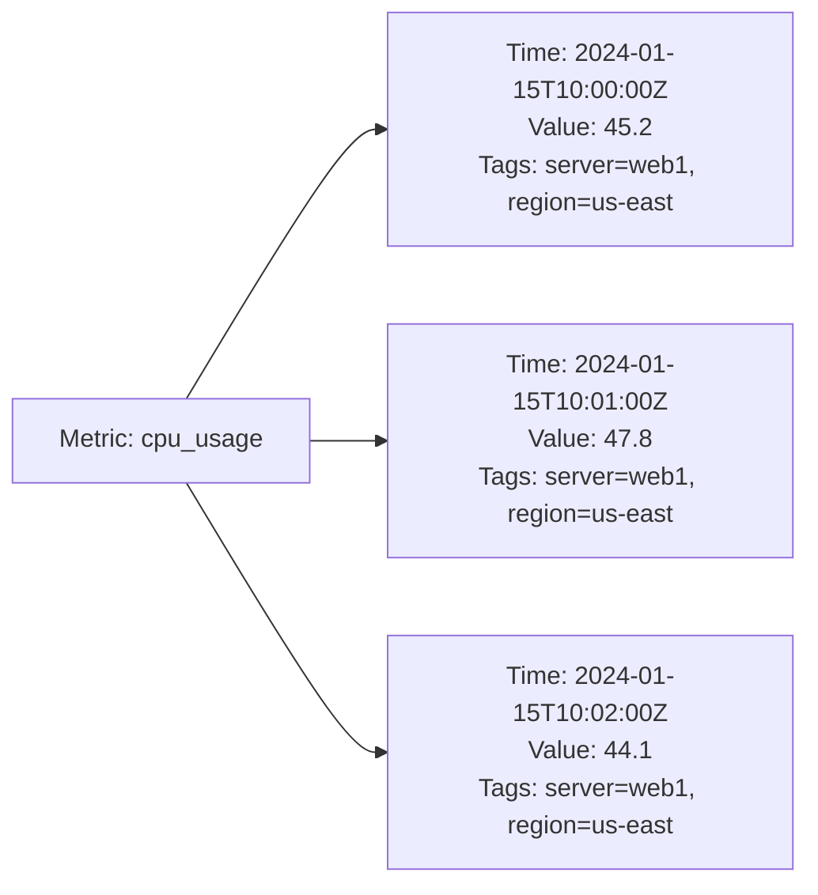

# Non-Relational Databases (NoSQL)

NoSQL databases provide flexible data models optimized for specific use cases, offering horizontal scalability and high performance for modern applications.

They sacrifice (not all of them though) some ACID guarantees for improved availability and partition tolerance.

**When to Choose NoSQL**:

- Rapid development with evolving schemas
- Horizontal scaling requirements
- Massive data volumes and high throughput
- Specific data patterns (graphs, time-series, etc.)
- Geographic distribution needs

## Database Types

### Document Databases

Store data as flexible, JSON-like documents that can contain nested structures and varying schemas.



**Characteristics**:

- Schema flexibility within collections
- Rich query capabilities with indexing
- Horizontal scaling through sharding
- ACID transactions (limited scope in distributed setups)

**Use Cases**: Content management, user profiles, product catalogs, real-time analytics
**Examples**: MongoDB, CouchDB, Amazon DocumentDB

### Key-Value Stores

Simplest NoSQL model storing data as key-value pairs with high performance and scalability.



**Characteristics**:

- Extremely fast read/write operations
- Simple data model (no complex queries)
- Horizontal scaling and partitioning
- Often in-memory with optional persistence

**Use Cases**: Caching, session storage, shopping carts, real-time recommendations
**Examples**: Redis, Amazon DynamoDB, Riak, Memcached

### Column-Family (Wide Column)

Store data in column families, providing flexibility between relational and key-value models.



**Characteristics**:

- Sparse columns (rows can have different columns)
- Efficient for time-series and analytical data
- High write throughput and compression
- CQL (Cassandra Query Language) for familiar SQL-like interface

**Use Cases**: Time-series data, IoT sensors, logging, real-time analytics
**Examples**: Apache Cassandra, HBase, Amazon SimpleDB

### Graph Databases

Optimize for storing and querying relationships between entities using nodes and edges.



**Characteristics**:

- Native graph storage and processing
- Efficient traversal of complex relationships
- ACID transactions for data consistency
- Graph query languages (Cypher, Gremlin)

**Use Cases**: Social networks, recommendation engines, fraud detection, network analysis
**Examples**: Neo4j, Amazon Neptune, ArangoDB

### Time-Series Databases

Specialized for time-stamped data with optimizations for temporal queries and analytics.



**Characteristics**:

- Optimized for time-based queries and aggregations
- Built-in compression for temporal data
- Retention policies and downsampling
- Real-time ingestion and querying

**Use Cases**: IoT monitoring, application metrics, financial data, log analysis
**Examples**: InfluxDB, TimescaleDB, Prometheus

## BASE Properties

BASE represents the consistency model used by many NoSQL databases, contrasting with ACID properties of relational databases.

### Basically Available

**Principle**: System remains functional even during partial failures

- Graceful degradation rather than complete failure
- Some operations may be slower or limited
- Read/write operations continue during network partitions

### Soft State

**Principle**: System state may change over time without external input

- Data consistency isn't maintained at all times
- Background processes synchronize data
- Temporary inconsistencies are acceptable

### Eventually Consistent

**Principle**: System will become consistent given enough time

- All replicas will converge to the same state
- No guarantees on when consistency is achieved
- Conflicts are resolved through various strategies

## ACID vs BASE Comparison

| Aspect                  | ACID (Relational)                      | BASE (NoSQL)                            |
|-------------------------|----------------------------------------|-----------------------------------------|
| **Consistency**         | Immediate, strong                      | Eventual, weak                          |
| **Availability**        | May sacrifice for consistency          | Prioritized over consistency            |
| **Partition Tolerance** | Limited                                | High                                    |
| **Scalability**         | Vertical (limited)                     | Horizontal (unlimited)                  |
| **Use Cases**           | Financial, transactional               | Social media, analytics, IoT            |
| **CAP Theorem**         | CP (Consistency + Partition tolerance) | AP (Availability + Partition tolerance) |

## Denormalization Strategies

NoSQL databases embrace denormalization to optimize for read performance and reduce multi-collection operations.

### Denormalization Patterns

**Common Denormalization Patterns**:

- **Embedding**: Nest related data within documents
- **Duplication**: Copy data across entities for faster access
- **Aggregation**: Pre-compute summaries and calculated values
- **Materialized Views**: Create query-optimized data structures

### Document Database Example

**Normalized Approach** (Multiple collections):

```javascript
// Users collection
{_id: "user123", name: "John", email: "john@example.com"}

// Posts collection  
{_id: "post1", userId: "user123", title: "Hello", content: "..."}
{_id: "post2", userId: "user123", title: "World", content: "..."}
```

**Denormalized Approach** (Embedded documents):

```javascript
{
  _id: "user123",
  name: "John Doe",
  email: "john@example.com",
  posts: [
    {
      postId: "post1",
      title: "Hello World",
      content: "This is my first post",
      timestamp: "2024-01-15T10:00:00Z",
      tags: ["introduction", "hello"]
    }
  ],
  profile: {
    bio: "Software developer",
    location: "San Francisco",
    joinDate: "2023-01-01"
  }
}
```

### Key-Value Store Example

**Composite Value Strategy**:

```json
// Key: user_session:123
{
  "user": {
    "id": "123",
    "name": "John Doe",
    "preferences": {"theme": "dark"}
  },
  "session": {
    "loginTime": "2024-01-15T10:00:00Z",
    "lastActivity": "2024-01-15T12:30:00Z",
    "permissions": ["read", "write"]
  },
  "cache": {
    "recentSearches": ["NoSQL", "databases"],
    "favoriteItems": [{"id": "item1", "name": "Product A"}]
  }
}
```

### Denormalization Trade-offs

| Aspect               | Benefits                             | Drawbacks                      |
|----------------------|--------------------------------------|--------------------------------|
| **Read Performance** | ✅ Faster queries, fewer operations   | ❌ Larger documents to transfer |
| **Write Complexity** | ❌ Multiple updates needed            | ❌ Consistency challenges       |
| **Storage**          | ❌ Data duplication increases storage | ❌ Higher storage costs         |
| **Consistency**      | ❌ Eventual consistency required      | ❌ Potential data staleness     |
| **Scalability**      | ✅ Better read scaling                | ❌ Write amplification          |

### When to Denormalize

**Good Candidates**:

- Read-heavy workloads
- Frequently accessed related data
- Data that changes infrequently
- Performance-critical user-facing queries

**Avoid When**:

- High write frequency with updates
- Strong consistency requirements
- Highly normalized data with complex relationships
- Storage costs are primary concern

## Reference Materials

- [What is a NoSQL Database?](https://cloud.google.com/discover/what-is-nosql)
- [NoSQL vs SQL Databases](https://www.youtube.com/watch?v=_Ss42Vb1SU4&ab_channel=Exponent)
- [7 Database Paradigms](https://www.youtube.com/watch?v=W2Z7fbCLSTw&ab_channel=Fireship)
- [ACID vs BASE Properties](https://aws.amazon.com/compare/the-difference-between-acid-and-base-database/)
- [Graph Databases Introduction](https://www.youtube.com/watch?v=GekQqFZm7mA&ab_channel=CodingTech)
- [Time-Series Databases Explained](https://www.youtube.com/watch?v=vuNEWixlsWY&ab_channel=CodewithIrtiza)
- [Column vs Row Oriented Storage](https://www.youtube.com/watch?v=Vw1fCeD06YI&ab_channel=HusseinNasser)
- [Database Denormalization Strategies](https://www.youtube.com/watch?v=4bTq0GdSeQs&ab_channel=Decomplexify)
