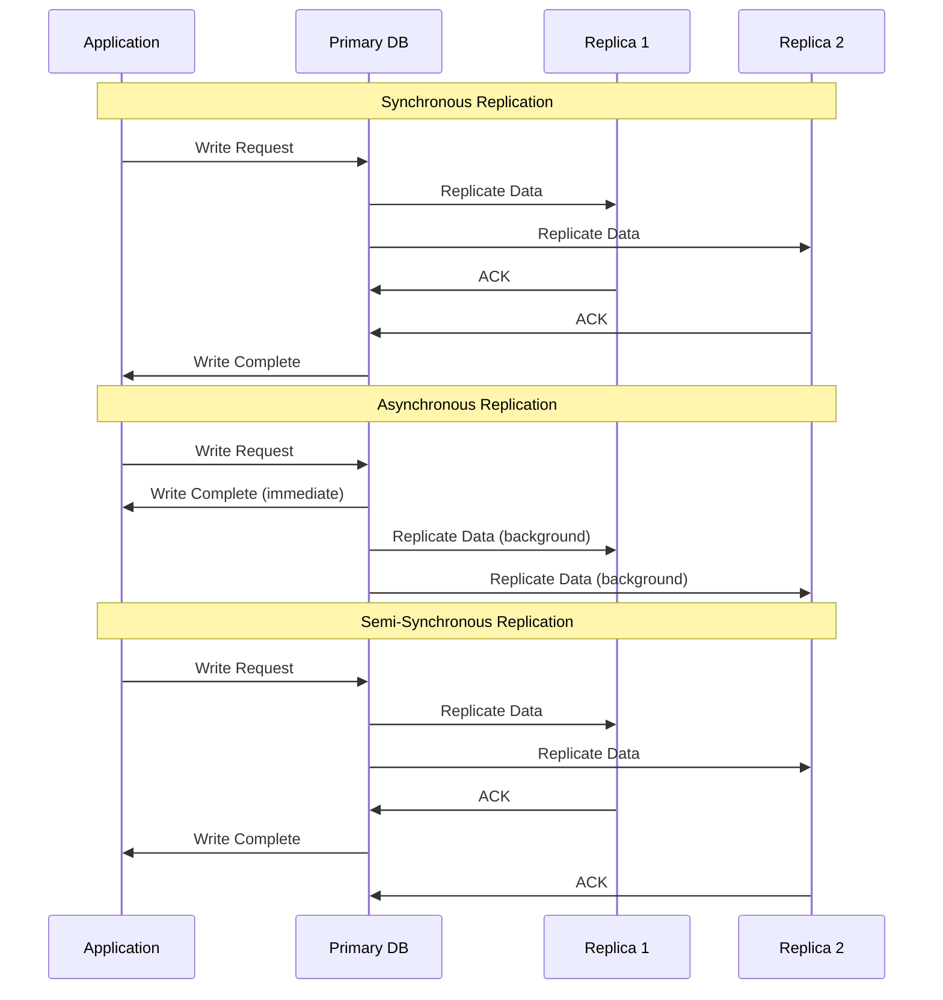
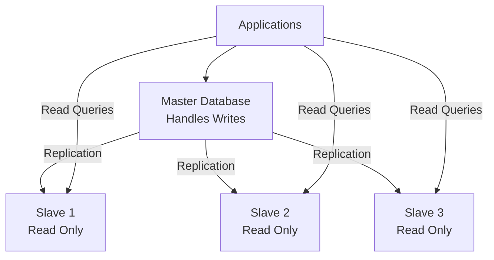
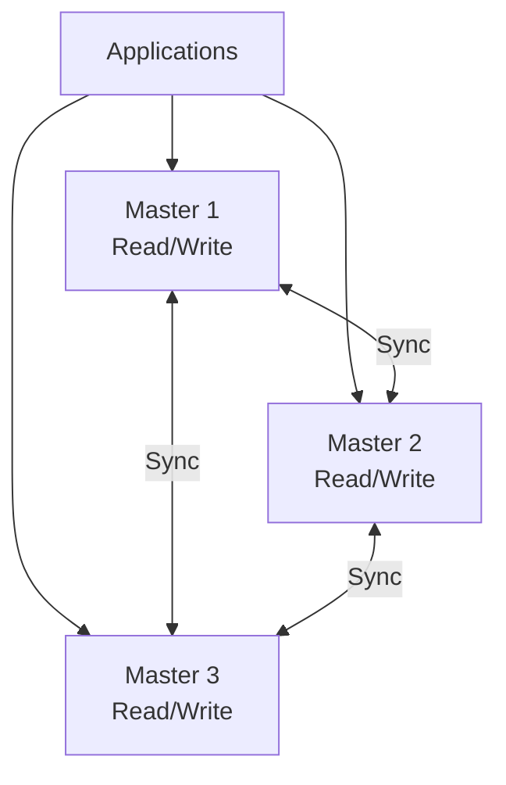
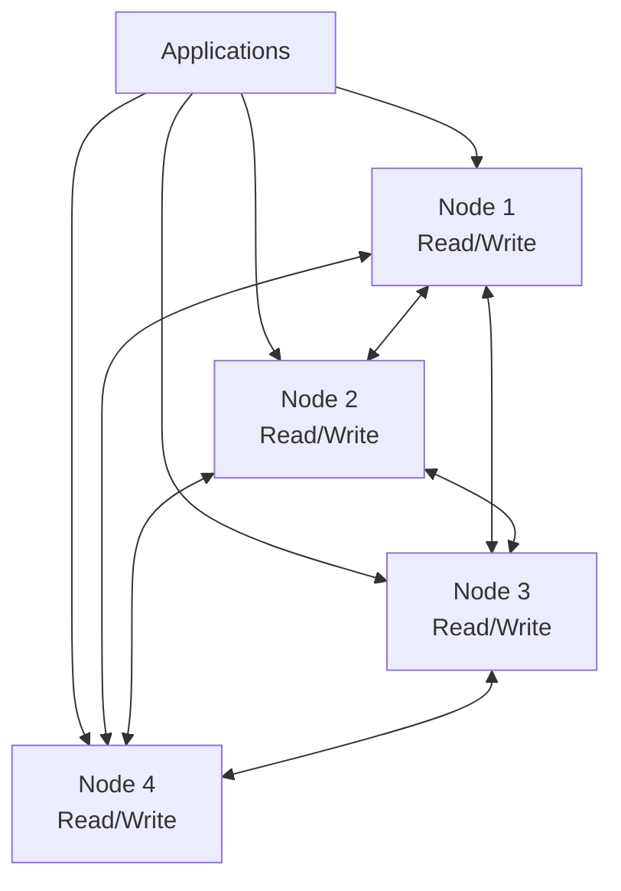
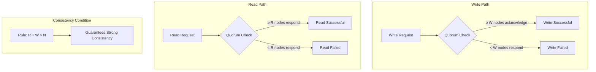

# Database Replication

Database replication copies data across multiple servers to improve availability, performance, and disaster recovery.

## Core Benefits

**High Availability**

- System remains operational during server failures
- Automatic failover to healthy replicas
- Eliminates single points of failure

**Performance Scaling**

- Distribute read workload across multiple servers
- Reduce latency with geographically distributed replicas
- Offload reporting and analytics to dedicated replicas

**Disaster Recovery**

- Geographic data distribution protects against site failures
- Point-in-time recovery capabilities
- Business continuity during major outages

**Cost Optimization**

- Separate analytical workloads from transactional systems
- Optimize resource allocation per workload type

## Replication Methods

The timing of data synchronization affects consistency guarantees and performance characteristics.

### Synchronous Replication

**Process**: Primary waits for replica acknowledgment before confirming write

- ✅ **Strong Consistency**: All replicas have identical data
- ✅ **Zero Data Loss**: No risk of data loss during failures
- ❌ **Higher Latency**: Slower writes due to network round-trips
- ❌ **Availability Risk**: Single slow replica affects all writes

**Use Cases**: Financial systems, critical transactional data

### Asynchronous Replication

**Process**: Primary confirms write immediately, replicates in background

- ✅ **Low Latency**: Fast write operations
- ✅ **High Availability**: Replica failures don't affect writes
- ❌ **Eventual Consistency**: Temporary data inconsistencies possible
- ❌ **Potential Data Loss**: Unreplicated data lost if primary fails

**Use Cases**: Read-heavy applications, analytics, content distribution

### Semi-Synchronous Replication

**Process**: Wait for at least one replica acknowledgment before commit

- ⚖️ **Balanced Approach**: Compromise between consistency and performance
- ✅ **Reduced Data Loss**: At least one replica guaranteed to be current
- ⚖️ **Moderate Latency**: Better than full synchronous, slower than async

**Use Cases**: Applications requiring balance between performance and consistency

## Replication Architectures

Different architectural patterns provide varying trade-offs between consistency, availability, and complexity.

### Master-Slave (Primary-Replica) Architecture

Single primary handles writes, multiple replicas serve reads.

**Characteristics**:

- Single source of truth for writes
- Read scaling through multiple replicas
- Simple consistency model
- Automatic failover capabilities

**Benefits**:

- ✅ Simple to understand and implement
- ✅ Strong write consistency
- ✅ Read scalability
- ✅ Clear data lineage

**Challenges**:

- ❌ Write bottleneck at master
- ❌ Single point of failure for writes
- ❌ Replication lag affects read consistency
- ❌ Failover complexity

**Examples**: MySQL replication, PostgreSQL streaming replication, MongoDB replica sets

### Multi-Master Architecture

Multiple nodes accept both read and write operations.

**Characteristics**:

- No single point of failure for writes
- Geographic distribution of write capability
- Complex conflict resolution required
- Eventually consistent data model

**Benefits**:

- ✅ Write scalability and availability
- ✅ Geographic write distribution
- ✅ No single point of failure
- ✅ Lower write latency (nearest master)

**Challenges**:

- ❌ Complex conflict resolution
- ❌ Eventual consistency model
- ❌ Higher operational complexity
- ❌ Potential write conflicts

**Examples**: MariaDB Galera, CouchDB

### Masterless (Leaderless) Replication

All nodes are equal peers handling both reads and writes.

**Characteristics**:

- No designated leader or coordinator
- Quorum-based read/write operations
- Built-in fault tolerance
- Eventual consistency with tunable consistency levels

**Benefits**:

- ✅ Highly available (no single point of failure)
- ✅ Linear scalability
- ✅ Automatic failure handling
- ✅ Tunable consistency levels

**Challenges**:

- ❌ Complex consistency semantics
- ❌ Read repair and anti-entropy processes
- ❌ Quorum management overhead
- ❌ Eventual consistency complexities

**Examples**: Apache Cassandra, Amazon DynamoDB, Riak

## Architecture Comparison

| Architecture     | Write Scalability | Read Scalability | Consistency | Complexity | Fault Tolerance |
|------------------|-------------------|------------------|-------------|------------|-----------------|
| **Master-Slave** | Low               | High             | Strong      | Low        | Medium          |
| **Multi-Master** | Medium            | High             | Eventual    | High       | High            |
| **Masterless**   | High              | High             | Tunable     | Medium     | Very High       |

## Replication Patterns in Practice

### Conflict Resolution

When multiple nodes can accept writes, conflicts are inevitable and must be resolved systematically.

**Common Conflict Resolution Patterns**:

| Pattern                                        | How it Works                          | Pros                 | Cons                 |
|------------------------------------------------|---------------------------------------|----------------------|----------------------|
| **Last Write Wins**                            | Latest timestamp wins                 | Simple to implement  | May lose data        |
| **Vector Clocks**                              | Track causality across nodes          | Preserves causality  | Complex to implement |
| **Application-Level**                          | App decides conflict resolution       | Business logic aware | Requires custom code |
| **CRDT (Conflict-free Replicated Data Types)** | Mathematically commutative operations | Always converges     | Limited data types   |

### Read and Write Quorums

Masterless systems use quorum consensus to ensure consistency.

**Parameters**:

- **N**: Total number of replicas
- **W**: Write quorum (nodes that must acknowledge write)
- **R**: Read quorum (nodes that must respond to read)

**Tuning Examples**:

- **R=1, W=N**: Fast reads, slow writes, high consistency
- **R=N, W=1**: Fast writes, slow reads, high consistency  
- **R=W=(N+1)/2**: Balanced performance and consistency

## Reference Materials

- [What is Database Replication?](https://www.ibm.com/topics/data-replication)
- [Database Replication Explained](https://www.youtube.com/watch?v=bI8Ry6GhMSE&ab_channel=Exponent)
- [Master-Replica Replication](https://arpitbhayani.me/blogs/master-replica-replication)
- [Multi-Master Replication](https://arpitbhayani.me/blogs/multi-master-replication/)
- [Leaderless Replication](https://arpitbhayani.me/blogs/leaderless-replication)
