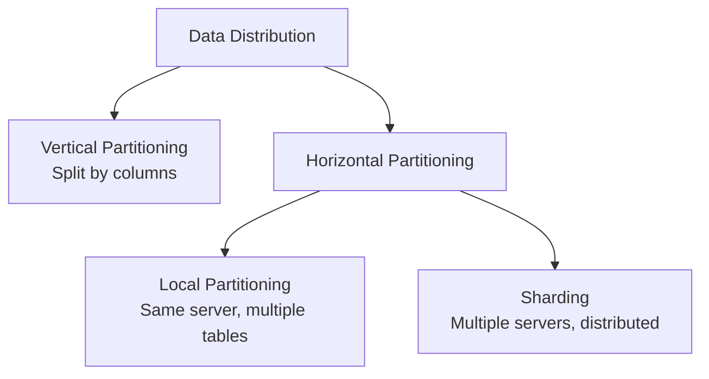
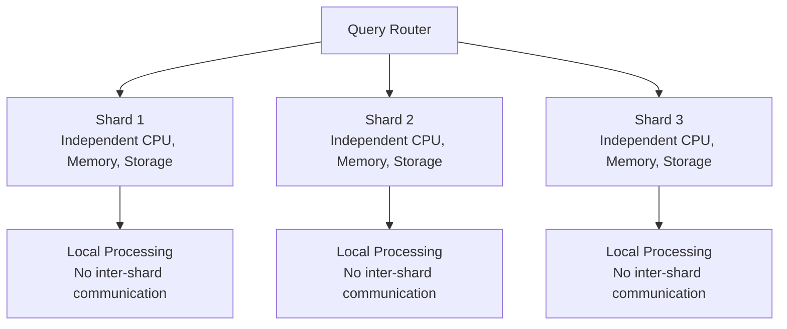
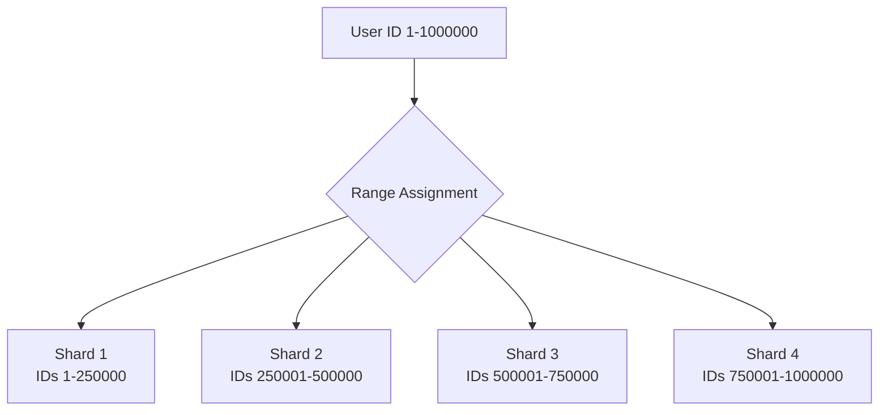
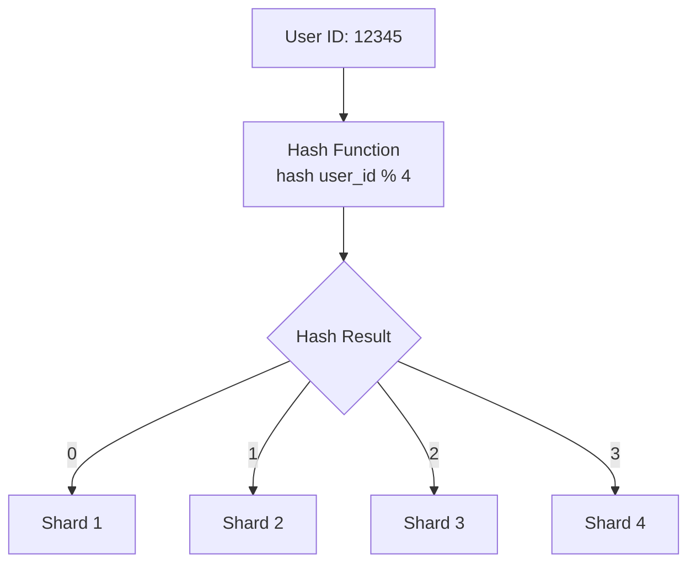
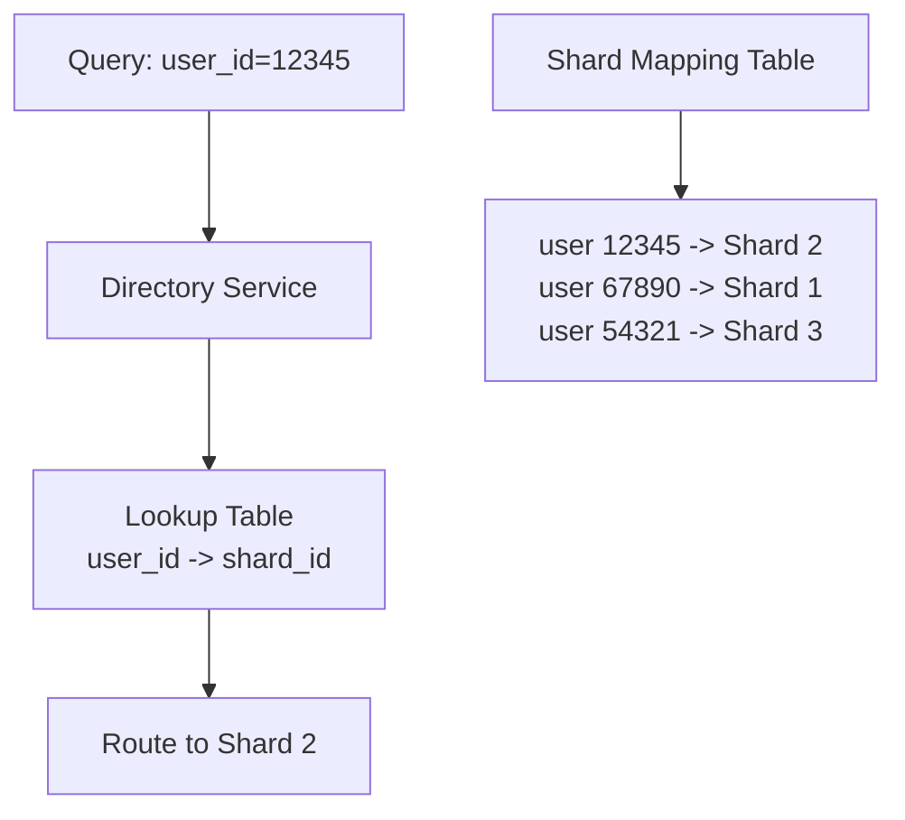
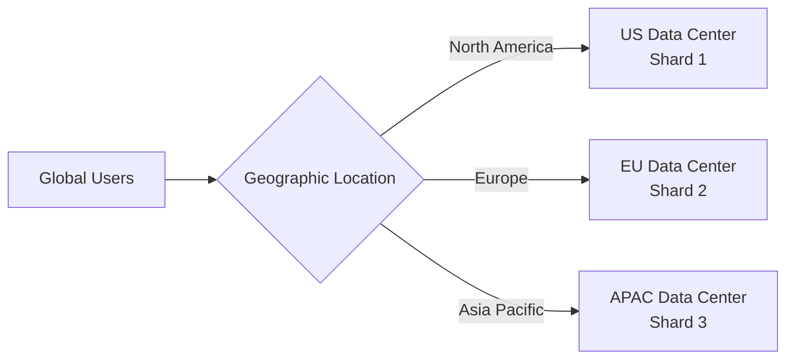

# Database Sharding

Database sharding horizontally partitions data across multiple database instances to improve scalability, performance, and availability.

**Core Concepts**:

- **Logical Shards**: Data partitions based on business logic
- **Physical Shards**: Database instances hosting logical shards
- **Shard Key**: Column(s) used to determine data placement
- **Shard Router**: Component directing queries to appropriate shards

## Partitioning vs Sharding

### Partitioning (Single Database)

- **Vertical**: Split tables by columns (normalization)
- **Horizontal**: Split tables by rows within same database
- **Benefits**: Query optimization, maintenance efficiency
- **Limitations**: Single server resource constraints

### Sharding (Distributed Database)

- **Scope**: Multiple independent database instances
- **Benefits**: Linear scalability, fault isolation
- **Complexity**: Cross-shard queries, distributed transactions

## Shared-Nothing Architecture

Sharding implements a shared-nothing approach where each shard operates completely independently.

**Characteristics**:

- Each shard has dedicated resources (CPU, memory, storage)
- No shared resources between shards
- Parallel processing without contention
- Fault isolation - shard failures don't affect others

## Benefits and Trade-offs

### Benefits

**Scalability**

- ✅ **Linear Scale**: Add shards to increase capacity proportionally
- ✅ **Load Distribution**: Spread traffic across multiple servers
- ✅ **Parallel Processing**: Simultaneous query execution

**Performance**

- ✅ **Reduced Contention**: Fewer concurrent users per shard
- ✅ **Optimized Resources**: Tailored hardware per shard needs
- ✅ **Faster Queries**: Smaller datasets per shard

**Availability**

- ✅ **Fault Isolation**: Failure affects only one shard
- ✅ **Independent Maintenance**: Update shards without downtime
- ✅ **Geographic Distribution**: Place shards near users

### Trade-offs

**Complexity**

- ❌ **Application Logic**: Complex routing and query planning
- ❌ **Operations**: Backup, monitoring, and maintenance complexity
- ❌ **Cross-Shard Operations**: Joins and transactions across shards

**Consistency**

- ❌ **Distributed Transactions**: ACID properties harder to maintain
- ❌ **Data Integrity**: Foreign key constraints across shards
- ❌ **Eventual Consistency**: Some operations may require eventual consistency

**Performance**

- ❌ **Cross-Shard Queries**: Network overhead for multi-shard operations
- ❌ **Hotspots**: Uneven data distribution can create bottlenecks
- ❌ **Rebalancing**: Moving data between shards is expensive

## Sharding Patterns

Different strategies for distributing data across shards, each with specific use cases and trade-offs.

### Range-Based

Partition data based on ranges of the shard key values.

**Characteristics**:

- Data divided into contiguous ranges
- Range boundaries define shard assignment
- Simple routing logic

**Benefits**:

- ✅ Easy to implement and understand
- ✅ Range queries are efficient
- ✅ Simple to add new ranges

**Drawbacks**:

- ❌ Hot spots from uneven access patterns
- ❌ Sequential key generation creates bottlenecks
- ❌ Difficult to rebalance existing ranges

**Use Cases**: Time-series data, ordered datasets, analytical workloads

### Hash-Based

Use hash function on shard key to determine shard placement.

**Characteristics**:

- Deterministic hash function placement
- Even distribution across shards
- No range scan capability

**Benefits**:

- ✅ Even data distribution
- ✅ Prevents hot spots
- ✅ Simple and predictable

**Drawbacks**:

- ❌ Range queries require multiple shards
- ❌ Rebalancing requires data migration
- ❌ Adding/removing shards is complex

**Use Cases**: User data, session storage, OLTP workloads

### Directory-Based

Use lookup service to map shard keys to physical shards.

**Characteristics**:

- Centralized routing decisions
- Flexible mapping logic
- Dynamic shard assignment

**Benefits**:

- ✅ Maximum flexibility in data placement
- ✅ Can optimize for access patterns
- ✅ Easy to rebalance data

**Drawbacks**:

- ❌ Directory service becomes bottleneck
- ❌ Additional complexity and latency
- ❌ Single point of failure

**Use Cases**: Multi-tenant applications, custom data placement requirements

### Geographic

Distribute data based on geographic location or user region.

**Characteristics**:

- Data locality based on geography
- Compliance with data sovereignty laws
- Optimized for regional access patterns

**Benefits**:

- ✅ Reduced latency for users
- ✅ Data sovereignty compliance
- ✅ Natural fault isolation

**Drawbacks**:

- ❌ Uneven regional data distribution
- ❌ Cross-region queries are expensive
- ❌ Complex global operations

**Use Cases**: Global applications, compliance requirements, CDN-like services

## Pattern Comparison

| Pattern             | Distribution  | Complexity | Range Queries | Rebalancing    | Best For                   |
|---------------------|---------------|------------|---------------|----------------|----------------------------|
| **Range-Based**     | May be uneven | Low        | Excellent     | Difficult      | Time-series, analytics     |
| **Hash-Based**      | Even          | Low        | Poor          | Very difficult | OLTP, user data            |
| **Directory-Based** | Flexible      | High       | Good          | Easy           | Multi-tenant, custom needs |
| **Geographic**      | Geographic    | Medium     | Regional only | Medium         | Global apps, compliance    |

## Reference Materials

- [What is Database Sharding?](https://aws.amazon.com/what-is/database-sharding/)
- [Understanding Database Sharding](https://www.digitalocean.com/community/tutorials/understanding-database-sharding)
- [Shared-Nothing Architecture](https://en.wikipedia.org/wiki/Shared-nothing_architecture)
- [Sharding Pinterest](https://medium.com/pinterest-engineering/sharding-pinterest-how-we-scaled-our-mysql-fleet-3f341e96ca6f)
