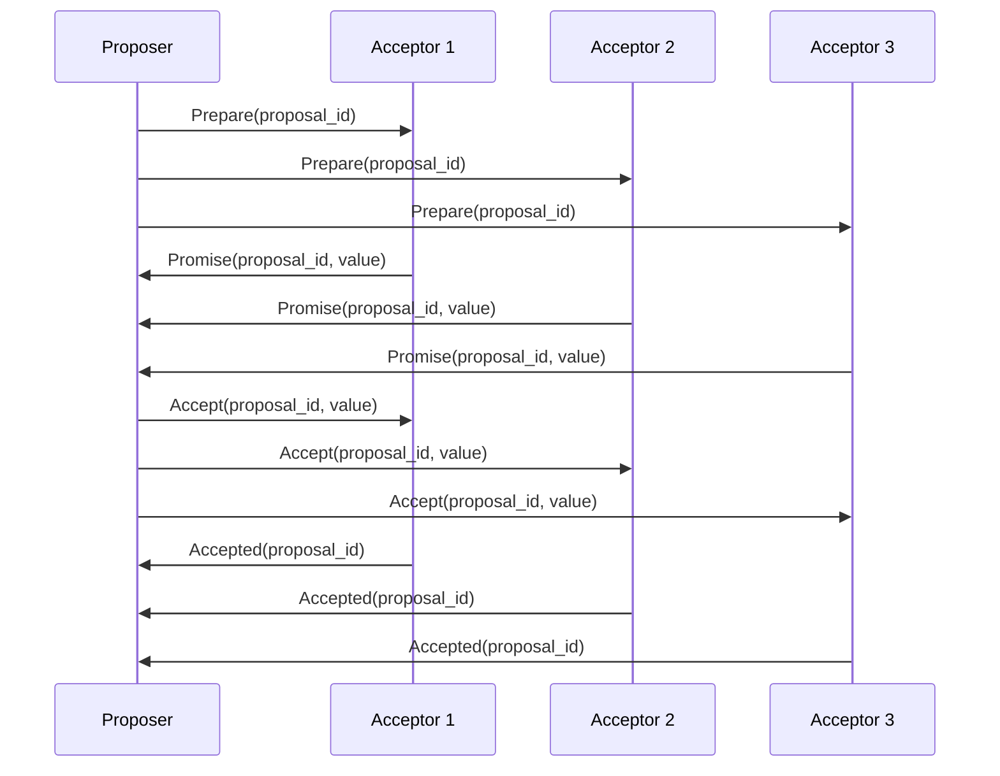
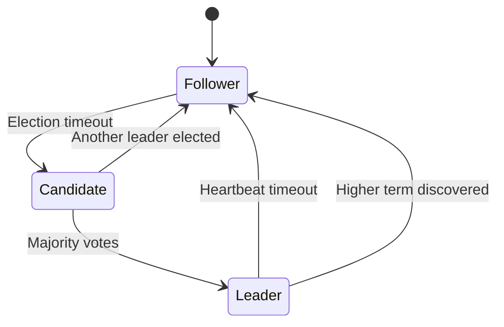
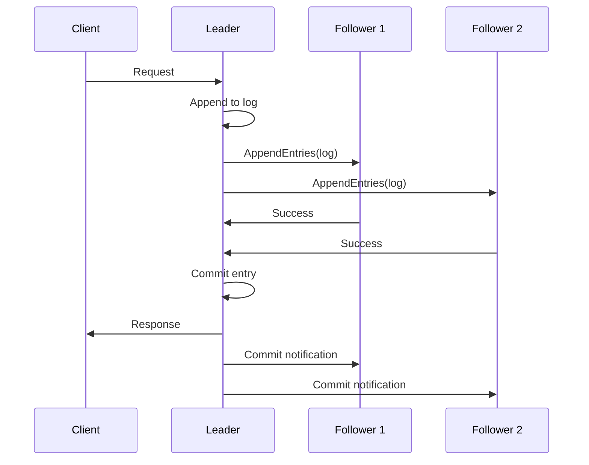
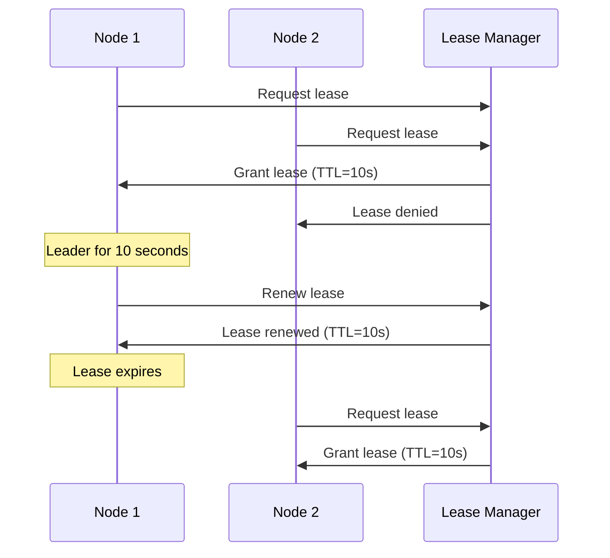

# Leader Election

Leader election is the process of selecting a single node to coordinate tasks in a distributed system.

**Core Characteristics**:

- **Consistency**: Single source of truth for decision-making
- **Coordination**: Prevents conflicting operations across nodes
- **Fault Tolerance**: Automatic failover when leader fails
- **Performance**: Reduces coordination overhead

## Use Cases

**Distributed Databases**

- Coordinate writes to prevent conflicts
- Maintain consistent transaction ordering
- Handle replication and recovery

**Cluster Management**

- Ensure only one master node is active
- Coordinate resource allocation
- Manage service discovery

**Consensus Systems**

- Facilitate agreement on shared state
- Implement distributed locks
- Coordinate distributed transactions

## Consensus Algorithms

Consensus algorithms ensure that distributed systems agree on a single value or state, even in the presence of failures.

### Paxos Algorithm

Paxos is a family of protocols for solving consensus in distributed systems with crash failures.



**Phases**:

1. **Prepare Phase**: Proposer sends proposal with unique ID to majority of acceptors
2. **Promise Phase**: Acceptors promise not to accept proposals with lower IDs
3. **Accept Phase**: Proposer sends commit message with chosen value
4. **Learn Phase**: Acceptors notify learners of the decided value

**Characteristics**:

- ✅ Proven safety and liveness properties
- ✅ Handles network partitions and node failures
- ❌ Complex to understand and implement
- ❌ Multiple variants (Multi-Paxos, Fast Paxos)

### Raft Algorithm

Raft is designed to be more understandable than Paxos while providing equivalent functionality.



**Node States**:

- **Leader**: Handles all client requests and log replication
- **Follower**: Receives commands from leader, votes in elections
- **Candidate**: Requests votes during leader election

**Election Process**:

1. **Election Timeout**: Follower becomes candidate when no heartbeat received
2. **Vote Request**: Candidate requests votes from all other nodes
3. **Vote Response**: Nodes vote for candidate with most up-to-date log
4. **Leader Selection**: Candidate with majority votes becomes leader
5. **Heartbeat**: Leader sends periodic heartbeats to maintain leadership

**Log Replication**:



**Safety Guarantees**:

- **Election Safety**: At most one leader per term
- **Leader Append-Only**: Leader never overwrites or deletes log entries
- **Log Matching**: If two logs contain entry with same index and term, they're identical
- **Leader Completeness**: Committed entries from previous terms are preserved
- **State Machine Safety**: Applied state machine commands are identical across nodes

## Lease-Based Leader Election

Leases provide time-bound leadership with automatic expiration, simplifying leader election in distributed systems.

### How Leases Work



**Key Concepts**:

- **Lease**: Time-bound permission to act as leader
- **TTL (Time To Live)**: Duration of lease validity
- **Renewal**: Process of extending lease before expiration
- **Contention**: Multiple nodes competing for the same lease

**Benefits**:

- ✅ Automatic failover when lease expires
- ✅ Simple implementation using distributed locks
- ✅ No split-brain scenarios
- ✅ Configurable lease duration

**Trade-offs**:

- ❌ Requires external lease manager (single point of failure)
- ❌ Clock synchronization issues can cause problems
- ❌ Lease renewal overhead
- ❌ Potential for brief leadership gaps

### Example Implementation with etcd

```python
import etcd3
import threading
import time

class LeaderElection:
    def __init__(self, etcd_host='127.0.0.1', etcd_port=2379, 
                 lease_ttl=10, leader_key='/election/leader'):
        self.etcd = etcd3.client(host=etcd_host, port=etcd_port)
        self.lease_ttl = lease_ttl
        self.leader_key = leader_key
        self.is_leader = False
        self.lease = None
        self.renewal_thread = None
        
    def start_election(self):
        while True:
            try:
                # Create lease and attempt to become leader
                self.lease = self.etcd.lease(self.lease_ttl)
                self.etcd.put(self.leader_key, 'leader', lease=self.lease)
                
                self.is_leader = True
                print("I am the leader")
                
                # Start lease renewal in background
                self.renewal_thread = threading.Thread(target=self._renew_lease)
                self.renewal_thread.daemon = True
                self.renewal_thread.start()
                
                # Perform leader duties
                self._leader_work()
                
            except etcd3.exceptions.LeaseExistError:
                self.is_leader = False
                print("I am a follower")
                time.sleep(self.lease_ttl)
                
    def _renew_lease(self):
        while self.is_leader:
            time.sleep(self.lease_ttl / 2)  # Renew halfway through TTL
            try:
                self.lease.refresh()
                print("Lease renewed")
            except:
                self.is_leader = False
                break
                
    def _leader_work(self):
        while self.is_leader:
            # Perform actual leader work here
            time.sleep(1)

# Usage
if __name__ == "__main__":
    election = LeaderElection()
    election.start_election()
```

## Popular Technologies

### Consensus-Based Systems

- **etcd**: Distributed key-value store using Raft
- **Consul**: Service discovery and configuration using Raft
- **Zookeeper**: Coordination service using ZAB (Zookeeper Atomic Broadcast)

### Lease-Based Systems

- **etcd**: Provides lease functionality for leader election
- **Redis**: Distributed locks with expiration
- **Chubby**: Google's distributed lock service

### Real-World Applications

- **Kubernetes**: Uses etcd for cluster coordination
- **MongoDB**: Uses Raft for replica set elections
- **CockroachDB**: Uses Raft for distributed consensus
- **Elasticsearch**: Uses custom election algorithm for cluster coordination

## Reference Materials

- [Leader Election in Distributed Systems](https://aws.amazon.com/builders-library/leader-election-in-distributed-systems/)
- [The Raft Consensus Algorithm](https://raft.github.io/)
- [Paxos Made Moderately Complex](https://paxos.systems/how/)
- [Distributed Systems: Consensus](https://www.youtube.com/watch?v=rN6ma561tak&ab_channel=MartinKleppmann)
- [Understanding Raft Consensus](https://www.youtube.com/watch?v=IujMVjKvWP4&ab_channel=CoreDump)
- [Paxos vs Raft Comparison](https://www.youtube.com/watch?v=JQss0uQUc6o&ab_channel=PaPoCWorkshop)
