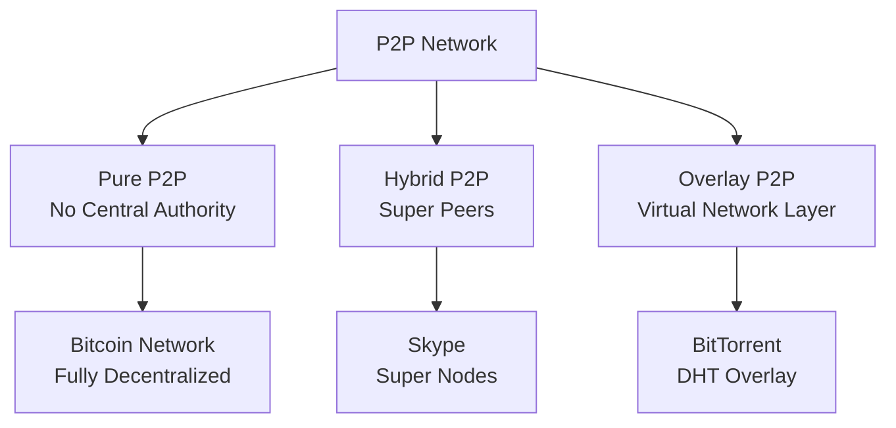
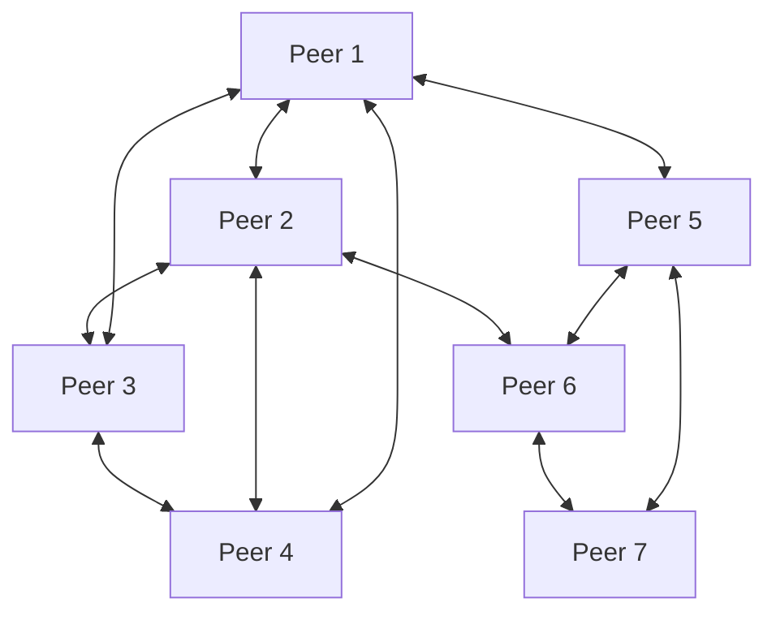
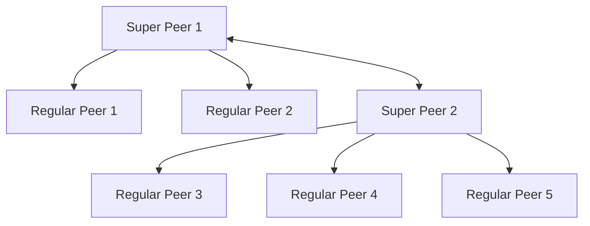
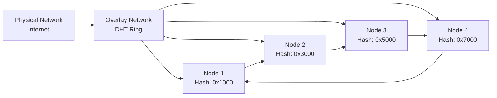
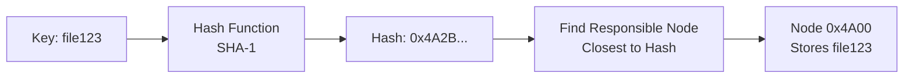
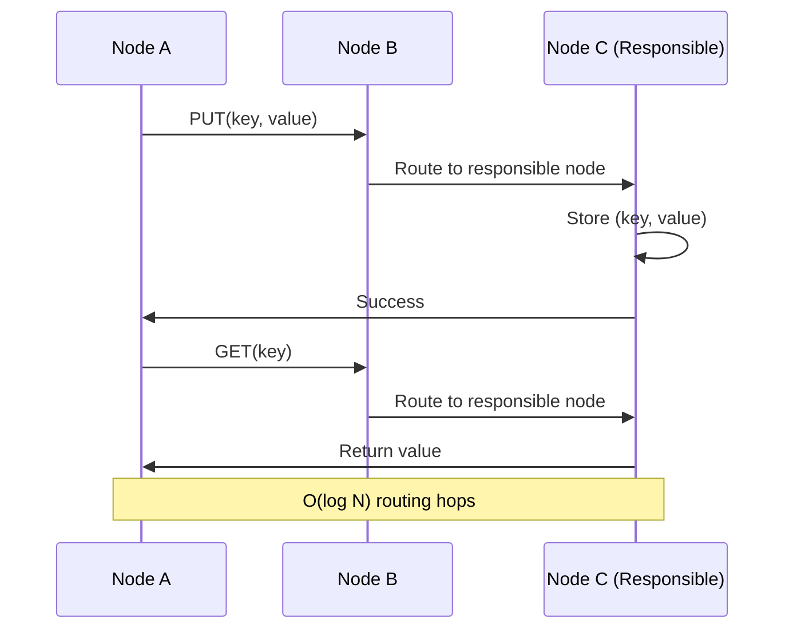
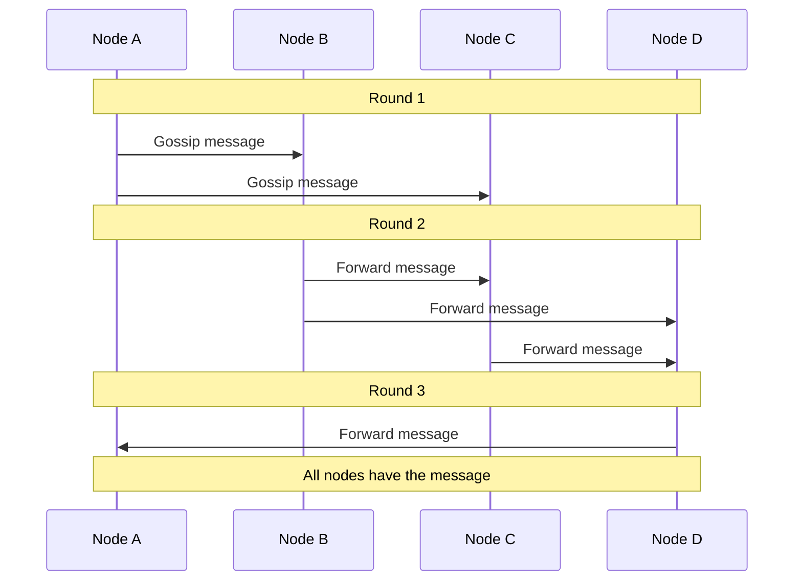

# Peer-to-Peer (P2P) Networks

Peer-to-peer networks are decentralized systems where each node (peer) acts as both client and server, sharing resources and roles.

**Core Characteristics**:

- **Decentralization**: No central authority or single point of control
- **Symmetry**: All peers have equal roles and capabilities
- **Resource Sharing**: Peers contribute and consume resources
- **Fault Tolerance**: Network survives individual peer failures

## Use Cases

**File Sharing & Distribution**

- BitTorrent for large file distribution
- IPFS for decentralized web content
- Content delivery networks (CDNs)

**Communication Systems**

- P2P messaging applications
- Voice and video calling
- Decentralized social networks

**Blockchain & Cryptocurrency**

- Bitcoin and Ethereum networks
- Decentralized consensus mechanisms
- Distributed ledger technology

**Distributed Computing**

- Distributed rendering and processing
- Collaborative computing platforms

## P2P Network Architectures

### Pure P2P Networks

Completely decentralized with no central authority or servers.

**Characteristics**:

- All peers have equal status and capabilities
- No single point of failure
- Self-organizing and self-healing
- Complete decentralization

**Examples**: Bitcoin network, Gnutella, Freenet

**Trade-offs**:

- ✅ Maximum fault tolerance and censorship resistance
- ✅ No central authority dependencies
- ❌ Difficult to bootstrap and discover peers
- ❌ Harder to implement and maintain

### Hybrid P2P Networks

Combine P2P architecture with some centralized elements for coordination.

**Characteristics**:

- Super peers act as coordinators and relay points
- Regular peers connect through super peers
- Centralized coordination with distributed execution
- Easier peer discovery and connection management

**Examples**: Skype, KaZaA, eMule

**Trade-offs**:

- ✅ Easier to implement and manage
- ✅ Better performance and reliability
- ✅ Simplified peer discovery
- ❌ Super peers become bottlenecks
- ❌ Less decentralized than pure P2P

### Overlay P2P Networks

Create virtual networks on top of existing infrastructure using Distributed Hash Tables (DHTs) and routing algorithms.

**Characteristics**:

- Virtual network layer on top of physical network
- Structured routing using Distributed Hash Tables (DHTs)
- Efficient resource location and retrieval
- Scalable to millions of nodes

**Examples**: BitTorrent DHT, Chord, Kademlia, Pastry

**Trade-offs**:

- ✅ Highly scalable and efficient
- ✅ Predictable performance characteristics
- ✅ Structured resource location
- ❌ Complex routing algorithms
- ❌ Vulnerable to churn (frequent node joins/leaves)

## Distributed Hash Tables (DHTs)

DHTs provide structured routing in P2P networks by mapping keys to responsible peers, enabling efficient resource location and storage.

### How DHTs Work

**Concepts**:

- **Hash Function**: Maps keys to consistent hash values
- **Node ID**: Each peer has a unique identifier in the hash space
- **Responsibility**: Each node is responsible for keys closest to its ID
- **Routing**: Efficient algorithms to find the responsible node

### Popular DHT Algorithms

**Chord DHT**

- Circular hash space (ring topology)
- Each node maintains finger table for routing
- O(log N) lookup complexity
- Simple but requires maintenance of finger tables

**Kademlia DHT**

- XOR-based distance metric
- k-buckets for storing node information
- O(log N) lookup complexity
- Self-organizing and fault-tolerant

**Pastry DHT**

- Plaxton tree-based routing
- Leaf set and routing table
- O(log N) lookup complexity
- Locality-aware routing

### DHT Operations

**Operations**:

- **PUT(key, value)**: Store data at responsible node
- **GET(key)**: Retrieve data from responsible node
- **JOIN**: New node joins the network
- **LEAVE**: Node gracefully leaves the network

**Benefits**:

- ✅ Scalable to millions of nodes
- ✅ Fault-tolerant and self-healing
- ✅ Decentralized and distributed
- ✅ Predictable performance (O(log N))

**Challenges**:

- ❌ Complex routing algorithms
- ❌ Vulnerable to churn (frequent joins/leaves)
- ❌ Security concerns (Sybil attacks)
- ❌ Maintenance overhead

## Gossip Protocol

Gossip protocol is a decentralized communication mechanism where nodes periodically exchange information with randomly selected peers.

It is used to enable efficient information dissemination across large distributed systems.

### How Gossip Works

**Key Principles**:

- **Random Selection**: Each node randomly selects peers to communicate with
- **Periodic Exchange**: Information exchange happens at regular intervals
- **Epidemic Spreading**: Information spreads like an epidemic through the network
- **Eventual Consistency**: All nodes eventually receive the information

### Gossip Algorithm Phases

**1. Information Dissemination**

- Node has new information
- Select random peers
- Send information to selected peers
- Peers receive and process information
- Peers update their state
- Peers become new disseminators

**2. Random Peer Selection**

- Each node maintains a list of known peers
- Randomly selects subset of peers for each gossip round
- Ensures uniform distribution of information
- Prevents hotspots and bottlenecks

**3. Convergence Process**

- Information spreads exponentially through the network
- Convergence time: O(log N) where N is network size
- High probability that all nodes receive the information
- Self-healing and fault-tolerant

**4. Failure Detection**

- Nodes share membership lists during gossip
- Track last-seen timestamps for each peer
- Declare peers as failed after timeout period
- Propagate failure information through gossip

### Gossip Protocol Types

**Anti-Entropy Gossip**

- Nodes exchange their entire state
- Ensures eventual consistency
- Higher bandwidth usage
- Used for database replication

**Rumor Mongering**

- Nodes only gossip about new information
- More efficient bandwidth usage
- Information may be lost if not gossiped quickly
- Used for event dissemination

**Hybrid Approaches**

- Combine anti-entropy and rumor mongering
- Balance between efficiency and reliability
- Adaptive based on network conditions

### Gossip Protocol Trade-offs

**When to Use Gossip**:

- Large-scale distributed systems
- High fault tolerance requirements
- Eventually consistent systems
- Dynamic network topologies

**When to Avoid Gossip**:

- Strong consistency requirements
- Bandwidth-constrained environments
- Small, stable networks
- Real-time systems with strict latency requirements

## Reference Materials

- [How P2P Networks Work](https://www.youtube.com/watch?v=2v6KqRB7adg&ab_channel=ByteMonk)
- [BitTorrent & P2P Applications](https://www.youtube.com/watch?v=23uTlbdCKbw&ab_channel=EpicNetworksLab)
- [Kademlia DHT Explained](https://www.youtube.com/watch?v=_kCHOpINA5g&ab_channel=ArpitBhayani)
- [Gossip Protocol Deep Dive](https://newsletter.systemdesign.one/p/gossiping-protocol)
- [Understanding Gossip Protocols](https://www.youtube.com/watch?v=QQ2n1UX3Qwg&ab_channel=CodeSync)
- [Chord DHT Algorithm](https://pdos.csail.mit.edu/papers/chord:sigcomm01/chord_sigcomm.pdf)
- [Kademlia: A Peer-to-Peer Information System](https://pdos.csail.mit.edu/~petar/papers/maymounkov-kademlia-lncs.pdf)
- [BitTorrent Protocol Specification](https://www.bittorrent.org/beps/bep_0003.html)
