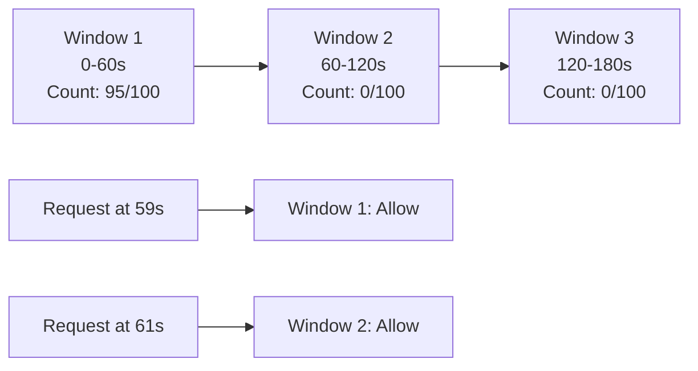
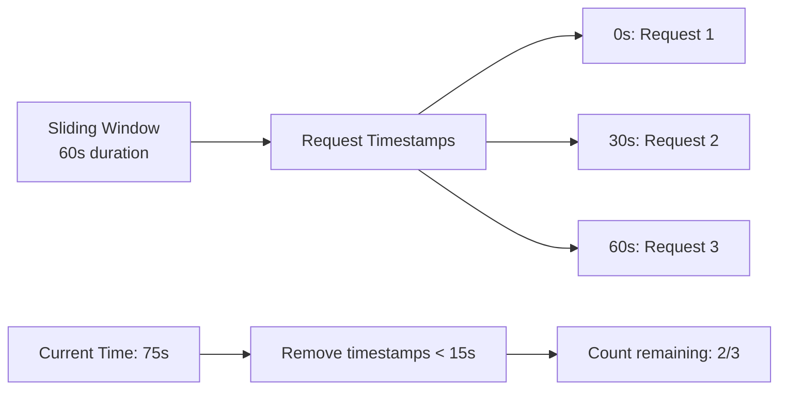
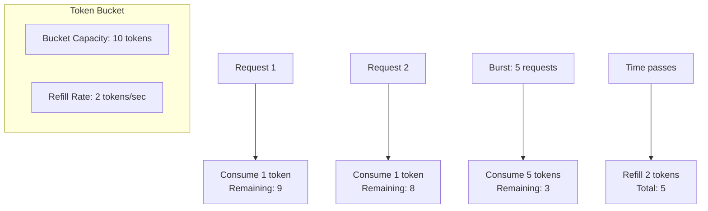
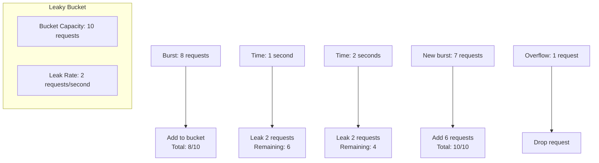

# Rate Limiting

Rate limiting controls the frequency of requests from clients to protect services from abuse, ensure fair resource usage, and maintain system stability.

## Use Cases

**Security & Abuse Prevention**

- **DoS Protection**: Limit requests to prevent service disruption
- **Brute Force Prevention**: Restrict login attempts and credential testing
- **API Abuse**: Prevent excessive API usage and scraping
- **Bot Protection**: Distinguish between human and automated traffic

**Resource Management**

- **Fair Usage**: Ensure equitable access to shared resources
- **Cost Control**: Manage infrastructure costs and resource consumption
- **Performance**: Maintain system responsiveness under load
- **Quota Enforcement**: Implement usage limits and billing tiers

**Business Logic**

- **Inventory Protection**: Prevent hoarding of limited items
- **Feature Gating**: Control access to premium features
- **A/B Testing**: Limit exposure to experimental features
- **Geographic Restrictions**: Implement region-specific limits

## Rate Limiting Strategies

### By Identity

**User-Based Rate Limiting**

- Limits requests per authenticated user
- Tied to user accounts and sessions
- Enables personalized quotas and billing tiers
- **Use Cases**: API quotas, premium features, user-specific limits

**IP-Based Rate Limiting**

- Limits requests per IP address
- Simple to implement and deploy
- Can affect multiple users behind same IP
- **Use Cases**: DoS protection, geographic restrictions, network-level limits

**API Key-Based Rate Limiting**

- Limits requests per API key or token
- Enables different limits for different clients
- Supports tiered access and billing
- **Use Cases**: Third-party integrations, developer APIs, service accounts

### By Scope

**Endpoint-Based Rate Limiting**

- Different limits for different API endpoints
- Protects expensive operations
- Enables fine-grained control
- **Use Cases**: Read vs write operations, expensive computations, resource-intensive endpoints

**Service-Based Rate Limiting**

- Limits across entire services or applications
- Protects shared resources
- Simpler to manage at scale
- **Use Cases**: Microservices, shared databases, external service calls

**Geographic Rate Limiting**

- Limits based on client location
- Enables region-specific policies
- Compliance with local regulations
- **Use Cases**: Data sovereignty, regional restrictions, compliance requirements

### By Implementation

**Client-Side Rate Limiting**

- Implemented in client applications
- Reduces server load
- Can be bypassed by malicious clients
- **Use Cases**: Mobile apps, desktop applications, browser extensions

**Server-Side Rate Limiting**

- Implemented at server or gateway level
- Cannot be bypassed by clients
- Centralized control and monitoring
- **Use Cases**: APIs, web services, microservices

**Distributed Rate Limiting**

- Shared state across multiple servers
- Consistent limits across distributed systems
- Requires coordination mechanism
- **Use Cases**: Load-balanced services, microservices, distributed systems

## Rate Limiting Algorithms

Different algorithms provide various trade-offs between accuracy, memory usage, and implementation complexity.

### Fixed Window Counter

Limits requests within fixed time windows (e.g., 100 requests per minute).



**How it Works**:

1. Divide time into fixed windows (e.g., 1-minute intervals)
2. Count requests within each window
3. Allow requests if count < limit, reject otherwise
4. Reset counter at window boundary

**Implementation**:

```python
import time

def fixed_window_rate_limit(user_id, max_requests, window_size):
    current_time = int(time.time())
    current_window = current_time // window_size
    key = f"{user_id}:{current_window}"
    
    current_count = redis.get(key)
    
    if current_count is None:
        redis.set(key, 1, ex=window_size)
        return True
    elif int(current_count) < max_requests:
        redis.incr(key)
        return True
    else:
        return False
```

**Trade-offs**:

- ✅ Simple to implement and understand
- ✅ Low memory usage
- ✅ Predictable behavior
- ❌ Burst traffic at window boundaries
- ❌ Uneven distribution within windows

### Sliding Window Counter

Provides more accurate rate limiting by maintaining a rolling window of request timestamps.



**How it Works**:

1. Store timestamps of all requests in sorted set
2. Remove timestamps outside the sliding window
3. Count remaining timestamps
4. Allow request if count < limit

**Implementation**:

```python
def sliding_window_rate_limit(user_id, max_requests, window_size):
    current_time = int(time.time() * 1000)
    key = f"{user_id}:timestamps"
    
    # Remove expired timestamps
    redis_client.zremrangebyscore(key, 0, current_time - window_size)
    
    current_count = redis_client.zcard(key)
    
    if current_count < max_requests:
        redis_client.zadd(key, {current_time: current_time})
        redis_client.expire(key, window_size // 1000)
        return True
    else:
        return False
```

**Trade-offs**:

- ✅ More accurate than fixed window
- ✅ Smoother traffic distribution
- ✅ No burst at window boundaries
- ❌ Higher memory usage (stores timestamps)
- ❌ More complex implementation

### Token Bucket Algorithm

Allows burst traffic while maintaining average rate limits through token-based consumption.



**How it Works**:

1. Bucket has fixed capacity (max tokens)
2. Tokens are added at constant rate
3. Each request consumes one token
4. Allow request if tokens available, reject otherwise

**Implementation**:

```python
import time
import math

def token_bucket_rate_limit(user_id, max_tokens, refill_rate, window_size):
    key_tokens = f"{user_id}:tokens"
    key_timestamp = f"{user_id}:last_refill"
    
    current_time = time.time()
    current_tokens = redis.get(key_tokens)
    last_refill = redis.get(key_timestamp)
    
    current_tokens = float(current_tokens) if current_tokens else max_tokens
    last_refill = float(last_refill) if last_refill else current_time
    
    # Calculate tokens to add based on elapsed time
    elapsed = current_time - last_refill
    tokens_to_add = elapsed * refill_rate
    new_tokens = min(max_tokens, current_tokens + tokens_to_add)
    
    if new_tokens >= 1:
        redis.set(key_tokens, new_tokens - 1, ex=window_size)
        redis.set(key_timestamp, current_time, ex=window_size)
        return True
    else:
        return False
```

**Trade-offs**:

- ✅ Allows burst traffic
- ✅ Smooth average rate over time
- ✅ Flexible for varying traffic patterns
- ❌ Complex to tune parameters
- ❌ Memory overhead for token tracking

### Leaky Bucket Algorithm

Smooths burst traffic by processing requests at a fixed rate, regardless of arrival rate.



**How it Works**:

1. Requests enter bucket at any rate
2. Bucket leaks requests at fixed rate
3. Allow request if bucket not full
4. Drop requests when bucket overflows

**Implementation**:

```python
def leaky_bucket_rate_limit(user_id, max_requests, leak_rate, window_size):
    key_requests = f"{user_id}:requests"
    key_timestamp = f"{user_id}:last_checked"
    
    current_time = time.time()
    current_requests = redis.get(key_requests)
    last_checked = redis.get(key_timestamp)
    
    current_requests = float(current_requests) if current_requests else 0
    last_checked = float(last_checked) if last_checked else current_time
    
    # Calculate leaked requests
    elapsed = current_time - last_checked
    leaked = elapsed * leak_rate
    new_requests = max(0, current_requests - leaked)
    
    if new_requests < max_requests:
        redis.set(key_requests, new_requests + 1, ex=window_size)
        redis.set(key_timestamp, current_time, ex=window_size)
        return True
    else:
        return False
```

**Trade-offs**:

- ✅ Smooths burst traffic
- ✅ Predictable output rate
- ✅ Simple to implement
- ❌ May drop requests during bursts
- ❌ Can introduce latency

## Algorithm Comparison

| Algorithm          | Accuracy | Memory | Burst Handling | Complexity | Best For          |
|--------------------|----------|--------|----------------|------------|-------------------|
| **Fixed Window**   | Low      | Low    | Poor           | Low        | Simple use cases  |
| **Sliding Window** | High     | High   | Good           | Medium     | Accurate limiting |
| **Token Bucket**   | Medium   | Medium | Excellent      | Medium     | Burst-friendly    |
| **Leaky Bucket**   | Medium   | Low    | Poor           | Low        | Smooth output     |

## Rate Limiting Headers

**Standard Headers**:

```plaintext
X-RateLimit-Limit: 1000
X-RateLimit-Remaining: 999
X-RateLimit-Reset: 1640995200
X-RateLimit-Retry-After: 60
```

**HTTP Status Codes**:

- `429 Too Many Requests`: Rate limit exceeded
- `503 Service Unavailable`: Temporary rate limiting
- `200 OK`: Request allowed

## Further References

- [Rate Limiting Strategies](https://redis.io/glossary/rate-limiting/)
- [Distributed Rate Limiting](https://systemsdesign.cloud/SystemDesign/RateLimiter)
- [Rate Limiting Best Practices](https://www.youtube.com/watch?v=CW4gVlU0xtU&ab_channel=ArpitBhayani)
- [Sliding Window Rate Limiting](https://blog.cloudflare.com/counting-things-a-lot-of-different-things/)
- [Token Bucket vs Leaky Bucket](https://www.nginx.com/blog/rate-limiting-nginx/)
