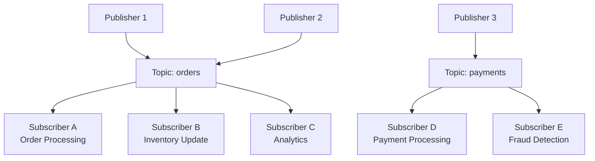
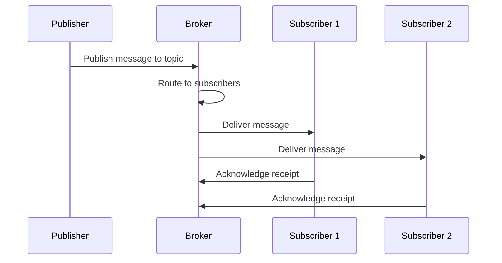
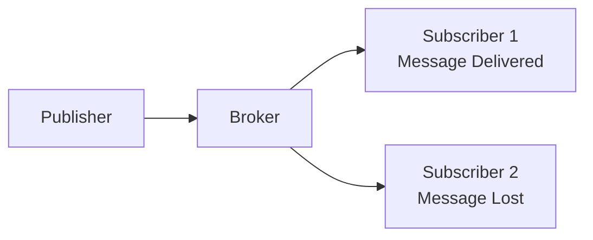
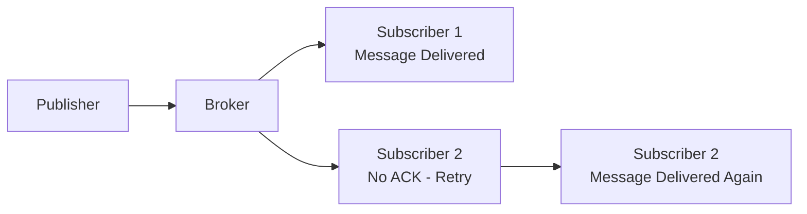
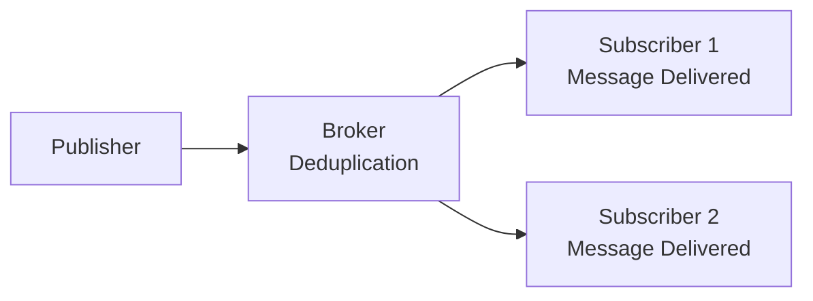

# Pub/Sub (Publish/Subscribe)

Pub/Sub is a messaging pattern that decouples message producers (publishers) from consumers (subscribers) through an intermediary broker.

Publishers send messages to topics without knowing who will receive them, while subscribers express interest in specific topics.



## Use Cases

**Real-Time Event Streaming**

- Live data feeds and monitoring systems
- IoT sensor data processing
- Real-time analytics and dashboards
- Financial market data distribution

**Microservices Communication**

- Event-driven architecture
- Service-to-service messaging
- Domain event propagation
- Cross-service notifications

**Event Notification Systems**

- User activity notifications
- System status alerts
- Business event broadcasting
- Audit trail and logging

**Fan-Out Processing**

- Data distribution to multiple consumers
- Parallel processing pipelines
- Multi-channel notifications
- Content syndication

## Pub/Sub Components

**Publisher (Producer)**

- Sends messages to topics
- Doesn't know about subscribers
- Can publish to multiple topics
- Typically asynchronous

**Subscriber (Consumer)**

- Receives messages from topics
- Expresses interest in specific topics
- Processes messages independently
- Can subscribe to multiple topics

**Topic (Channel)**

- Named message streams
- Categories for message routing
- Can have multiple publishers and subscribers
- Logical grouping mechanism

**Broker (Message Broker)**

- Central message routing component
- Manages topics and subscriptions
- Handles message delivery
- Provides reliability guarantees

**Message**

- Data payload with metadata
- Contains topic routing information
- May include headers and properties
- Immutable once published

### Message Flow



## Trade-offs

### Benefits

**Decoupling**

- Publishers and subscribers are independent
- No direct dependencies between components
- Easy to modify without affecting others
- Enables loose coupling architecture

**Scalability**

- Multiple subscribers process messages in parallel
- Horizontal scaling of consumers
- Load distribution across subscribers
- Broadcast-style communication

**Flexibility**

- Add/remove subscribers without code changes
- Dynamic subscription management
- Multiple subscription patterns
- Easy system extension

**Asynchronous Processing**

- Non-blocking message delivery
- Better performance and responsiveness
- Handles varying processing speeds
- Enables event-driven architecture

### Challenges

**Message Delivery Guarantees**

- Ensuring reliable delivery is complex
- Exactly-once delivery is difficult
- Requires acknowledgments and retries
- Network failures can cause message loss

**Back-Pressure Handling**

- Consumers may be overwhelmed by message volume
- Requires flow control mechanisms
- Can lead to system overload
- Need for message buffering and queuing

**Message Ordering**

- Maintaining message order across subscribers
- Handling out-of-order delivery
- Complex with multiple consumers
- May require additional ordering mechanisms

**Debugging and Monitoring**

- Asynchronous nature makes debugging harder
- Message flow is not always visible
- Requires comprehensive logging
- Complex failure scenarios

## Delivery Semantics

Different delivery guarantees provide various trade-offs between reliability and performance.

### At-Most-Once Delivery

Messages are delivered zero or one time, with possibility of message loss.



**Characteristics**:

- Fastest delivery mechanism
- No duplicate messages
- Possible message loss
- No acknowledgment required

**Use Cases**: Real-time notifications, metrics, non-critical events

### At-Least-Once Delivery

Messages are delivered one or more times, with possibility of duplicates.



**Characteristics**:

- Guaranteed message delivery
- Possible duplicate messages
- Requires acknowledgments
- Retry mechanisms needed

**Use Cases**: Critical business events, financial transactions, audit logs

### Exactly-Once Delivery

Messages are delivered exactly one time, with no duplicates or loss.



**Characteristics**:

- Most reliable delivery
- No duplicates or loss
- Complex implementation
- Higher overhead

**Use Cases**: Financial systems, critical data processing, state changes

## Idempotent Operations

Operations that produce the same result when executed multiple times.

**Why Idempotency Matters**:

- Handles duplicate message delivery
- Ensures consistent system state
- Simplifies error recovery
- Enables safe retries

**Idempotency Patterns**:

- **Idempotent Keys**: Unique identifiers for operations
- **State Checks**: Verify current state before applying changes
- **Conditional Updates**: Only update if conditions are met
- **Idempotent APIs**: Design APIs to be naturally idempotent

**Example**:

```python
def process_order(order_id, amount):
    # Check if order already processed
    if order_exists(order_id):
        return get_order(order_id)
    
    # Process order only if not exists
    return create_order(order_id, amount)
```

## Pub/Sub vs Message Queues

### Key Differences

| Aspect                   | Pub/Sub                           | Message Queues                  |
|--------------------------|-----------------------------------|---------------------------------|
| **Delivery Model**       | Broadcast to multiple subscribers | Point-to-point delivery         |
| **Subscriber Knowledge** | Publishers don't know subscribers | Producers know consumers        |
| **Message Persistence**  | Varies by implementation          | Typically consumed once         |
| **Scaling**              | Horizontal scaling of subscribers | Load balancing across consumers |
| **Use Cases**            | Event broadcasting, notifications | Task processing, job queues     |

### When to Use Each

**Use Pub/Sub When**:

- Broadcasting events to multiple consumers
- Decoupling publishers from subscribers
- Event-driven architecture
- Real-time notifications

**Use Message Queues When**:

- Point-to-point communication
- Task distribution and load balancing
- Asynchronous job processing
- Request-response patterns

## Further References

- [Pub/Sub Pattern Explained](https://redis.io/glossary/pub-sub/)
- [Pub/Sub vs Message Queues](https://www.youtube.com/watch?v=DXTHb9TqJOs&ab_channel=HusseinNasser)
- [Message Ordering in Distributed Systems](https://codeopinion.com/message-ordering-in-pub-sub-or-queues/)
- [Competing Consumers Pattern](https://www.enterpriseintegrationpatterns.com/patterns/messaging/CompetingConsumers.html)
