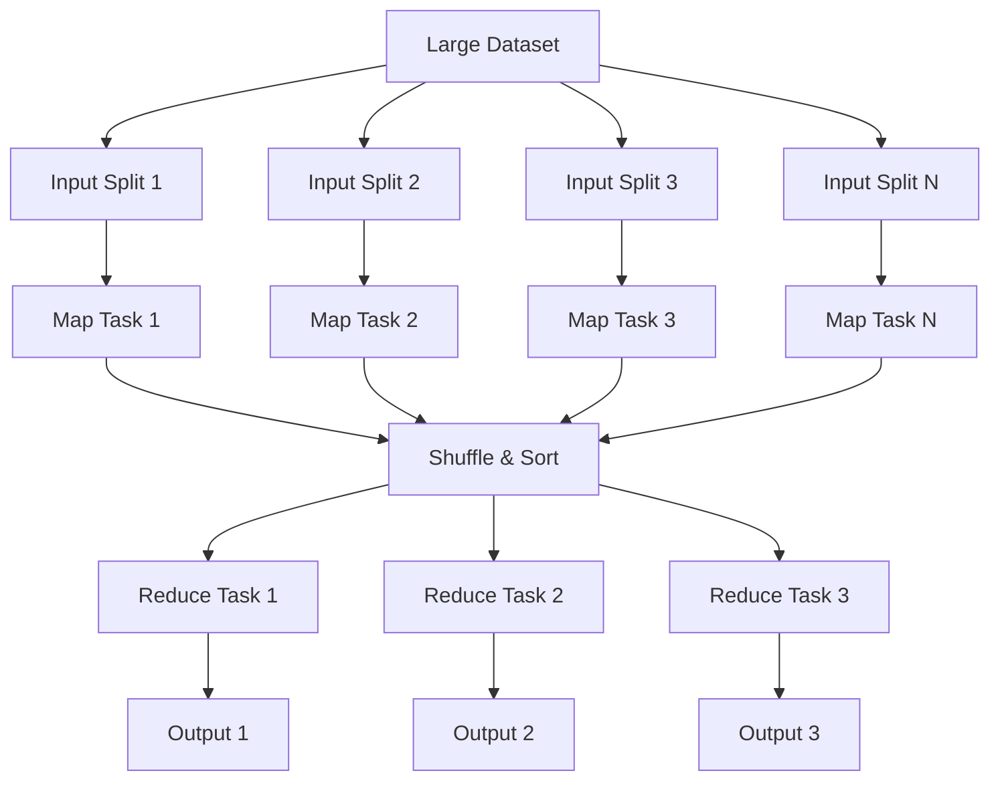
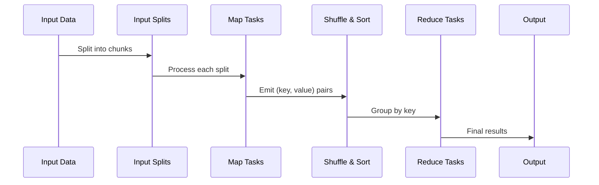
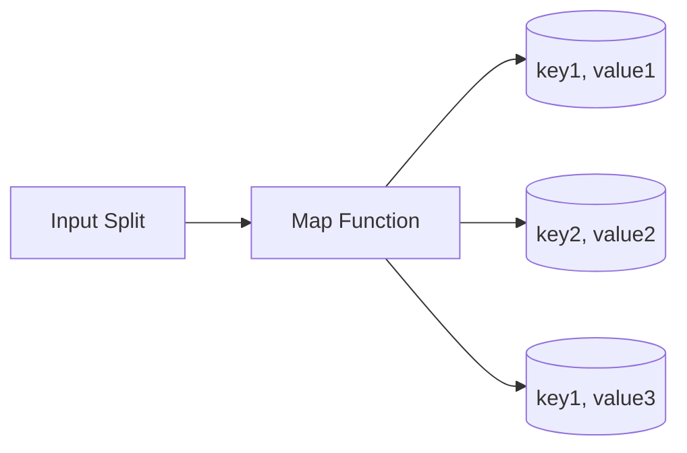
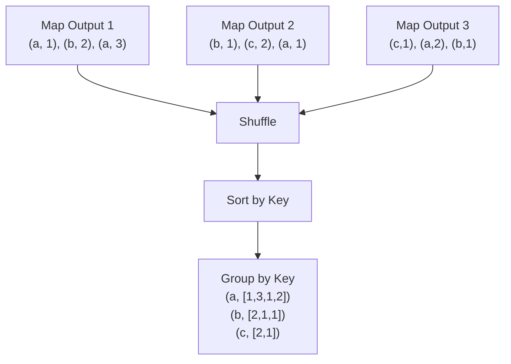
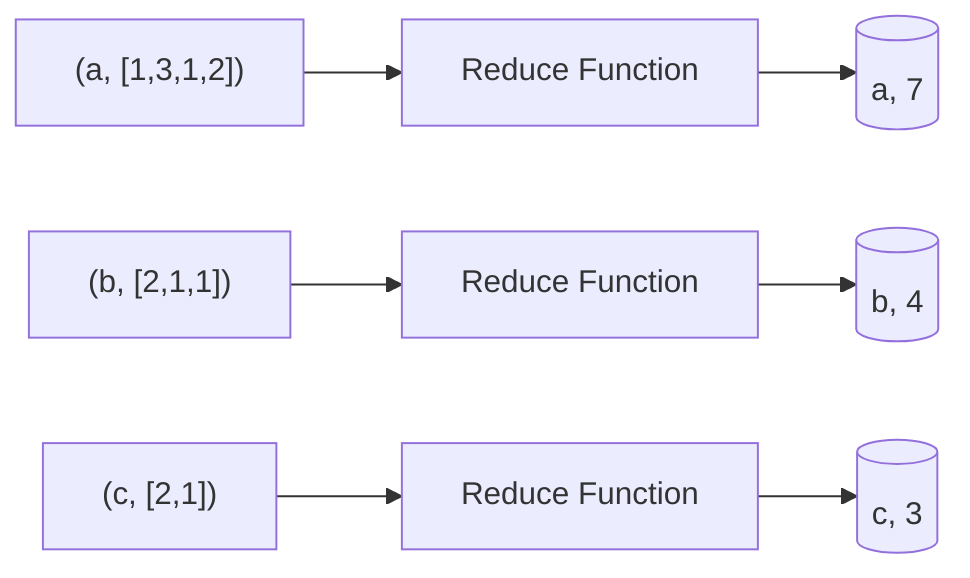

# MapReduce

MapReduce is a programming model and processing framework for distributed computing on large datasets across clusters of computers.

It enables parallel processing by breaking down complex tasks into map and reduce phases.



**Core Benefits**:

- **Scalability**: Process petabytes of data across thousands of machines
- **Data Locality**: Process data where it's stored to minimize network transfer
- **Simplicity**: Simple programming model for complex distributed processing

## Use Cases

**Data Processing & Analytics**

- Log analysis and processing
- Web page indexing and ranking
- Data mining and pattern recognition
- ETL (Extract, Transform, Load) operations

**Machine Learning**

- Training large-scale models
- Feature extraction and preprocessing
- Distributed model evaluation
- Recommendation system computations

**Text Processing**

- Word count and frequency analysis
- Document clustering and classification
- Search engine indexing
- Natural language processing

**Scientific Computing**

- Genomic data analysis
- Climate modeling
- Financial risk analysis
- Large-scale simulations

## MapReduce Concepts

### Core Functions

**Map Function**

- Processes input data and produces intermediate key-value pairs
- Stateless and parallelizable
- Applied to each input record independently
- Output format: `(key, value)`

**Reduce Function**

- Merges all intermediate values with the same key
- Processes sorted key-value pairs
- Produces final output
- Can perform aggregation, filtering, or transformation

### Data Flow



## MapReduce Workflow

### 1. Input Splitting

- Large datasets divided into fixed-size chunks
- Each split processed by one map task
- Enables parallel processing across multiple nodes

### 2. Mapping Phase



**Characteristics**:

- Each map task processes one input split
- Map functions run in parallel
- Outputs intermediate key-value pairs
- No communication between map tasks

### 3. Shuffle and Sort Phase



**Process**:

- Collects all map outputs
- Sorts intermediate data by key
- Groups values by key
- Distributes data to reduce tasks

### 4. Reducing Phase



**Process**:

- Each reduce task processes one or more keys
- Processes all values for assigned keys
- Produces final output
- Can perform aggregation, filtering, or transformation

### 5. Output Phase

- Final results written to distributed storage
- Typically stored in HDFS or similar systems
- Can be used as input for subsequent MapReduce jobs

## Fault Tolerance and Scalability

### Fault Tolerance Mechanisms

**Task-Level Fault Tolerance**

- **Task Retries**: Failed tasks automatically retried on different nodes
- **Speculative Execution**: Slow tasks duplicated on faster nodes
- **Data Replication**: Input data replicated across multiple nodes (typically 3x)
- **Checkpointing**: Intermediate results periodically saved
- **Job Recovery**: Entire jobs can be restarted from last checkpoint

### Scalability Features

**Horizontal Scaling**

- Add more nodes to handle larger datasets
- Linear scaling with cluster size
- Automatic load distribution
- No single point of failure

**Data Locality Optimization**

- **Data Locality**: Process data where it's stored
- **Rack Awareness**: Prefer nodes in same rack
- **Load Balancing**: Distribute tasks evenly
- **Resource Management**: Efficient CPU and memory usage

## Word Count Example

A classic MapReduce example that counts word frequencies in text documents.

### Input Data

```plaintext
Document 1: "hello world hello"
Document 2: "world hello mapreduce"
Document 3: "mapreduce world hello"
```

### Example Implementation

```python
import sys
import re
from collections import defaultdict

def mapper(text):
    """Map function: emit (word, 1) for each word"""
    words = re.findall(r'\w+', text.lower())
    for word in words:
        yield (word, 1)

def shuffle_and_sort(mapped_items):
    """Shuffle and sort: group values by key"""
    shuffled = defaultdict(list)
    for key, value in mapped_items:
        shuffled[key].append(value)
    return sorted(shuffled.items())

def reducer(key_value_pairs):
    """Reduce function: sum all values for each key"""
    for key, values in key_value_pairs:
        total = sum(values)
        yield (key, total)

def word_count_mapreduce(documents):
    """Complete MapReduce word count implementation"""
    # Map phase
    mapped_items = []
    for doc in documents:
        mapped_items.extend(mapper(doc))
    
    # Shuffle and sort phase
    sorted_items = shuffle_and_sort(mapped_items)
    
    # Reduce phase
    results = list(reducer(sorted_items))
    
    return results

# Example usage
documents = [
    "hello world hello",
    "world hello mapreduce", 
    "mapreduce world hello"
]

results = word_count_mapreduce(documents)
for word, count in results:
    print(f"{word}: {count}")

# Output:
# hello: 3
# mapreduce: 2
# world: 3
```

## MapReduce vs Alternatives

### Limitations of MapReduce

**Performance Issues**:

- High latency due to disk I/O between phases
- Limited to batch processing
- No interactive queries or real-time processing
- Complex multi-stage jobs require multiple MapReduce jobs

**Programming Model**:

- Rigid map-reduce paradigm
- Difficult to express complex algorithms
- Limited support for iterative algorithms
- No support for streaming data

### Alternatives

**Apache Spark**

- In-memory processing for faster execution
- Rich APIs (RDD, DataFrame, Dataset)
- Support for streaming, machine learning, and graph processing
- Interactive queries and real-time processing

**Apache Flink**

- True streaming processing
- Low latency and high throughput
- Event-time processing
- Exactly-once semantics

**Apache Storm**

- Real-time stream processing
- Low latency processing
- Fault-tolerant and scalable
- Simple programming model

## Popular Technologies

### MapReduce Implementations

**Apache Hadoop MapReduce**

- Original open-source implementation
- Part of Apache Hadoop ecosystem
- Mature and widely adopted
- **Use Cases**: Large-scale batch processing, ETL operations

### Cloud Services

**Amazon EMR (Elastic MapReduce)**

- Managed Hadoop and Spark clusters
- Auto-scaling capabilities
- **Use Cases**: Cloud-based big data processing

**Google Cloud Dataproc**

- Managed Spark and Hadoop service
- Serverless and cluster-based options
- **Use Cases**: Cloud data processing and analytics

**Azure HDInsight**

- Managed Hadoop, Spark, and other services
- Enterprise security and compliance
- **Use Cases**: Enterprise big data processing

## When to Use MapReduce

**Use MapReduce When**:

- Processing large datasets (terabytes to petabytes)
- Batch processing is acceptable
- Simple map-reduce operations
- Cost-effective processing is required

**Consider Alternatives When**:

- Real-time processing required
- Interactive queries needed
- Complex iterative algorithms
- Low latency is critical
- Rich analytics and machine learning required

## Reference Materials

- [MapReduce: Simplified Data Processing on Large Clusters](https://static.googleusercontent.com/media/research.google.com/en//archive/mapreduce-osdi04.pdf)
- [MapReduce Explained with Examples](https://levelup.gitconnected.com/map-reduce-explained-with-example-system-design-af7b868187a5)
- [What is MapReduce?](https://www.youtube.com/watch?v=lHp7M078nHo&ab_channel=Jordanhasnolife)
- [Big Data Processing Frameworks Comparison](https://www.databricks.com/glossary/mapreduce)
