# CAP and PACELC Theorems

CAP and PACELC theorems are fundamental principles that describe the inherent trade-offs in distributed systems.

## CAP Theorem

The CAP theorem states that a distributed system can guarantee only two out of three below properties in the event of a network partition:

- **Consistency**
- **Availability**
- **Partition Tolerance**

### The Three Properties

**Consistency (C)**

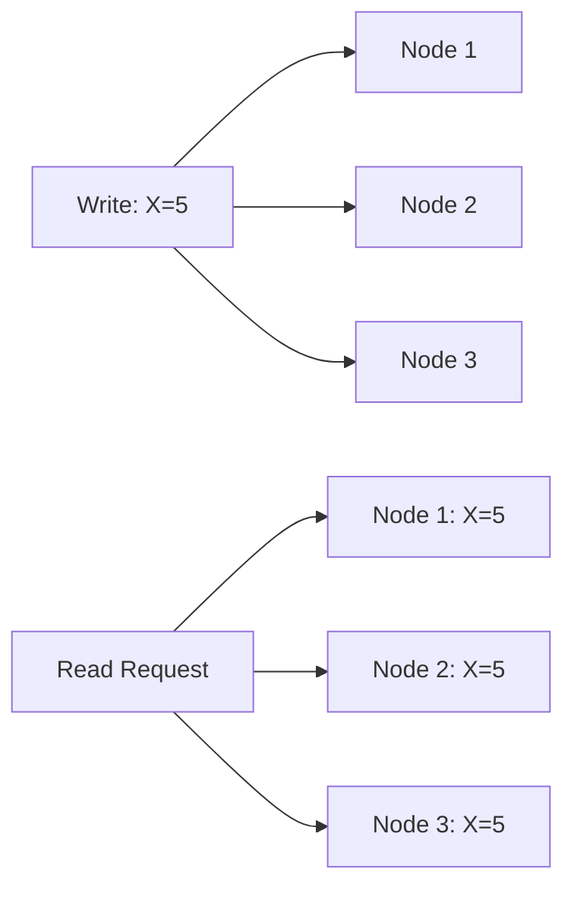

- Every read receives the most recent write or an error
- All nodes see the same data simultaneously
- Strong consistency across the entire system
- **Example**: Banking systems where account balances must be consistent

**Availability (A)**

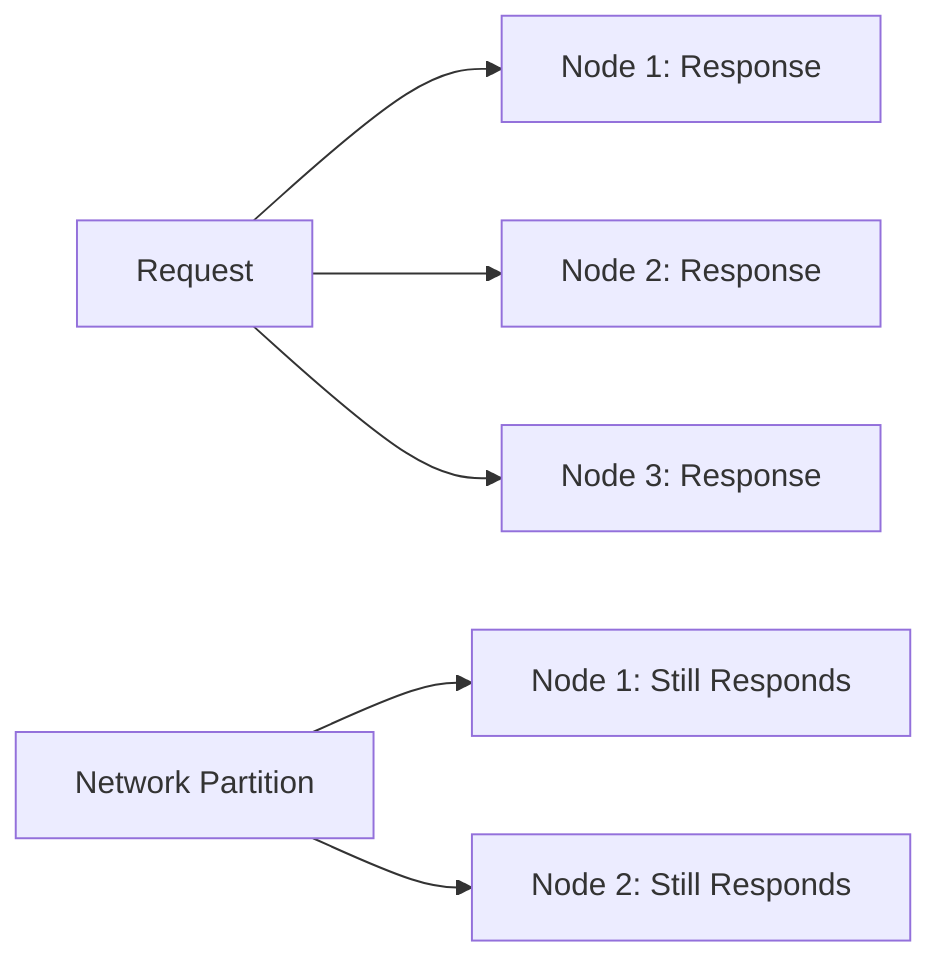

- Every request receives a response (non-error)
- System remains operational despite failures
- No guarantee that response contains most recent data
- **Example**: Social media feeds where availability is more important than perfect consistency

**Partition Tolerance (P)**

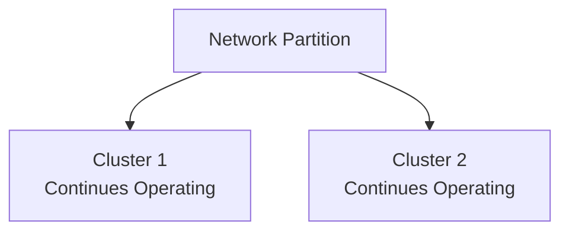

- System continues operating despite network partitions
- Tolerates message loss or delays between nodes
- Essential for distributed systems over unreliable networks
- **Example**: Global systems that must work across regions

### CAP Triangle Visualization

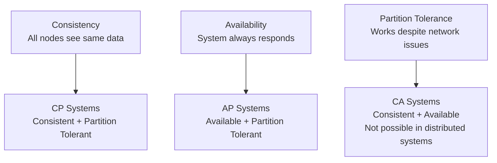

### CAP System Classifications

**CP Systems (Consistency + Partition Tolerance)**

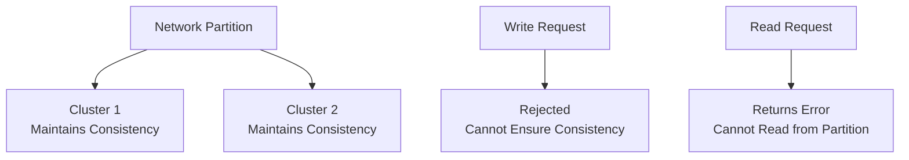

**Characteristics**:

- Prioritizes consistency over availability during partitions
- May reject requests when consistency cannot be guaranteed
- Strong consistency guarantees
- **Examples**: HBase, MongoDB (with strong consistency), traditional RDBMS

**AP Systems (Availability + Partition Tolerance)**

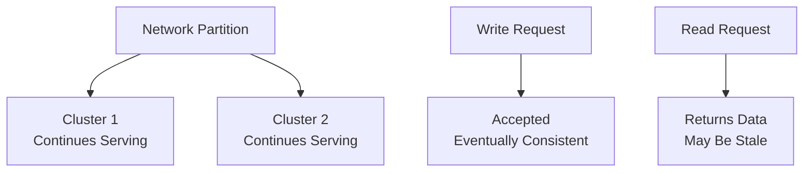

**Characteristics**:

- Prioritizes availability over consistency during partitions
- Always responds to requests, even with stale data
- Eventually consistent
- **Examples**: Cassandra, CouchDB, DynamoDB

**CA Systems (Consistency + Availability)**

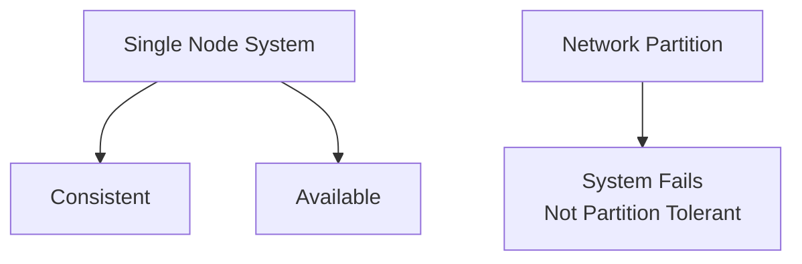

**Characteristics**:

- Only possible in single-node systems
- Cannot handle network partitions
- Not suitable for distributed systems
- **Examples**: Single-instance databases, local file systems

### Real-World Examples

| System         | CAP Classification   | Use Case            | Trade-off                              |
|----------------|----------------------|---------------------|----------------------------------------|
| **HBase**      | CP                   | Big data analytics  | Consistency over availability          |
| **Cassandra**  | AP                   | High-scale web apps | Availability over consistency          |
| **MongoDB**    | CP/AP (configurable) | Document storage    | Flexible based on configuration        |
| **DynamoDB**   | AP                   | Cloud applications  | Availability with eventual consistency |
| **PostgreSQL** | CP                   | Financial systems   | Strong consistency                     |
| **Redis**      | CP                   | Caching             | Consistency with fast access           |

### Choosing CAP Properties

**Choose CP When**:

- Data consistency is critical (banking, financial systems)
- Strong consistency requirements
- Can tolerate temporary unavailability
- Data integrity is more important than uptime

**Choose AP When**:

- High availability is required (social media, content delivery)
- Can tolerate eventual consistency
- User experience depends on system responsiveness
- Temporary data inconsistency is acceptable

## PACELC Theorem

PACELC extends CAP by adding a fourth dimension: **Latency**. It states that distributed systems face trade-offs not only during partitions but also during normal operation.

### PACELC Breakdown

**P - Partition**

- Same as CAP theorem
- Choose between Availability (A) and Consistency (C)

**A - Availability**

- System remains responsive during partitions
- May return stale data

**C - Consistency**

- All nodes see the same data
- May reject requests during partitions

**E - Else (No Partition)**

- Normal operation without network partitions
- Choose between Latency (L) and Consistency (C)

**L - Latency**

- Low response time for requests
- May sacrifice consistency for speed

**C - Consistency**

- Strong consistency guarantees
- May increase response time

### PACELC System Classifications

**AP/EL Systems (Availability + Partition Tolerance / Else + Low Latency)**

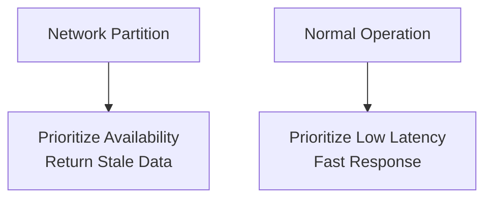

**Characteristics**:

- Available during partitions, low latency during normal operation
- May return inconsistent data
- Optimized for performance
- **Examples**: Cassandra, DynamoDB

**AP/EC Systems (Availability + Partition Tolerance / Else + Consistency)**

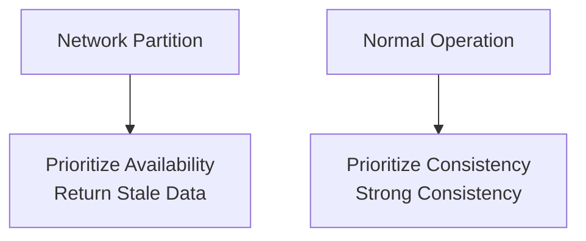

**Characteristics**:

- Available during partitions, consistent during normal operation
- Higher latency for consistency
- **Examples**: MongoDB (with strong consistency), Riak

**CP/EL Systems (Consistency + Partition Tolerance / Else + Low Latency)**

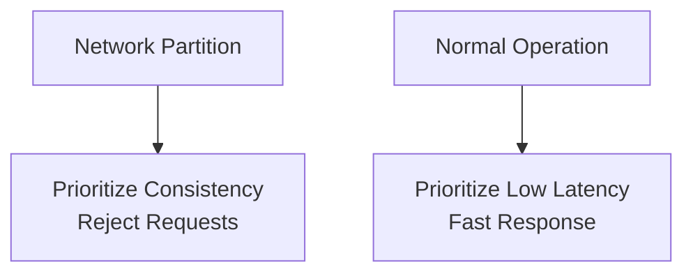

**Characteristics**:

- Consistent during partitions, low latency during normal operation
- May be unavailable during partitions
- **Examples**: HBase, traditional RDBMS

**CP/EC Systems (Consistency + Partition Tolerance / Else + Consistency)**

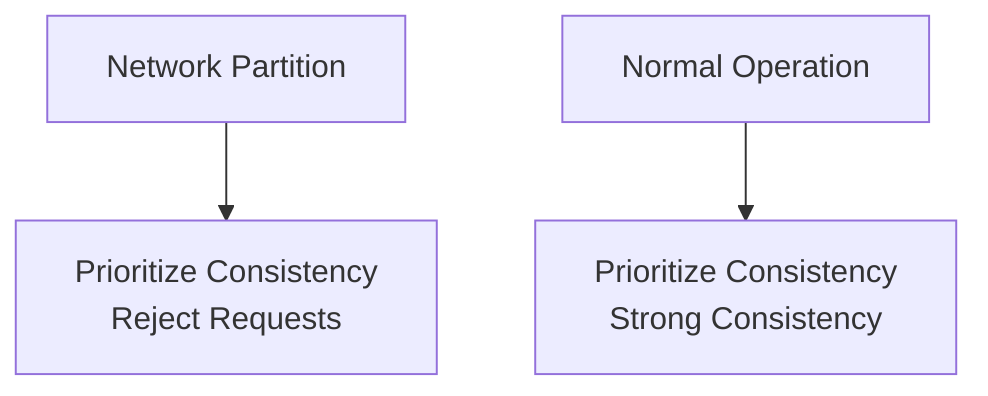

**Characteristics**:

- Consistent in all scenarios
- May have higher latency
- **Examples**: Strongly consistent databases, financial systems

### PACELC Examples

| System         | PACELC Classification | Partition Behavior               | Normal Operation                      |
|----------------|-----------------------|----------------------------------|---------------------------------------|
| **Cassandra**  | AP/EL                 | Available, may return stale data | Low latency, eventual consistency     |
| **DynamoDB**   | AP/EL                 | Available, eventually consistent | Low latency, configurable consistency |
| **HBase**      | CP/EL                 | Consistent, may reject requests  | Low latency, strong consistency       |
| **MongoDB**    | CP/EC                 | Consistent, may reject requests  | Strong consistency, higher latency    |
| **PostgreSQL** | CP/EC                 | Consistent, may reject requests  | Strong consistency, higher latency    |

### Practical Implications

**AP/EL Systems**:

- Best for high-throughput applications
- Good for read-heavy workloads
- Suitable for content delivery, social media
- Trade consistency for performance

**CP/EC Systems**:

- Best for critical data applications
- Good for financial, transactional systems
- Suitable for systems requiring strong consistency
- Trade performance for consistency

**AP/EC Systems**:

- Balanced approach during normal operation
- Available during partitions
- Good for systems with mixed requirements
- Moderate performance with consistency

**CP/EL Systems**:

- Fast during normal operation
- Consistent during partitions
- Good for systems that can tolerate brief unavailability
- High performance with consistency guarantees

## CAP vs PACELC Comparison

| Aspect                    | CAP Theorem             | PACELC Theorem                   |
|---------------------------|-------------------------|----------------------------------|
| **Scope**                 | Network partitions only | Partitions + normal operation    |
| **Dimensions**            | 3 (C, A, P)             | 4 (P, A, C, E, L, C)             |
| **Partition Behavior**    | Choose 2 out of 3       | Same as CAP                      |
| **Normal Operation**      | Not addressed           | Latency vs Consistency trade-off |
| **System Classification** | CP, AP, CA              | AP/EL, AP/EC, CP/EL, CP/EC       |

## Common Misconceptions

- ❌ "You can only have 2 properties at any time"
- ✅ **Reality**: You can have all 3, but must choose 2 during partitions

- ❌ "CA systems are impossible"
- ✅ **Reality**: CA systems exist but aren't distributed (single-node)

## Further References

- [CAP Theorem - Wikipedia](https://en.wikipedia.org/wiki/CAP_theorem)
- [PACELC Theorem - Wikipedia](https://en.wikipedia.org/wiki/PACELC_theorem)
- [CAP Theorem Simplified](https://www.youtube.com/watch?v=BHqjEjzAicA&ab_channel=ByteByteGo)
- [An Illustrated Proof of the CAP Theorem](https://mwhittaker.github.io/blog/an_illustrated_proof_of_the_cap_theorem/)
- [CAP Theorem Definition](https://www.scylladb.com/glossary/cap-theorem/)
- [PACELC Theorem Definition](https://www.scylladb.com/glossary/pacelc-theorem/)
- [Problems with CAP and Yahoo's NoSQL System](https://dbmsmusings.blogspot.com/2010/04/problems-with-cap-and-yahoos-little.html)
- [Brewer's Conjecture and the Feasibility of Consistent, Available, Partition-Tolerant Web Services](https://users.ece.cmu.edu/~adrian/731-sp04/readings/GL-cap.pdf)
