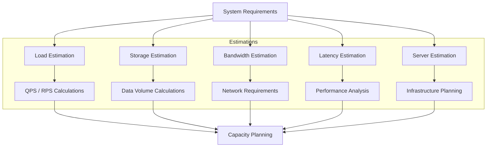
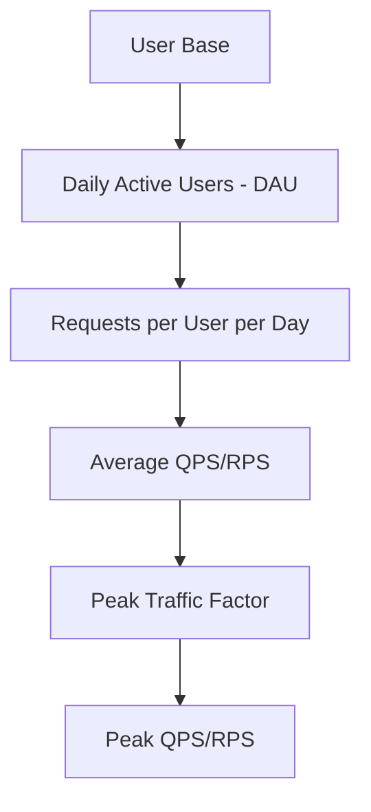
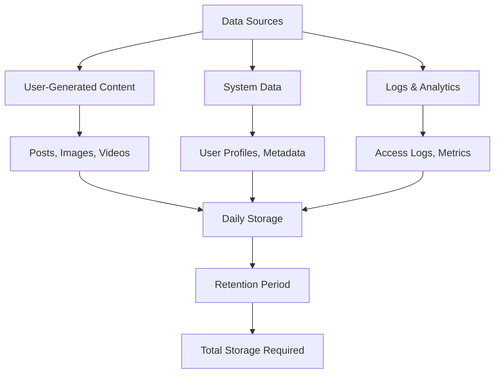
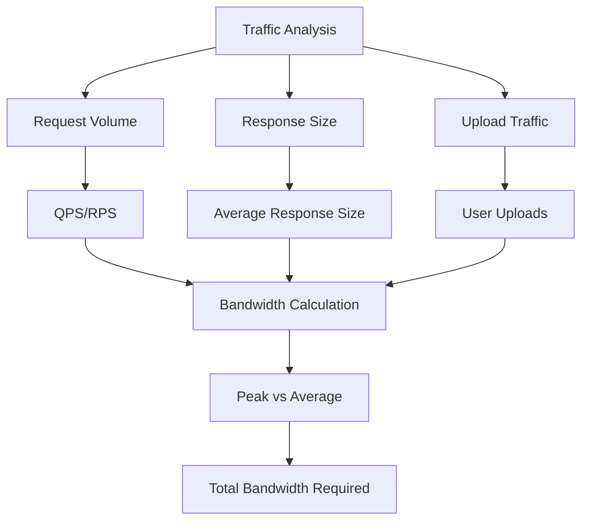
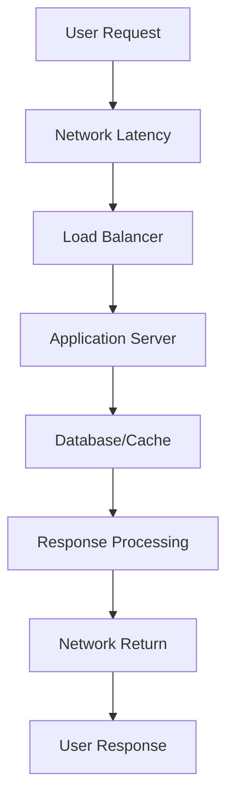
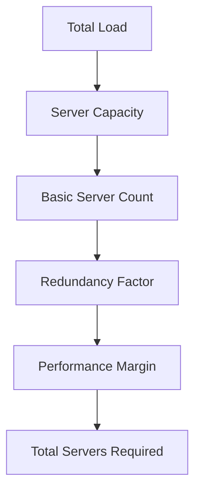

# Back of the Envelope Calculations

Back-of-the-envelope calculations are quick estimations that help demonstrate the ability to think at scale and make informed trade-offs when designing systems.

These calculations use simplifications and basic math to approximate system requirements without requiring full precision.

## Essential Units and Conversions

### Storage Units

**Decimal Units (SI System)**

| Unit | Equivalent | Use Case                            |
|------|------------|-------------------------------------|
| 1 KB | 1000 bytes | Network bandwidth, storage capacity |
| 1 MB | 1000 KB    | File sizes, memory                  |
| 1 GB | 1000 MB    | Hard drives, RAM                    |
| 1 TB | 1000 GB    | Large storage systems               |
| 1 PB | 1000 TB    | Data centers, big data              |

**Binary Units (IEC System)**

| Unit  | Equivalent | Use Case                |
|-------|------------|-------------------------|
| 1 KiB | 1024 bytes | Memory addressing       |
| 1 MiB | 1024 KiB   | Operating system memory |
| 1 GiB | 1024 MiB   | RAM, cache              |
| 1 TiB | 1024 GiB   | Large memory systems    |
| 1 PiB | 1024 TiB   | Supercomputing          |

### Time Units

| Unit     | Equivalent    | Use Case             |
|----------|---------------|----------------------|
| 1 second | 1000 ms       | Response time        |
| 1 minute | 60 seconds    | Session duration     |
| 1 hour   | 3600 seconds  | Daily calculations   |
| 1 day    | 86400 seconds | Daily active users   |
| 1 month  | ~30 days      | Monthly calculations |
| 1 year   | 365 days      | Annual projections   |

### Key Constants

**Useful Approximations**:

- 1 day = 86,400 seconds ≈ 10^5 seconds
- 1 month = 30 days ≈ 2.6 × 10^6 seconds
- 1 year = 365 days ≈ 3.15 × 10^7 seconds
- 2^10 = 1024 ≈ 10^3
- 2^20 = 1,048,576 ≈ 10^6
- 2^30 = 1,073,741,824 ≈ 10^9

## Calculation Framework

### Step-by-Step Process

1. **Define the Problem**: What are you trying to estimate?
2. **Make Assumptions**: State your assumptions clearly
3. **Break Down the Problem**: Divide into smaller, manageable parts
4. **Use Approximations**: Round numbers for easier calculation
5. **Calculate**: Perform the math step by step
6. **Validate**: Check if results make sense
7. **State Limitations**: Acknowledge what the calculation doesn't account for

## Estimation Templates

### Load Estimation

Estimate the expected number of requests per second, data volume, or user traffic for the system.

Consider whether the application is read-heavy, write-heavy, or balanced.

**Key Formulas**:

**Total RPS**:
$$
\text{RPS} = \frac{\text{DAU} \times \text{Requests per User per Day (e.g. 100)}}{86,400 \text{ seconds (1 day)}}
$$

**Read QPS**:
$$
\text{Read QPS} = \frac{\text{DAU} \times \text{Reads per User per Day (e.g. 50)}}{86,400 \text{ seconds (1 day)}}
$$

**Write QPS**:
$$
\text{Write QPS} = \frac{\text{DAU} \times \text{Writes per User per Day (e.g. 50)}}{86,400 \text{ seconds (1 day)}}
$$

**Peak Traffic**:
$$
\text{Peak QPS} = \text{Average QPS} \times \text{Peak Factor (typically 2-3)}
$$

**Traffic Patterns**:

- **Read-heavy**: 80% reads, 20% writes (social media, content sites)
- **Write-heavy**: 20% reads, 80% writes (logging, analytics)
- **Balanced**: 50% reads, 50% writes (e-commerce, banking)

#### Load Estimation Example

**Scenario**: Social media platform with 200 million monthly active users

**Assumptions**:

- 50% of monthly users are daily active users
- Read-heavy application (80% reads, 20% writes)
- Average 15 requests per user per day
- Peak traffic is 3x average traffic

**Step 1: Calculate DAU**
$$
\text{DAU} = 200\ \text{Million} \times 50\% = 100\ \text{Million users}
$$

**Step 2: Calculate Average RPS**
$$
\text{Average RPS} = \frac{100\ \text{Million} \times 15}{86,400} = \frac{1.5 \times 10^9}{8.64 \times 10^4} ≈ 17,400 \text{ RPS}
$$

**Step 3: Calculate Read/Write QPS**
$$
\text{Read QPS} = 17,400 \times 80\% ≈ 14,000 \text{ reads/second}
$$
$$
\text{Write QPS} = 17,400 \times 20\% ≈ 3,400 \text{ writes/second}
$$

**Step 4: Calculate Peak Traffic**
$$
\text{Peak RPS} = 17,400 \times 3 = 52,200 \text{ RPS}
$$
$$
\text{Peak Read QPS} = 14,000 \times 3 = 42,000 \text{ reads/second}
$$
$$
\text{Peak Write QPS} = 3,400 \times 3 = 10,200 \text{ writes/second}
$$

**Summary**:

- Average: 17.4K RPS (14.0K reads, 3.40K writes)
- Peak: 52.2K RPS (42.0K reads, 10.20K writes)

### Storage Estimation

Estimate the amount of storage required to handle the data generated by the system.

**Basic Formula**:
$$
\text{Daily Storage} = \text{DAU} \times \text{Objects per User per Day} \times \text{Average Object Size}
$$
$$
\text{Total Storage} = \text{Daily Storage} \times \text{Retention Period (days)}
$$

**Common Data Sizes**:

| Data Type              | Size Range    | Typical Use Case   |
|------------------------|---------------|--------------------|
| **Text Data**          |               |                    |
| ASCII character        | 1 byte        | Plain text         |
| UTF-16 character       | 2 bytes       | Unicode text       |
| Tweet (280 chars)      | 280 bytes     | Social media posts |
| User profile           | 1-5 KB        | User information   |
| **Media Files**        |               |                    |
| Compressed image       | 500 KB - 1 MB | Web images         |
| High-res image         | 2-5 MB        | Photography        |
| 1-min video (1080p)    | 100 MB        | Video content      |
| 1-min audio (128 Kbps) | 1 MB          | Podcasts, music    |
| **System Data**        |               |                    |
| UUID                   | 16 bytes      | Unique identifiers |
| Integer                | 4 bytes       | Counters, IDs      |
| Float                  | 4 bytes       | Measurements       |
| Timestamp              | 8 bytes       | Date/time          |
| Log entry              | 200 bytes     | System logs        |
| HTML page              | 2-5 KB        | Web pages          |

#### Storage Estimation Example

**Scenario**: Video streaming platform (like YouTube)

**Assumptions**:

- 50 million daily active users
- 20% of users upload videos daily
- Average 1 video per uploading user per day
- Average video size: 100 MB
- Video metadata: 1 KB per video
- User profiles: 2 KB per user
- Retention: 3 years

**Step 1: Calculate Video Storage**
$$
\text{Uploading Users} = 50\ \text{Million} \times 20\% = 10\ \text{Million}
$$
$$
\text{Daily Video Storage} = 10\ \text{Million} \times 1\ \text{video} \times 100\ \text{MB} = 1\ \text{TB/day}
$$

**Step 2: Calculate Video Metadata Storage**
$$
\text{Daily Video Metadata} = 10\ \text{Million} \times  1\ \text{video} \times 1\ \text{KB} = 10\ \text{GB/day}
$$

**Step 3: Calculate User Profile Storage**
$$
\text{User Profiles} = 50\ \text{Million} \times 2\ \text{KB} = 100\ \text{GB} \text{ (one-time)}
$$

**Step 4: Calculate Total Storage (3 years)**
$$
\text{Video Storage (3 years)} = 1\ \text{TB/day} \times 365\ \text{days} \times 3\ \text{years} = 1,095\ \text{TB}
$$
$$
\text{Metadata Storage (3 years)} = 10\ \text{GB/day} \times 365\ \text{days} \times 3\ \text{years} = 10.95\ \text{TB}
$$
$$
\text{Total Storage} = 1,095\ \text{TB} + 10.95\ \text{TB} + 0.1\ \text{TB} ≈ 1,106\ \text{TB} = 1.1\ \text{PB}
$$

**Summary**: ~1.1 PB total storage required for 3 years

### Network Bandwidth Estimation

Estimate the network bandwidth needed to support the expected traffic and data transfer.

**Formulas**:

**Outbound Bandwidth**:
$$
\text{Outbound Bandwidth} = \text{Read QPS} \times \text{Average Response Size}
$$

**Inbound Bandwidth**:
$$
\text{Inbound Bandwidth} = \text{Write QPS} \times \text{Average Request Size}
$$

**Total Bandwidth**:
$$
\text{Total Bandwidth} = \text{Outbound} + \text{Inbound}
$$

#### Bandwidth Estimation Example

**Scenario**: E-commerce platform with 10K RPS

**Assumptions**:

- Average response size: 50 KB
- 20% of requests are uploads (product images)
- Average upload size: 2 MB
- Peak traffic: 3x average

**Step 1: Calculate Outbound Bandwidth**
$$
\text{Read QPS} = 10,000 \times 80\% = 8,000 \text{ QPS}
$$
$$
\text{Outbound Bandwidth} = 8,000 \times 50 \text{ KB} = 400,000 \text{ KB/s} = 400 \text{ MB/s}
$$

**Step 2: Calculate Inbound Bandwidth**
$$
\text{Write QPS} = 10,000 \times 20\% = 2,000 \text{ QPS}
$$
$$
\text{Inbound Bandwidth} = 2,000 \times 2 \text{ MB} = 4,000 \text{ MB/s} = 4 \text{ GB/s}
$$

**Step 3: Calculate Peak Bandwidth**
$$
\text{Peak Outbound} = 400 \text{ MB/s} \times 3 = 1.2 \text{ GB/s}
$$
$$
\text{Peak Inbound} = 4 \text{ GB/s} \times 3 = 12 \text{ GB/s}
$$

**Summary**:

- Average: 4.4 GB/s total (400 MB/s out, 4 GB/s in)
- Peak: 13.2 GB/s total (1.2 GB/s out, 12 GB/s in)

### Latency Estimation

Latency is the time taken for a request to travel through the system and return a response.

**Latency Components**:

| Component         | Latency Range | Notes              |
|-------------------|---------------|--------------------|
| **Network**       |               |                    |
| Same data center  | 0.1 - 0.5 ms  | Very fast          |
| Cross-region      | 50 - 100 ms   | Significant impact |
| Cross-continent   | 150 - 300 ms  | Major impact       |
| **Storage**       |               |                    |
| RAM (cache hit)   | 0.1 - 0.2 ms  | Fastest            |
| SSD               | 0.1 - 1 ms    | Fast               |
| HDD               | 2 - 20 ms     | Slow               |
| **Database**      |               |                    |
| In-memory DB      | 0.1 - 1 ms    | Very fast          |
| SSD-based DB      | 1 - 10 ms     | Fast               |
| HDD-based DB      | 10 - 100 ms   | Slow               |
| **Processing**    |               |                    |
| Simple logic      | 1 - 5 ms      | Fast               |
| Complex logic     | 10 - 100 ms   | Moderate           |
| Heavy computation | 100+ ms       | Slow               |

**Total Latency Formula**:
$$
\text{Total Latency} = \text{Network} + \text{Processing} + \text{Database} + \text{Storage}
$$

#### Latency Estimation Example

**Scenario**: Global e-commerce platform

**Request Flow**:

1. User in Europe requests product page
2. Request goes to US data center
3. Application server processes request
4. Database query (cache miss)
5. Response sent back to user

**Latency Breakdown**:
$$
\text{Network (Europe → US)} = 100 \text{ ms}
$$
$$
\text{Load Balancer} = 1 \text{ ms}
$$
$$
\text{Application Processing} = 10 \text{ ms}
$$
$$
\text{Database Query (SSD)} = 5 \text{ ms}
$$
$$
\text{Response Processing} = 2 \text{ ms}
$$
$$
\text{Network (US → Europe)} = 100 \text{ ms}
$$

$$
\text{Total Latency} = 100 + 1 + 10 + 5 + 2 + 100 = 218 \text{ ms}
$$

**Optimization Strategies**:

- Use CDN for static content: -50 ms
- Cache frequently accessed data: -5 ms
- Use regional data centers: -100 ms
- Optimize database queries: -2 ms

**Optimized Latency**: ~61 ms (72% improvement)

### Server Estimation

Estimate the number of servers needed to handle the expected load with appropriate redundancy and performance margins.

**Basic Formula**:
$$
\text{Servers Needed} = \frac{\text{Total Load}}{\text{Server Capacity}} \times \text{Safety Factor}
$$

**Safety Factors**:

- **Redundancy**: 2-3x for high availability
- **Performance Margin**: 20-50% headroom
- **Geographic Distribution**: Additional servers per region
- **Load Balancing**: 10-20% overhead

**Performance Margin Calculation**:

**Performance Margin** affects the **effective capacity per server**, not the number of servers. It reduces how much load each server should handle to maintain headroom.

- **Traffic Spikes**: Unexpected increases in user activity
- **Server Degradation**: Performance degradation

**Example**:

**Without Headroom**:

- Server Capacity: 1000 RPS
- Peak Traffic: 1000 RPS → Server at 100% capacity
- Traffic Spike: 1200 RPS → Server overloaded ❌

**With 30% Headroom**:

- Server Capacity: 1000 RPS
- Effective Capacity: 700 RPS (70% utilization)
- Peak Traffic: 1000 RPS → Need 2 servers
- Traffic Spike: 1200 RPS → Can handle it ✅

#### Server Estimation Example

**Scenario**: Social media platform with 52K peak RPS

**Assumptions**:

- Peak RPS: 52,200 requests/second
- Each server can handle: 1,000 RPS (maximum capacity)
- Redundancy factor: 2x (for high availability)
- Performance margin: 30% headroom (use only 70% of server capacity)
- Geographic distribution: 3 regions

**Step 1: Calculate Effective Server Capacity**
$$
\text{Effective Capacity per Server} = 1,000 \text{ RPS} \times 70\% = 700 \text{ RPS/server}
$$

**Step 2: Calculate Basic Server Count**
$$
\text{Basic Number of Servers} = \frac{52,200 \text{ RPS}}{700 \text{ RPS/server}} = 74.6 ≈ 75 \text{ servers}
$$

**Step 3: Apply Redundancy Factor (2x)**
$$
\text{With Redundancy} = 75 \times 2 = 150 \text{ servers}
$$

**Step 4: Geographic Distribution**
$$
\text{Per Region} = \frac{150}{3} = 50 \text{ servers per region}
$$

**Summary**: 150 servers total (50 per region)

**Final Breakdown**:

- **Basic requirement**: 75 servers (with 30% headroom)
- **Redundancy (2x)**: 150 servers
- **Geographic distribution**: 50 servers per region
- **Each server**: Runs at 70% capacity (700 RPS) with 300 RPS headroom

## Additional Estimation Scenarios

### Cache Sizing

**Formula**:
$$
\text{Cache Size} = \text{Active Data} \times \text{Cache Hit Rate} \times \text{Safety Factor}
$$

**Example**: 1TB active data, 80% cache hit rate, 2x safety factor
$$
\text{Cache Size} = 1 \text{ TB} \times 0.8 \times 2 = 1.6 \text{ TB}
$$

### Database Connections

**Formula**:
$$
\text{Connections} = \text{Concurrent Users} \times \text{Connection per User} \times \text{Safety Factor}
$$

**Example**: 10K concurrent users, 2 connections per user, 1.5x safety factor
$$
\text{Connections} = 10,000 \times 2 \times 1.5 = 30,000 \text{ connections}
$$

### Cost Estimation

**Example**:

- 138 servers @ $100/month
- 1.1PB storage @ $0.02/GB/month
- 13.2GB/s bandwidth @ $0.10/GB

**Monthly Cost Formula**:
$$
\text{Cost} = \text{Servers} \times \text{Server Cost} + \text{Storage} \times \text{Storage Cost} + \text{Bandwidth} \times \text{Bandwidth Cost}
$$

$$
\text{Monthly Cost} = 138 \times 100 + 1,100,000 \times 0.02 + 13.2 \times 0.10 \times 2.6 \times 10^6 ≈ \$13,800 + \$22,000 + \$3,400 = \$39,200
$$

## Best Practices

**Estimation Guidelines**:

1. **State Assumptions Clearly**: Document all assumptions
2. **Use Round Numbers**: Simplify calculations with approximations
3. **Show Your Work**: Break down complex calculations
4. **Validate Results**: Check if numbers make sense
5. **Consider Edge Cases**: Account for peak loads and failures
6. **Update Regularly**: Revisit estimates as requirements change

**Common Pitfalls**:

- ❌ Forgetting to account for redundancy
- ❌ Underestimating peak traffic
- ❌ Ignoring geographic distribution
- ❌ Not considering data growth
- ❌ Overlooking operational overhead

## Further References

- [Latency Numbers Every Programmer Should Know](https://colin-scott.github.io/personal_website/research/interactive_latency.html)
- [Back-of-the-Envelope Calculation Guide](https://www.designgurus.io/blog/back-of-the-envelope-system-design-interview)
- [Use Back-of-the-envelope-calculations to Choose the Best Design](https://highscalability.com/google-pro-tip-use-back-of-the-envelope-calculations-to-choo/)
- [Capacity Planning for System Design](https://systemdesign.one/back-of-the-envelope/)
